# Gimbal Platform 前端重构方案

> 范围:`src/gimbal-platform/frontend`。本方案在完成 Signal 视觉体系、四域信息架构(场景 / 服务 / 执行中心 / 平台 + 用户工作台)的原型设计后产出,包含方案自检、完整重构方案与技术栈迁移计划。全部原型图见文末。
>
> **v2 修订(2026-09-17)**:对照代码实测修订 v1 的四处失实——①现状导航是 `TopNav.vue`(顶栏)而非侧边栏,Phase 1 实为导航范式更换;②数据集独立路由(`CaseDataSetsList.vue` / `DataSetEditor.vue`)是独立目的地,降级动作是退役路由而非"同一目的地";③登录/注册/批次详情未列入迁移序列导致 Element Plus 无法退场,完成标准已自洽;④Phase 2 排序理由按实测 el-* 用量校准,并去除不存在的 E2E 依赖。实测依据:`:deep()` 覆盖 53 处 / 14 文件;el-* 用量 UsersAdmin 93 / Auths 74 / CarryConfig 65 / ConstantsPool 63 / Register 38 / AdaptationBatchDetail 36 / AssertionRegistryEditor 35 / AdaptationCenter 34 / DataSetEditor 37 / Login 24 / Executions 23 / ExecutionsList 19 / SchemeWorkbench 10 / CaseDataSetsList 10 / CaseComposer 4 / ScenarioDetailView 0。
>
> **v2.1 增补(2026-09-17,第二轮影响检查)**:发现 v2 未覆盖的**逻辑层耦合**——`utils/confirmAction.ts`(ElMessageBox 封装,5 个视图调用)、`utils/errorFallback.ts`(全站错误 toast 单一真源)、`utils/removeExecution.ts`、`stores/scenario-draft.ts`(导出成功 toast)直接 import element-plus。这些交叉切面被 Phase 2 所有批次依赖,必须提前到 Phase 1 替换(见 Phase 1 新增任务)。同时补入两项利好实测:el-table 高级特性全站仅 6 处、el-form `:rules` 校验仅 5 个文件 27 处 API 引用——两大预想迁移坑实际都浅。测试侧影响量化:全站 956 条测试,其中直接 mock/断言 `element-plus` ElMessage 的测试文件 10+,换 toast 实现时需一次性换测试替身。
>
> **v2.2 定稿(2026-09-17,开工版)**:①新增 **§7 工作台卡片规范**(薄版六条)与 **§8 阶段路线**(架构重构 → 运行中心优化 → 工作台卡片化);②Phase 1 骨架规范补 **collapsed topbar 统一面包屑**(替代各页自造返回);③原型修订小项(断言徽标可点、数据集计数联动、编排器向导交互修正等)落入对应批次验收;④**D2 基线修正**:实测 `main` 分支上的前端落后当前工作树 252 文件 / +45,789 行(var-lock、carry-lift 等近期工作均在 twin-gen 线上未合回),故实现分支从**当前前端态**(d3dcdf50)另起 `feat/frontend-signal-refactor`——"不与孪生产物混线"的意图不变,靠新分支 + 选择性暂存保证。
>
> **表单范式决策(2026-09-17,批次 2 前置,方案 A 定稿)**:表单校验统一采用 **vee-validate v4 + zod schema + shadcn-vue Form 族**(官方集成,CLI 落地 `ui/form/`),Login/Register 已统一迁入;批次 1 曾采用的手写校验废弃。选 A 否决手写 composable 的理由:后续表单长尾(运行中心/工作台/适配)按架构统一,不逐页自造。**统一写法 = shadcn-vue 官方示例范式**:`useForm({ validationSchema, initialValues })` + 原生 `<form @submit="handleSubmit(...)">` + `<FormField v-slot="{ componentField }">`/`FormMessage`;**不用** vee-validate 的 `<Form>` 组件包装(两页曾一度混用两种写法,分支评审 P2 后统一,批次 2 起照此)。checkbox 用官方 `field` 绑定(`type="checkbox"` + `:value`/`:unchecked-value`)。版本约束:`@vee-validate/zod@4.15` 对 zod **3.25.x 的 v3/v4 混合内核不兼容**(校验静默失效),锁定 `zod@3.24.4`(**exact pin,caret 会重新放进 3.25**)。测试纪律:zod `safeParseAsync` 管线是异步的,断言错误渲染用 `vi.waitFor`,固定双 flushPromises 不可靠;新栈 Input 无静态 id,选择器用 `data-testid`(透传到原生元素)。
>
> **原型图使用口径(2026-09-17,用户定调)**:原型图的比例与实际平台不一致、部分功能未渲染。**强制基准只有两项——目录结构(四域信息架构/导航归属)与配色方案(Signal token)**;其余渲染(布局比例、组件摆位、示意性内容)均为参考,实现时**功能优先**:现有功能不因原型未画出而被裁掉,原型画出的比例不作为像素级走查标准。走查验收据此判"结构对不对、色对不对",不判"像不像原图"。
>
> **实施进度(2026-09-17,随批次更新)**:Phase 0 ✅(9c93d21/1b6f347/49d084e)→ Phase 1 ✅(c7feecd 交叉切面 + 1352649 结构层 + 4a3747f 评审回应)→ 批次 0 ✅(6c072bb 数据集路由退役 + c5803db 删除能力承接 + **P1 补齐编辑能力**:双模式对话框改名/改行 + TSV/CSV 粘贴 + CSV 导出,编辑保存原样带回 varUnlocks — 全量评审发现批次 0 曾漏编辑,违背 D1"维护能力承接"承诺,已修复并沉淀审计教训:**退役页面独占的能力不能只查调用方断链,要对照被删文件的能力清单**)→ 批次 1 ✅(c00bbc7 + f5326c9 Enter 双发修复)→ 表单范式 A 落地 ✅(b4af2c9 + Login 统一组合式)→ **批次 2 ✅**(54c37c0 用户管理 / 20f1fd9 传递字段 / Auths 认证管理,admin 三页 EP 退场;UsersAdmin/CarryConfig 首次补测试,Auths 状态机测试存活并扩至 6 条;el-select allow-create 场景由 Input+datalist 承接,记入范式注意项)。测试数 924 → 853 → 866:批次 0 退役约 120 条(随视图),新增约 90 条(toast/confirm/Sidebar/面包屑/App 三态/路由 meta/登录注册/数据区含编辑/表单),**非丢失**。全量评审遗留 P3 已清:退役数据集深链 redirect 兜底到方案工作台;场景改名后面包屑即时同步(useScenarioName 缓存改 reactive Map,composer 载入/保存两处 seed)。每笔提交点全量 vitest + vue-tsc + vite build 三绿。待办:全路由侧边栏模式手动走查(需后端在场,Phase 1 验收遗留项)、批次 2-6、Phase 3 清理(store 死 action `saveDataSet`/`removeDataSet`、`/dev/dual-stack` 退场、EP 依赖移除)。

---

## 〇、开工前需裁决的两个事项

| # | 事项 | 默认方案(不反对即按此执行) |
|---|---|---|
| D1 | **dataset v2 暂停任务的归属**:dataset v2 T6-T8 处于暂停态,本方案把数据集入口并入方案工作台,两者重叠 | 退役 `/scenarios/:scenarioId/data-sets` 独立路由(含 `CaseDataSetsList.vue` / `DataSetEditor.vue` 两个视图),dataset v2 剩余任务**作废**;数据集能力由方案工作台 `SchemeDataSection.vue` 承接。若需保留独立列表页,T6-T8 续作与本方案 Phase 2 第 2 批合并排期 |
| D2 | **分支策略**:v1 标注在 `twin-gen/artifacts` 分支上实施,该分支是孪生生成器快照分支 | ~~从 `main` 另起~~ → **v2.2 修正:从当前前端态(d3dcdf50)另起** `feat/frontend-signal-refactor`。原因:实测 main 上的前端落后 252 文件 / +45,789 行,从 main 分支会丢掉近期全部前端工作;不与孪生产物混线的意图不变(新分支 + 选择性暂存,孪生成器未提交改动不入本分支) |

---

## 一、方案自检:对现有功能的影响

逐项核对最初给出的 12 项平台能力,确认新架构下没有能力被砍掉,只有位置调整:

| 原能力 | 落点 | 变动类型 |
|---|---|---|
| 场景库(创建/共享/收藏/管理) | 场景 › 场景库 | 位置不变,原样保留 |
| 用例编排 | 场景 › 编排器 `/composer/:scenarioId` | 位置不变 |
| 方案 | 场景详情页"方案"按钮 → `/scenarios/:scenarioId/schemes` | 位置不变 |
| 数据集 | 方案工作台 `SchemeDataSection` 承接;独立路由 `/scenarios/:scenarioId/data-sets`(列表 + 编辑器两个视图)**退役**(裁决见 D1) | **降级 + 路由退役**。现状代码里独立数据集页与方案工作台数据区是并存的两套目的地,不是同一目的地;退役后过去能做的事(维护方案数据集)在工作台内依然可做,但"从场景详情直达数据集列表"的路径消失 |
| 断言管理 | 场景详情页"断言注册表"入口 + 覆盖率徽标 | 可见性**提升**(新增覆盖率提示 + 逐步骤断言标注) |
| 适配中心 | 服务 › 适配中心;批次详情 `/adaptations/batches/:batchId` 保留 | 位置不变(批次详情列入 Phase 2 迁移序列,v1 漏排) |
| 执行历史 | 执行中心 › 执行历史 | 位置不变 |
| 认证管理 | 服务 › 认证管理 | 位置不变 |
| 常量池 | 用户工作台卡片 + "管理"深链到完整页 `/constants` | **从顶导航项降级为工作台组件**,但完整页仍在,功能无损 |
| 用户管理 | 平台 › 用户管理 | 位置不变 |
| 传递字段 | 服务 › 传递字段 | 位置不变 |
| 服务概念 | 纯导航分组标签,不挂自己的页 | 概念澄清,不是功能删除——认证管理/传递字段/适配中心三个真实页面都还在 |

**风险点与结论:**

1. **编辑流页面收起主侧边栏**(编排器 / 方案工作台 / 断言注册表 / 常量池)——用户从深层编辑页回到全局导航要多一次点击(返回按钮/面包屑)。可接受:这几个页面本身就是"进入即专注工作"的场景,持久侧边栏反而是干扰。
2. **常量池失去顶导航常驻入口**——如果用户高频直接从导航访问常量池,会觉得变远了。但常量池按能力描述本身是辅助工具而非核心工作流,归到工作台卡片更符合它的实际使用频率。
3. **没有一处是净删除**——所有能力都能在新结构里追溯到具体落点。唯一例外是数据集独立路由的退役(D1),该处是入口收拢而非能力删除。

结论:方案对现有功能无损,布置合理;D1/D2 裁决后可进入实施阶段。

---

## 二、完整前端重构方案

### 1. 范围与目标

- **视觉**:落地 Signal 配色体系(冷灰中性色 + 电光蓝 `#2F6FED`)、统一的字号 / 间距 / 圆角 / 阴影尺度。
- **结构**:顶栏导航(`TopNav.vue`)→ 四域侧边栏(场景 / 服务 / 执行中心 / 平台)+ 可选用户工作台;编辑流页面收起侧边栏,收为轻量 topbar。
- **技术栈**:Vue3 + Element Plus → **Vue3 + Tailwind CSS + shadcn-vue + motion-v**。

### 2. 技术栈迁移动机

Element Plus 是预设皮肤的重组件库,深度定制(自定义 chip、docked panel、shadow-float / shadow-hover 两套阴影语义、3 变体按钮)要靠大量 `:deep()` 选择器硬改——**实测现状 `:deep()` 已覆盖 53 处 / 14 个文件**,维护成本高且样式漂移风险大。shadcn-vue 是 Radix-vue 原语 + Tailwind 的**源码级组件**(装进项目里可以随意改,不是黑盒皮肤),配合 Tailwind 的 token 化配置正好对应已定稿的 spacing / radius / color 尺度;motion-v 补上 dialog / drawer / popover 的过渡动效语义。

**代价**:不是换皮肤是换组件库。全站 el- 组件实例约 700+(按钮 122 / 输入框 81 / 表单项 78 / 表格列 67 / 选项 55 / 下拉 32 为大头),用量最高的五个页面:用户管理 93 / 认证管理 74 / 传递字段 65 / 常量池 63 / 注册 38。shadcn-vue 没有现成的复杂表格 / 树选择 / 穿梭框,需要自己在 Radix-vue 基础上拼——但实测两大预想坑都浅:**el-table 高级特性(排序/选择/固定列)全站仅 6 处**,表格基本是纯展示;**el-form `:rules` 校验只在 5 个文件(Auths / Login / Register / UsersAdmin / UsersCard)共 27 处 API 引用**,vee-validate 范式换血面可控。

### 3. 迁移策略:分阶段、可回滚、双栈共存

**Phase 0 · 基础设施(不动业务页面)**

- 引入 Tailwind,配置 `tailwind.config` 把 Signal 的 color / spacing / radius / shadow token 全部录入(而不是零散写 hex)。
- 引入 shadcn-vue CLI,落地 Button / Input / Select / Tabs / Dialog / Drawer / DropdownMenu / Popover / Alert 这套已在原型里定稿的元素规范。
- 引入 motion-v,只包一层过渡:dialog / drawer 用 shadow-float 语义的进入动画,popover / dropdown 用 shadow-hover 语义的轻量动画。**可裁剪项(见 §6 C5)**:起步可只用 CSS transition 实现同语义过渡,motion-v 延后引入或不引入,不阻塞任何批次。
- **CSS 隔离**:Element Plus 和 Tailwind 同时在场时最大的风险是全局样式冲突。用 Tailwind 的 `preflight: false` 关闭其全局 reset,把 Tailwind 只当 utility 层使用,避免污染尚未迁移的 Element Plus 页面。
- **已知代价:双栈期 bundle 膨胀**。现状 element-plus 是全量 CSS + `app.use(ElementPlus)` 全局注册,Tailwind/shadcn 进场后两套样式与组件会同时打进产物,持续整个 Phase 2。接受此代价;若中期不可忍受,可在 Phase 2 后段把未迁移页面的 el- 组件改为按需引入,但这是优化项不是阻塞项。
- 验收(双向):
  1. 一个孤立测试页面能同时正确渲染 Element Plus 组件和 shadcn-vue 组件,**Element Plus 侧无样式回归**;
  2. **shadcn-vue 侧在无 preflight 环境下渲染正确**——shadcn 组件默认假定 reset 在场(button 字体继承、border 默认色、表单控件外观),关闭 preflight 后需逐一走查基础组件(至少覆盖 Button / Input / Select / Dialog / DropdownMenu),发现偏差就在组件源码层补显式样式,而不是开回 preflight。

**Phase 1 · 结构层:顶栏 → 侧边栏的导航范式更换**

- 现状是 `TopNav.vue`(234 行,顶栏,entries 数组 + `adminOnly` 过滤)+ `App.vue` 薄壳(条件渲染 TopNav + router-view)。本阶段:
  - 新建 `Sidebar.vue` 承接四域分组(场景 / 服务 / 执行中心 / 平台)+ 工作台入口,**保留 adminOnly 过滤语义**(用户管理 / 传递字段仅 admin 可见)和适配中心 pendingCount 徽标;
  - `App.vue` 布局壳改为"侧边栏 + 内容区"两栏,collapse 到 topbar 的逻辑做成路由 meta 驱动(`meta.chromeMode: 'full' | 'collapsed'`);
  - 迁移期 `TopNav.vue` 直接下线——导航是全局单点,不存在双栈共存问题,一步切换;原有 `TopNav.test.ts` / `TopNav.pool.test.ts` 的用例(分组结构、adminOnly、pool 徽标)迁移为 `Sidebar.test.ts` 并按四域分组扩展。
- **交叉切面先行(必须在 Phase 2 任何批次开始前完成)**:替换逻辑层对 element-plus 的直接依赖——
  - `utils/confirmAction.ts` / `promptAction`:ElMessageBox.confirm/prompt 封装,被 5 个视图调用(含最后迁移的编排器/方案工作台)。**接口签名不变,内部实现换新栈 dialog**;该封装的历史红利(取消/ESC 统一返 false,见文件头注释)在替换时必须保语义。
  - `utils/errorFallback.ts`(`showError`,全站错误 toast 单一真源)、`utils/removeExecution.ts`、`stores/scenario-draft.ts` 的 ElMessage 调用:同样只换内部实现,调用方零改动。
  - **测试替身一次性迁移**:10+ 测试文件直接 `vi.mock('element-plus')` 断言 ElMessage 调用(如 `ConstantPoolPanel.test.ts`),换 toast 实现后统一改为 mock 新 toast 模块。此项不完成,后续每批次都会反复在同一处踩坑。
- 四种页面骨架(列表页 / 枢纽详情页 / 编排表单页 / 工作台)固化成布局组件。**骨架规范强制一条**:collapsed topbar 左侧统一放面包屑(如 `场景库 / 订单退款异常复现 / 编排`),层级感与返回路径由此承载——场景详情题头的"返回"按钮退位(把黄金位还给主操作),编排器不再依赖左上角收起图标兼做返回。四种骨架均不自带各自的返回发明。
- 验收:`Sidebar.test.ts` 覆盖四域分组、adminOnly 折叠规则、pool 徽标;全路由在侧边栏模式下手动走查一遍(每条路由可达、collapsed 页面侧栏正确收起)。

**Phase 2 · 按风险从低到高逐页迁移**

排序原则按两个实测轴校准:**业务风险**(出错影响面)和 **重写量**(el-* 用量,决定双栈磨合价值)。注意 el-* 用量最高的页面(用户管理 93 / 认证 74 / 传递字段 65)恰恰是 admin 低频页——业务风险低但重写量大,正好作为双栈磨合的高样板量练手;而场景详情实测 0 处 el-(纯自定义组件装配),比 v1 排位显示的便宜得多。

| 批次 | 页面 | 实测 el- 用量 | 说明 |
|---|---|---|---|
| 0 | 数据集独立路由退役(D1) | 47 + 37 | 退役两个视图 + 两条路由,**先做以消掉迁移工作量**;入口收拢进方案工作台 |
| 1 | 登录 / 注册 | 24 / 38 | 无业务风险(未认证态、简单表单),新栈练手首战;v1 漏排但它是 Element Plus 退场的前置条件 |
| 2 | 用户管理 / 传递字段 / 认证管理 | 93 / 65 / 74 | admin 低频页,业务风险低;el- 用量全站最高,双栈磨合样板量最足 |
| 3 | 常量池 / 适配中心 / 批次详情 | 63 / 34 / 36 | 中等复杂度表格 + 状态徽标;批次详情 v1 漏排 |
| 4 | 执行历史 / 执行详情 | 23 / 19 | 表格 + 状态可视化,solid-fill 状态色在这里落地 |
| 5 | 场景详情(枢纽页) | 0 | 实测纯自定义组件,主要是装配 + 断言覆盖率徽标落地,工作量小于表面排位 |
| 6 | 编排器 / 方案工作台 / 断言注册表 | 4 / 10 / 35 | 交互最复杂(step 编辑、拖拽、表单联动),el- 用量低但自定义交互密度全站最高,放最后 |
| 并行 | 用户工作台 `/home` | — | 全新页面,按新技术栈直接新建,不算迁移,可任意批次并行插入 |

每页迁移的验收动作:视觉走查对照本方案末尾对应原型图(**结构与配色为基准,比例/摆位为示意,功能优先**——原型未渲染的功能不得裁掉)、该页面原有单测迁移到新组件结构后必须全绿、**手动过一遍该页面的完整交互路径**(不只是渲染,包括表单提交 / 弹窗 / 分页),按既有手验清单纪律记录。当前仓库**没有 E2E 基础设施**(devDependencies 无 playwright / cypress,测试资产是 vitest,60+ 测试文件),本方案不新增 E2E 建设;若后续要上,单独立项,不挂在本方案验收标准上。

**原型修订清单(v2.2,随对应批次落地;运行侧深改不在本阶段,见 §8 阶段 B)**:
- 批次 4(执行历史):时间列带日期;失败数字("4/2/6"中的 2)红色可点直达失败用例。两项均为纯前端展示改动。
- 批次 5(场景详情):断言覆盖率徽标整体可点直达注册表(不再与"断言注册表→"链接割裂);"3 数据集"计数可点直达方案工作台;"修改编排"更名"编排";剥离印在 UI 上的原型注释文案("方案和变量数据已合并…"一行)。
- 批次 6(编排器):步骤条可点击跳步;"下一步"为唯一蓝色主按钮(右上"保存"降级为次级或改自动保存);"已保存"徽标与保存按钮的语义二选一明确;未保存离开拦截走 `confirmAction`;标签输入换 tag 组件。
- "并行 /home"批次:按 §7 规范落 registry + 常量池卡;占位虚线卡改为引导 CTA 空态。

**Phase 3 · 清理**

前置条件:Phase 2 全部批次完成,含登录 / 注册 / 批次详情——**任何 Element Plus 页面存活时本阶段不可开始**。

- 移除 Element Plus 依赖(`element-plus`、`@element-plus/icons-vue`)和 `main.ts` 里的全局注册 + 全量 CSS 引入,以及相关全局样式覆盖代码(含 53 处 `:deep()` 中的 Element Plus 目标)。
- 移除 Phase 0 的双栈隔离配置(`preflight: false` 等临时妥协)——移除后回归走查 shadcn 组件视觉不变。
- 清理退役视图的残余引用(路由、导航项、测试、文档)。

### 4. 风险与缓解

- **回归风险**:每个 Phase 2 批次用 feature branch + 该批次的完整单测 + 手验清单覆盖后再合并,不做大爆炸式整体替换。
- **双栈期间样式冲突**:靠 Phase 0 的隔离配置兜底,迁移中的页面如果出现样式泄漏,优先检查是否是 Tailwind utility 类名和 Element Plus 内部类名撞车。
- **导航范式一步切换**:Phase 1 侧边栏上线时全部业务页面仍是 Element Plus,新旧 chrome 混搭期的视觉割裂是预期内的;侧边栏本身只用基础布局 + 导航项,不依赖两套组件库的复杂组件,冲突面小。
- **交叉切面单点故障(v2.1 新增)**:`confirmAction` / `errorFallback` 替换若丢语义(如取消/ESC 统一返 false 的历史修复),影响面是全站确认框和错误提示;替换时须保接口与语义不变,并以现有调用方测试为回归网。
- **测试爆炸半径(v2.1 新增)**:956 条测试中 10+ 文件直接 mock `element-plus` 断言 ElMessage;Phase 1 一次性换测试替身后,Phase 2 各批次的视图测试改写才是工作量主体。
- **工期**:Phase 2 是主要工作量所在,批次 2(el- 用量 200+)和批次 6(交互密度最高)远超其他批次,建议按批次单独排期而不是笼统估算。

### 5. 完成标准

- **全部路由页面**(含登录 / 注册 / 批次详情;数据集独立路由按 D1 退役,不计入)样式来自 shadcn-vue + Tailwind,`element-plus` 从 package.json 移除。
- 视觉走查与下文原型图一致(**配色、圆角、阴影语义、状态色**——按"原型图使用口径":结构与配色为基准,布局比例不作像素级比对;原型未画出的现有功能必须仍在)。
- 原有功能测试套件(vitest 单测 + 手验清单)全部通过,无能力回退;`vue-tsc` 0 错误(延续当前基线)。

### 6. 收益 / 损失权衡(实测账本,v2.1)

**收益侧**

| # | 收益 | 依据 / 量级 |
|---|---|---|
| R1 | 消灭皮肤对抗税:`:deep()` 硬撬 Element Plus 的 53 处 / 14 文件不再增长,自定义 chip / docked panel / 双阴影语义直接改源码实现 | 实测;且新交互密度(编排器、方案工作台)还在涨,不换这条曲线只会变陡 |
| R2 | Signal 视觉体系有处落放:token 化配置 ↔ 已定稿的 color/spacing/radius/shadow 尺度一一对应 | 原型已定稿,本方案文末 |
| R3 | 交叉切面封装红利兑现:`confirmAction` / `errorFallback` 早已收拢成单一真源,换栈时接口不动、只换内部实现,调用方零改动 | 实测 4 个逻辑层文件的 element-plus 依赖全部经由封装点,无散落 |
| R4 | 表格 / 表单两大预想坑实测都浅:el-table 高级特性全站 6 处、`:rules` 校验 5 文件 27 处 | 实测;v1/v2 高估的两大风险下调 |
| R5 | 长期 bundle 收益:element-plus 全量 CSS + 全局注册 → 源码级按需组件 | 双栈期结束后兑现 |
| R6 | 信息架构升级(四域侧栏 / 工作台 / 断言覆盖率可见性)与换栈同窗完成,视觉与结构一次到位 | 与技术栈迁移互为载体,分开做要付两次走查成本 |

**损失 / 成本侧**

| # | 成本 | 量级 | 性质 |
|---|---|---|---|
| C1 | 视图层重写:约 700+ el- 组件实例 | 批次 2(200+)与批次 6(交互密度)是大头 | 一次性 |
| C2 | 测试改写:956 条测试中视图层测试随页面重写;10+ 文件的 ElMessage mock 一次性换替身 | Phase 1 切面 + Phase 2 各批次摊销 | 一次性 |
| C3 | 双栈期 bundle 膨胀:两套组件 + 两套样式同时进场 | 持续整个 Phase 2,内网平台可接受 | 阶段性 |
| C4 | 范式换血学习成本:el-form rules → vee-validate(5 文件)、ElMessageBox → 新 dialog 语义、Tailwind 类名评审噪声 | 团队维度,一次性 | 一次性 |
| C5 | motion-v 动效:纯增量依赖,测试平台的动效收益弱于消费端产品 | 可裁剪项——dialog/drawer 进入动画可用 CSS transition 起步,motion-v 延后引入或不引入 | 可选 |
| C6 | 机会成本:同期工时不再投向功能迭代(dataset v2 已按 D1 作废,这笔账已并入) | — | 持续性 |

**结论**:核心论点(R1 + R2)成立且有实测支撑;预想的最大风险(表格/表单)实测下调;真实的隐性成本(C2 交叉切面 + 测试替身)已显式化并前置到 Phase 1。净权衡支持执行,唯一建议的裁剪是 C5(motion-v 降级为可选项)。

### 7. 工作台卡片规范(薄版六条,v2.2)

工作台定位为**可注册的卡片宿主**:其他模块以摘要卡形式注册进来,卡上深链跳完整页。规范只定六条,其余显式延后——口子开对,后续"最近执行"等卡即挂即用;开错会重演"完整页面组件塞进别人布局"的样式耦合(SchemeDataSection 教训)。

1. **卡片是独立摘要组件,不是页面缩小版**。复用 store / composable(数据层),不复用页面组件(视图层)。参照物:现有常量池卡(三行键值 + 快捷操作 + "管理"深链)。
2. **注册机制仿 router**,集中式 registry,卡片懒加载:
   ```ts
   // workbench/registry.ts
   export interface WorkbenchCardDef {
     id: string                    // 'constants' | 'recent-executions' | ...
     title: string
     component: () => Promise<Component>   // 懒加载
     span?: 1 | 2                  // 两列栅格占位,缺省 1
     adminOnly?: boolean           // 复用侧栏同一权限判定源,不另写一套
     refreshMs?: number            // 需要轮询的卡(执行状态)声明;缺省不刷
   }
   ```
   工作台只做两件事:按 registry 渲染 + 管理布局配置(哪个用户开哪些卡、什么顺序,localStorage 起步)。
3. **三态强制**:每张卡实现 loading / empty / error 三态,样式由工作台统一提供(包装层),卡片只喂状态;空态 = 引导 CTA,不是虚线占位。
4. **故障隔离**:每张卡套 ErrorBoundary,单卡接口失败不白屏整个工作台。
5. **数据契约:禁止拉全量截断**。卡片数据要么复用现有 list API 加 `limit`,要么后端补轻量 summary 端点(常量池等小数据量例外)。
6. **深链语义 + 轮询纪律**:卡上"管理/更多"跳完整页,目标页沿用 `meta.chromeMode`;徽标计数与侧栏同源。声明了 `refreshMs` 的卡必须随 `visibilitychange` 暂停轮询,后台页签不空烧。

**显式延后(不进本规范)**:拖拽自定义布局 / 卡片市场(v2)、卡片间联动(MVP 明确禁止)、全局搜索 ⌘K(独立入口,另立项)。

**落地节奏**:registry 六条随 Phase 2"并行 /home"批次定稿,首个注册卡 = 常量池卡;阶段 B 完成后"最近执行"卡成为第二张(依赖 summary 端点),规范由两张真实卡验证。

### 8. 阶段路线(开工定稿)

| 阶段 | 范围 | 依赖 / 边界 |
|---|---|---|
| **A · 架构与视觉重构** | 本方案 Phase 0→3 全部,含 /home + registry + 常量池卡、原型修订清单(见 §3 Phase 2 末) | 即日开工;分支 `feat/frontend-signal-refactor`(基线见 D2 修正) |
| **B · 运行中心优化** | 执行历史:场景/状态筛选、行可点进详情、失败下钻、运行中进度;场景详情:最近运行徽标 + 深链(补齐"运行→结果"回环的两端);执行 summary 端点;轮询 visibilitychange 暂停 | 阶段 A 的批次 4/5 落地后做;涉及后端 API 新增,届时另出小方案 |
| **C · 工作台卡片化扩展** | "最近执行"卡(状态色 + 失败重跑)、"最近/收藏场景"卡注册进 registry | 阶段 B 完成后(依赖 summary 端点);全局搜索不在其内 |

---

## 三、原型图

### 3.1 视觉基础

**Signal 配色定稿**

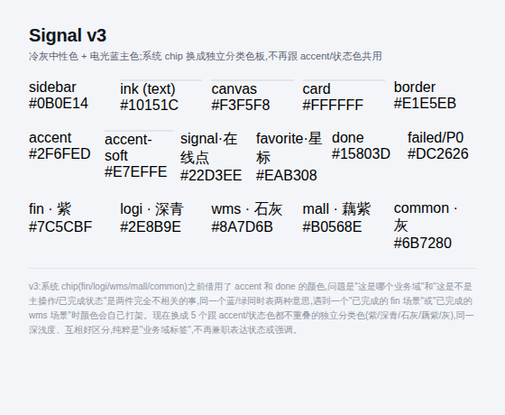

**基础尺度(字号 / 间距 / 圆角)**

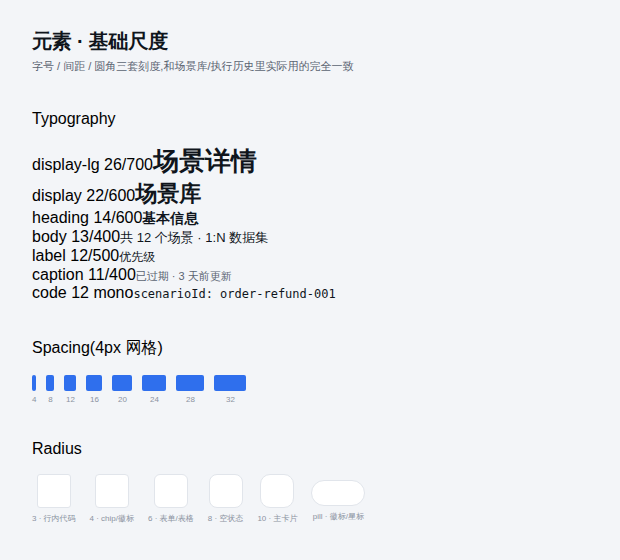

**核心组件(按钮 / 输入框 / Tabs / 空状态)**

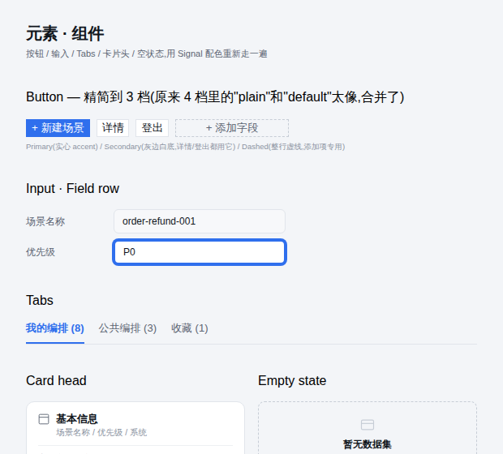

**弹窗 / 抽屉 / 下拉 / 提示条**

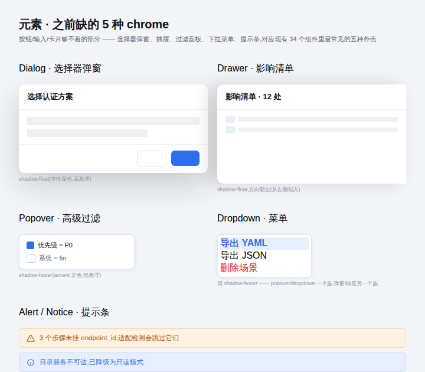

**常驻侧栏面板样式**


### 3.2 结构骨架

**四种页面骨架**

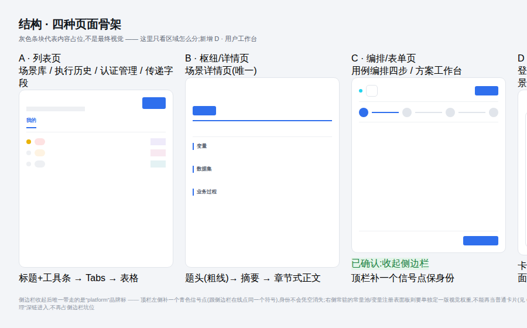

**模块地图(信息架构总览)**

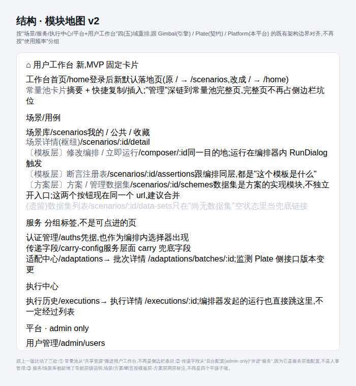

**场景库(不挂状态)与执行历史(状态在这)对比**


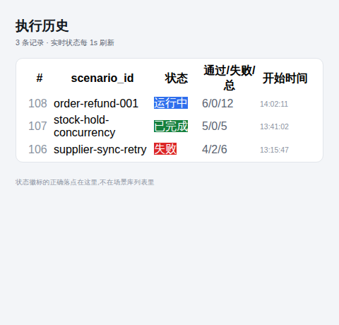

### 3.3 全路径页面渲染

| 路由 | 说明 | 截图 |
|---|---|---|
| `/home` | 用户工作台 | 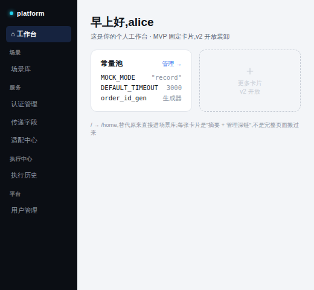 |
| `/scenarios/:scenarioId/detail` | 场景详情(枢纽),含断言覆盖率徽标 | 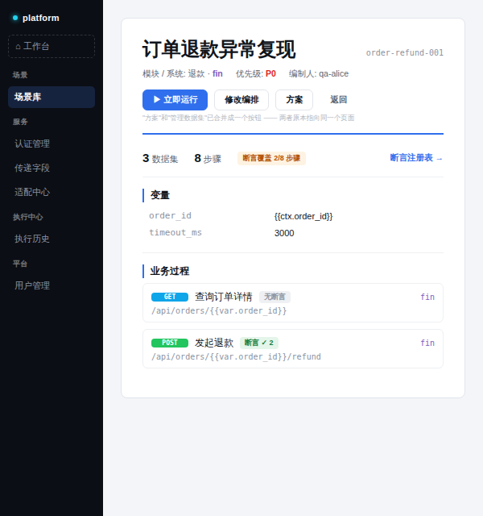 |
| `/composer/:scenarioId` | 编排器(Meta 步,侧边栏收起) | 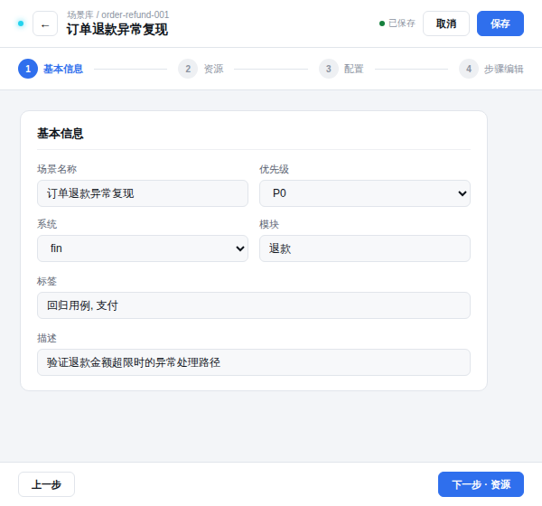 |
| `/scenarios/:scenarioId/schemes` | 方案工作台(侧边栏收起) | 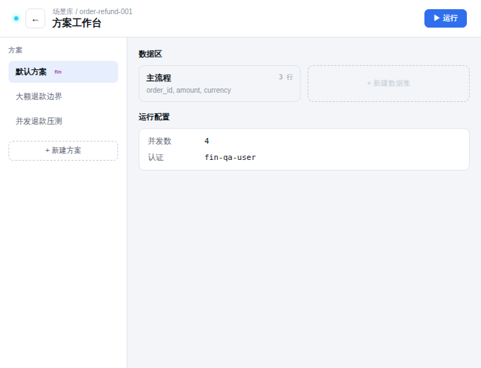 |
| `/scenarios/:scenarioId/assertions` | 断言注册表(侧边栏收起) | 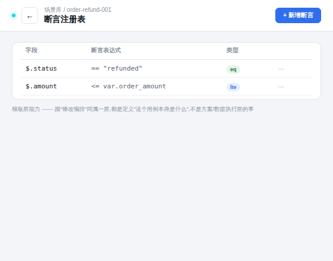 |
| `/executions/:id` | 执行详情 | 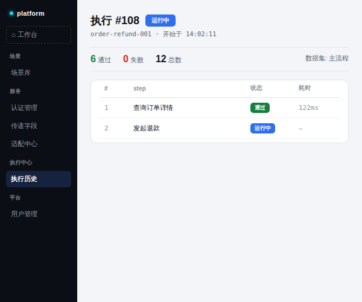 |
| `/auths` | 认证管理 | 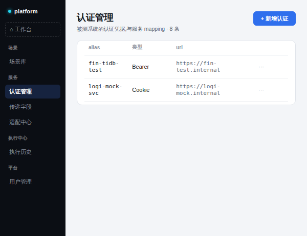 |
| `/carry-config` | 传递字段配置 | 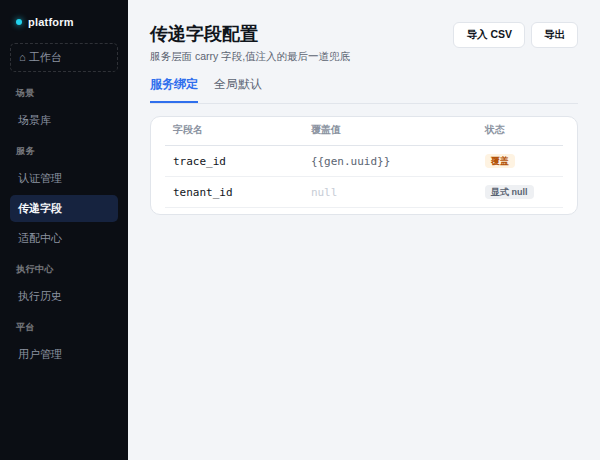 |
| `/adaptations` | 适配中心 | 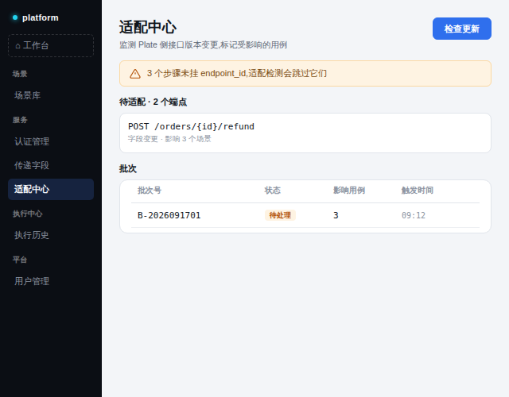 |
| `/admin/users` | 用户管理 | 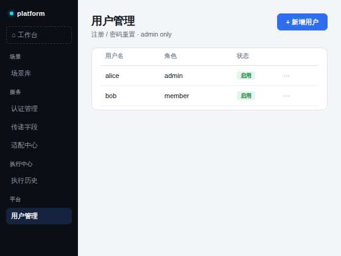 |
| 常量池完整页 `/constants` | 经工作台深链进入(侧边栏收起) | 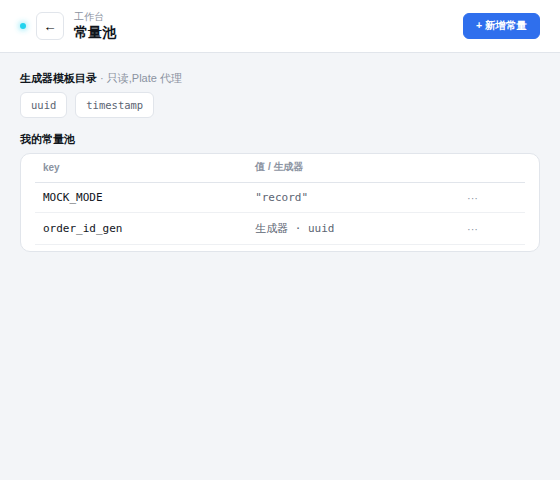 |

---

*未覆盖原型:登录/注册页、`/adaptations/batches/:batchId` 批次详情页——登录/注册与批次详情**已列入 Phase 2 迁移序列**(批次 1 / 批次 3),只是原型图暂不补齐,迁移时按 Signal 基础规范执行。遗留数据集列表页按 D1 退役,不需要原型。*
