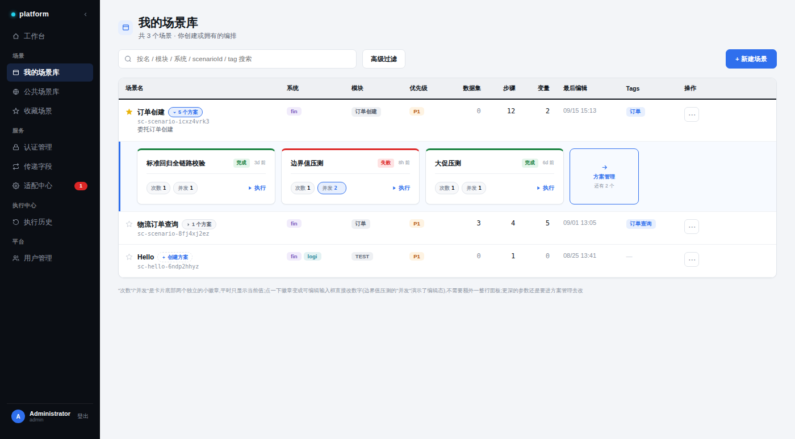
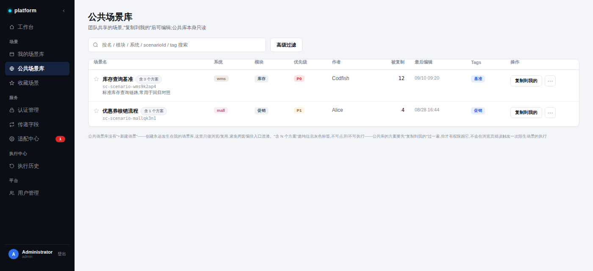
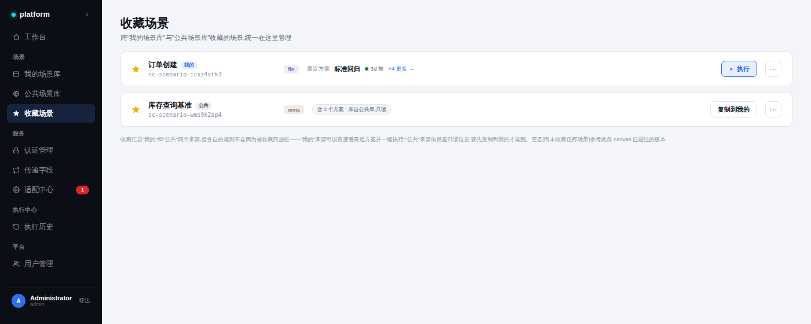

# 场景库设计方案

> 范围:`场景库` 模块——从原本"1 个页面 + 3 个 tab"拆分为「我的场景库 / 公共场景库 / 收藏场景」3 个独立页面,并重新设计了方案(Scheme)在列表层的交互。全部原型图见文末。

---

## 一、设计理念

### 1. 拆分而不是共用一张表

原来的"场景库"是一张表格配 3 个 tab(我的编排/公共编排/收藏),看起来是同一份数据换个过滤条件。但拆开来看,这三个视图的**操作和列本来就不一样**:

- 我的场景库需要"新建场景""方案管理"这类编排类操作;
- 公共场景库只能浏览和"复制到我的",没有编辑权;
- 收藏场景是跨来源的聚合视图,连表格结构都不适用(用了卡片列表)。

硬塞进一套 tab 假装是"同一张表换过滤条件",其实是在掩盖这个差异。拆成 3 个独立路由后,每个页面对自己的定位负责,侧边栏「场景」分组从 1 项变成 3 项,与「服务」分组的扁平风格保持一致,没有引入新的展开/折叠导航模式。

### 2. 预览与执行分离,但预览不是弹窗

场景库列表本身只做"发现"——用户想知道一个场景下有哪些方案、它们最近跑得怎么样。这个需求不该逼用户跳转到方案管理页面才能看到,但也不该用一个模态弹窗打断列表浏览的上下文。所以采用了**行内展开**的方式:点击场景名旁边的"N 个方案"徽章,在当前行下方原地展开方案预览面板,浏览完直接收起,不离开列表。

### 3. 能立刻做的事,不用先跳转

方案预览卡片上直接放了"执行"动作和"次数/并发"两个最常用的快捷参数,因为这两个操作**不需要先进入方案管理页面**就能确定要不要改。更深的参数(数据注入、变量覆盖)仍然只能在方案管理里改——原则是:高频、无副作用风险的轻量操作放在列表层,低频、有状态影响的深度配置留在专门页面。

### 4. 权限边界不因为视图切换而消失

收藏场景聚合了"我的"和"公共"两个来源,但没有因为聚合就统一放宽权限——"我的"来源的收藏项依然能直接执行,"公共"来源的收藏项依然是只读、必须先复制到我的。规则跟着数据的原始归属走,不跟着当前视图走。

---

## 二、具体功能设计

### 2.1 场景库三页拆分

| 页面 | 定位 | 与"我的场景库"的差异点 |
|---|---|---|
| 我的场景库 | 你创建或拥有的编排,可新建、可管理方案 | 基准版本,以下两列是相对它的差异 |
| 公共场景库 | 团队共享场景,只读,复制后才能编辑 | 无"+新建场景";方案信息变成灰色的只读标签"含 N 个方案",不可点开、不可执行;操作按钮从"方案"变成"复制到我的" |
| 收藏场景 | 跨"我的/公共"两个来源的收藏聚合 | 改用卡片列表(不是表格),每张卡按来源(我的/公共)分别继承对应页面的方案交互规则,不做统一处理 |

创建入口只保留在"我的场景库"一处,避免出现两套编排入口造成混淆。

### 2.2 "N 个方案"入口:从按钮到行内预览

原来是一个孤立的"方案"文字按钮,在"操作"列里跟"⋯"菜单挤在一起,还要横跨系统/模块/优先级等好几列才能从场景名看到它。现在的设计:

- **位置**:挪到场景名右侧,做成一个小圆角 chip("⌄ 5 个方案"),跟场景名同一视觉单元,不用跨列寻找。
- **交互**:点击展开/收起行内预览面板,面板背景用浅蓝底 + 左侧 3px 蓝色描边(复用已有的 docked-panel 视觉语言),跟场景库本身的白底表格区分开。
- **数量上限**:面板最多展示前 3 个方案(按位置排序),超过 3 个时末尾出现一个"→ 方案管理"入口块,注明"还有 N 个",点进去看完整列表、新建方案都在方案管理页完成——**行内预览不做新建**,新建能力收回到专门页面,职责单一。
- **0 个方案的场景**:chip 直接变成虚线的"+ 创建方案",跳过"点开一个空面板"这一步,点了直接进方案管理创建第一个方案。

### 2.3 方案卡片:次数 / 并发 的点击可配置

每张方案预览卡片(210px 宽)结构:

- **卡头**:方案名(超长自动省略号截断)+ 状态徽标(完成/失败,复用平台统一的状态色 token)+ 相对时间(灰色,不跟状态共用颜色)
- **卡身**:两个独立的小徽章——**"次数 1"** 和 **"并发 1"**,默认只显示当前值;点一下徽章,变成可编辑的输入框,直接改数字,不需要额外展开一整块面板或步进器。改完点"执行"就按新值跑。
- **执行按钮**:直接触发执行,**不弹出执行配置弹框**——这是刻意的:这里定位是"用已知配置快速再跑一次",不是"从头配置一次新的执行"。如果需要更复杂的参数(数据注入、变量覆盖等),要通过卡片进方案管理去改。

卡片顶部有一条 3px 的状态色描边(绿色=完成,红色=失败),配合卡身的阴影和圆角,跟工作台模块的卡片视觉语言保持统一,不是这个页面单独一套样式。

### 2.4 表格标题行

场景表格的表头(场景名/系统/模块/……)加重了视觉权重,不再是跟数据行同一片白底、靠一条细线撑着:

- 背景填充浅灰色 `#EEF0F3`,跟下方白色数据行形成实际色块分界
- 文字从弱化的浅灰改成近黑加粗,一眼能看清列名
- 底部分隔线加粗到 2px、颜色改为深色(跟正文文字同色),作为表头和数据区之间明确的分界线

---

## 三、原型图

### 3.1 我的场景库 —— 方案预览 + 次数/并发点击编辑 + 就地执行

### 3.2 公共场景库 —— 方案只读标签,复制后才能操作

### 3.3 收藏场景 —— 卡片列表,按来源分别继承规则

