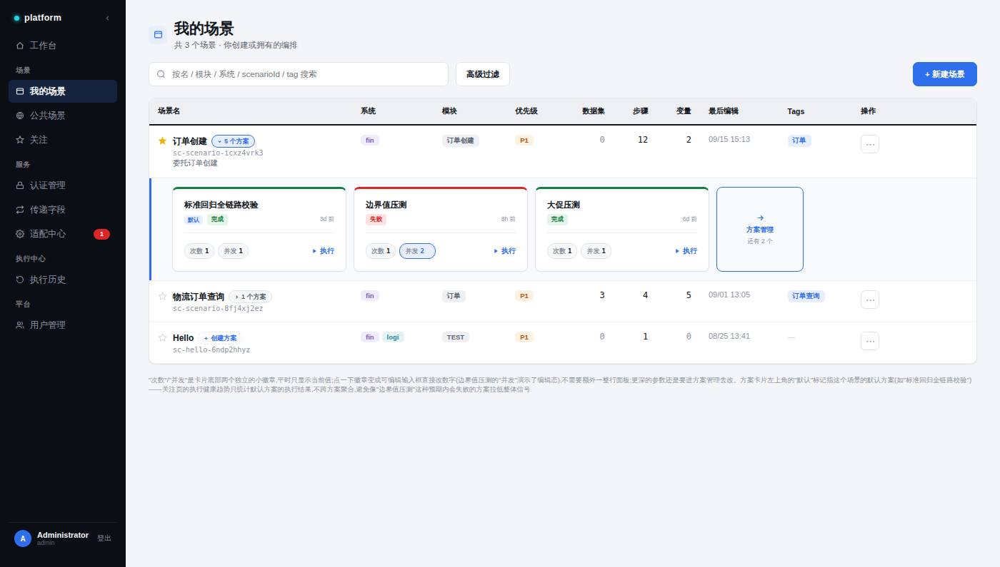
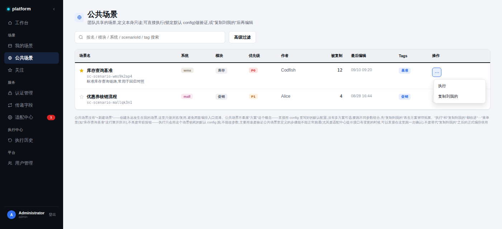
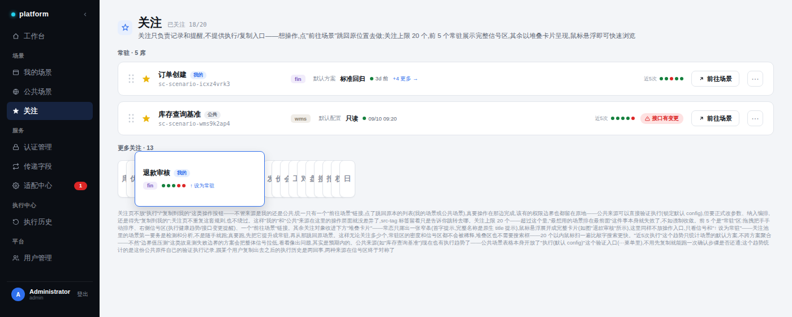

# 场景库设计方案 — 我的场景 / 公共场景 / 关注

## 一、整体拆分逻辑

场景库拆成三个独立页面,而不是一张表加筛选条件,是因为三者的**定位、可执行的操作、面向的用户心态**本质不同,硬塞进一张表会互相打架:

| 页面 | 定位 | 核心心态 |
|---|---|---|
| **我的场景** | 编排工作台 | "我在这里创建和维护我的编排" |
| **公共场景** | 统一模板库 | "我在这里找现成的、可信的业务流程范本" |
| **关注** | 个人追踪清单 | "我在这里盯着几个我最关心的场景的健康状况" |

三个页面共用同一套视觉语言(见第五节设计系统),但信息结构、可执行的操作、页面容量上限都是各自独立设计的。

---

## 二、我的场景

### 功能

- 用户自己创建和拥有的编排场景,唯一的创建入口(`+ 新建场景`)。
- 表格形态,列:场景名、系统、模块、优先级、数据集、步骤、变量、最后编辑、Tags、操作。
- 场景名列内嵌"方案数量"chip(如"▾ 5 个方案"),点击展开一个内联预览面板,平铺展示最多 3 个方案卡片 + 一个"方案管理"跳转 tile(方案数超过 3 个时显示"还有 N 个")。
- 方案卡片(210px 宽)结构:
  - 卡片顶部有一条状态色描边(绿=完成,红=失败),代表这个方案最近一次执行的结果。
  - 卡头分两行:第一行是方案全名(超长省略号截断,hover 有完整 title);第二行左边是可选的"默认"徽章(蓝色小胶囊,只有场景的默认方案才有)+ 状态 chip,右边贴边是相对时间。
  - 卡片底部一行:"次数""并发"两个独立的小徽章,平时只显示当前值,点一下变成可编辑输入框直接改数字(不需要额外弹一整层面板);最右边是"▶ 执行"文字链接。
  - 没有方案的场景(如示例里的"Hello")用虚线"+ 创建方案"chip 代替数量 chip,点击不会有展开面板。
- 场景名前的★星标是"关注"入口:点击关注/取消关注,已关注填充黄色,未关注是描边空心。

### 边界

- 场景的创建、方案的增删、参数的深度编辑都**不在**这张表格里完成——表格只负责列表浏览、快速预览方案状态、次数/并发这两个轻量参数的即时调整;更深的改动要跳去"方案管理"。
- 不做跨方案的聚合展示——每个方案卡片是独立的,没有一个"这个场景整体健不健康"的汇总指标(这个汇总指标属于"关注"页的职责,见第四节)。

### 样式要点

- 页面标题左侧 26×26 的 `icon-badge`(浅蓝底 `#E7EFFE` + 蓝色文件夹图标 `#2F6FED`),整个场景库三个页面统一用这个尺寸和配色的图标徽章,只换图标形状。
- 表格外层包一个 `.lib-card`(白底、`1px solid #E1E5EB` 边框、10px 圆角、极浅阴影)。
- 表头(`thead`)是本页反复打磨过的重点:`#EEF0F3` 灰底填充、`#10151C` 深色加粗文字、`2px solid #10151C` 黑色底边线——这个"填色+黑线"组合是经过 3 轮迭代定下来的(浅灰底不够显眼 → 加深底色 → 加粗蓝线 → 最终改黑线),现在是三个场景页表头的统一标准。
- 方案卡片的"默认"徽章样式:`8px` 字号、`#2F6FED` 蓝字、`#E7EFFE` 浅蓝底、`4px` 圆角小胶囊,永远只出现在被指定为默认的那一张方案卡上。这个标记不只是视觉强调——"关注"页统计的执行健康趋势,只认这张卡的执行记录。

---

## 三、公共场景

### 功能

- 团队共享的"统一模板"库,定位是业务流程的canonical范本,不是每个人各自维护的编排。
- 没有"+ 新建场景"——创建永远发生在"我的场景",这里只做浏览和复用,避免两套编排入口互相混淆。
- 表格列:场景名、系统、模块、优先级、**作者**、**被复制**(次数,反映这个模板被多少人采纳过,是可信度的间接指标)、最后编辑、Tags、操作。
- 场景名列**不出现方案数量 chip**——公共场景不暴露"方案"这个概念,直接用 config 里写好的默认配置跑,没有多方案可选。
- 操作列合并成一个 `⋯` 按钮,点开是下拉菜单:
  - **执行**——用这个场景锁死的默认 config 跑一次,不能改参数。主要用途是验证:这个模板定义的步骤现在还能不能正常跑通(尤其是适配中心提示"接口有变更"的时候,可以直接在这里确认一次),不是日常编排的正式入口。
  - **复制到我的**——把这个模板复制成一份用户自己的场景,复制之后才能改参数、拆分多方案、正式纳入编排使用。
- 场景名前同样有★关注入口,机制跟我的场景一致。

### 边界

- **定义本身只读**——不能在这张表格里编辑步骤、改 config、拆分方案。执行只是"跑一次锁死的默认配置来验证",不等于开放了编辑或自定义参数的权限;要真正基于这个模板做事,必须先复制。
- 不做"发布到公共"的入口——MVP 阶段明确不考虑这个方向,只做"消费"公共模板,不做"生产"。
- 优先级、适配状态等字段目前只做展示,没有做二次加工(比如按优先级自动排序公共列表)。

### 样式要点

- 页面标题的 `icon-badge` 用地球图标(蓝色描边圆+经纬线),配色跟我的场景的 `icon-badge` 完全一致(同尺寸、同浅蓝底),只是图标形状换成"公共/全局"的语义。
- 表格容器、表头样式跟我的场景**逐像素对齐**(同一套 `.lib-card` + 表头规范),这是特意做的一轮视觉统一,此前公共场景的表头、图标尺寸、卡片容器都是独立实现,和我的场景不一致,后来专门对齐过。
- `⋯` 下拉菜单是这次新加的组件:白底、`1px solid #E1E5EB` 边框、`8px` 圆角、`0 6px 16px rgba(16,21,28,.14)` 阴影,菜单项 `padding:7px 8px`、悬浮态 hover 高亮(圆角矩形背景)。菜单文案刻意做到最简——"执行""复制到我的"各自只有两三个字,不带图标、不带括注(如"(默认 config)"这种解释性文字在最终版被去掉了,因为按钮语义已经通过菜单本身的克制程度传达清楚)。

---

## 四、关注(原"收藏")

### 功能

- 从"收藏"升级来的概念——不再是一个简单的书签列表,而是一个**跨来源的主动追踪清单**:汇总来自"我的场景"和"公共场景"两边被标记关注的场景,统一在一个地方看它们的健康状况。
- **人数上限 20**,超过这个量"把最想用的排在最前面"这件事本身就失效了,所以强制收敛,不做无限列表。
- 页面内部分两层:
  - **常驻(5 席)**:完整卡片,横向信息流——拖拽把手(手动排序)、★关注状态、场景名+来源标签(我的/公共)+ ID、系统 chip、"默认方案/默认配置"+ 名称 + 状态点 + 时间、**信号区**、一个"↗ 前往场景"链接、`⋯` 更多菜单。
  - **更多关注(其余,示例里是 13 个)**:堆叠卡片——常态只露出一张窄条,显示场景名的首字(完整名称走原生 `title` 悬浮提示);鼠标悬浮展开成一张完整的小卡片(示例用"退款审核"演示了这个态),展开后只有信号信息 + 一个"↑ 设为常驻"链接。
- **信号区**是"关注"页真正的核心价值——不是单一指标,而是这个场景所有值得主动提醒的动态的集合:
  - **执行健康趋势**(近 5 次成功/失败的小圆点):"我的"来源统计的是该场景**默认方案**的执行记录;"公共"来源统计的是这份公共原件自己的**验证执行**记录(来自公共场景⋯菜单里的"执行"),两者现在都有,不再有来源差异。这个趋势故意只锁定默认方案/原件本身,不跨方案聚合,避免像"边界值压测"这类故意测失败边界的方案把整体信号拉低,造成"看着像出问题、其实是预期内"的误判。
  - **接口变更提醒**(红色徽章"⚠ 接口有变更"):两种来源都可能触发,数据来自适配中心的检测结果,是之前讨论中搁置的"公共场景适配状态提示"需求最终落地的地方——不放在公共场景表格行上,而是放在关注页的信号区。
  - 两类信号都是**规则驱动、自动展示**,不给用户配置项——有数据就显示,没有就留白,不需要用户手动开关。

### 边界

- **关注页本身不提供任何操作按钮**(不放"执行"、不放"复制到我的")——它的职责被严格限定在"记录和提醒",不是又一个可以直接操作场景的入口。想执行、想复制,点"前往场景"跳回原本的列表页(我的场景或公共场景),在那边完成,该有的权限规则(公共定义只读、要正式改动得先复制)都留在原地生效,关注页既不重复这套规则也不绕过它。
- 正因为操作层面被拿掉了,"我的"和"公共"两种来源在关注页的**操作体验完全没有差异**——统一都是"前往场景"一个按钮,`src-tag` 标签只是告诉你点了会跳去哪,不再对应不同的按钮样式。
- 堆叠区不提供搜索框——量级被 20 个上限卡死之后,鼠标扫一遍比敲字搜索更快,做搜索反而是给一个不存在的问题找解法。
- 堆叠区同样不放"执行"/"复制"——这一层的定位是"检测和分析的候选池",不是操作入口;真要动手,先点"↑ 设为常驻"把它提升到常驻区,常驻区才有跳转按钮。

### 样式要点

- 页面标题的 `icon-badge` 用星形图标(跟场景行前的★关注图标同一个 path),配色延续统一的浅蓝底+蓝色描边方案,而不是用星标本身的黄色——这是为了让三个场景页的 `icon-badge` 保持"同一套配色语言,只换图标形状"的规则,黄色只保留给"这一行已经被关注"的状态指示,不用在页面级图标上。
- 常驻卡片是 `.fav-card`(白底、`1px solid #E1E5EB`、10px 圆角),跟"我的场景"的方案卡片、公共场景的下拉菜单共享同一套圆角/边框/极浅阴影的基础语言,但内部横向信息流布局是关注页独有的。
- 堆叠卡片(`.stack-card`)常态是 26px 宽、64px 高的窄条,层叠效果靠 `margin-left:-13px` 的负边距做出来;首字用 13px 加粗灰字(`#8B93A1`)居中显示。曾经尝试过用 `writing-mode: vertical-rl` 让窄条里显示完整场景名的竖排文字,但渲染出来的中文字符重叠糊成一团,不可读,最终放弃这个方案,改成"首字 + 原生 title 悬浮提示"这个更可靠的做法。
- 悬浮展开态(`.stack-card.hover-demo`)放大到 200px 宽、76px 高,边框变成强调色 `#2F6FED`,配 `0 8px 18px rgba(16,21,28,.16)` 的明显阴影,营造"浮出来"的层次感。
- "已关注 18/20"这个计数用等宽字体(`ui-monospace`)显示在页面标题右侧,强调这是一个精确数字,不是模糊的估量。

---

## 五、跨页设计系统(共用规范)

### 色板
| 用途 | 主色 | 浅底色 |
|---|---|---|
| 强调色/链接/主按钮 | `#2F6FED` | `#E7EFFE` |
| 成功/完成 | `#15803D` | `#E4F5EA` |
| 失败/错误 | `#DC2626` | `#FEE2E2` |
| P1/警示 | `#B45309` | `#FEF3E2` |
| 分类标签(按业务系统):fin | `#7C5CBF` | `#F1ECFB` |
| 分类标签:wms | `#8A7D6B` | `#F0EDE8` |
| 分类标签:mall | `#B0568E` | `#FBEAF3` |
| 分类标签:logi | `#2E8B9E` | `#E3F2F3` |

### 文字色阶
主文字 `#10151C` / 次文字 `#5B6472` / 弱化文字(id、时间戳等) `#8B93A1`

### 边框与背景
描边 `#E1E5EB` / 分隔线 `#EEF0F3` / 画布底色 `#F3F5F8` / 侧边栏底色 `#0B0E14`

### 复用组件
- **`.icon-badge`**:26×26px,7px 圆角,浅色底 + 对应主色描边图标。三个场景页标题统一用这个组件,只换图标(我的场景=文件夹,公共场景=地球,关注=星形)。
- **`.lib-card`**:表格外层容器统一样式——白底、`1px solid #E1E5EB`、10px 圆角、`0 1px 2px rgba(16,21,28,.04)` 极浅阴影、`overflow:hidden`。
- **表头规范**:`#EEF0F3` 填充底色、`#10151C` 加粗深色文字、`2px solid #10151C` 黑色底边线——三个场景页表格统一执行。
- **`.chip`**:9.5px 加粗文字,彩色小胶囊,用于系统/模块/tag 等分类标签。
- **★关注星标**:所有场景行(我的场景、公共场景)统一用同一个 path 的星形 icon,已关注=`#EAB308` 黄色实心,未关注=`#C7CDD6` 灰色描边空心。

