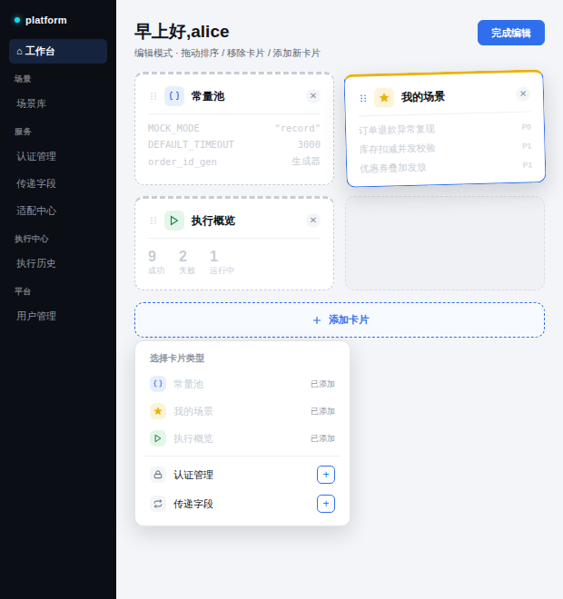
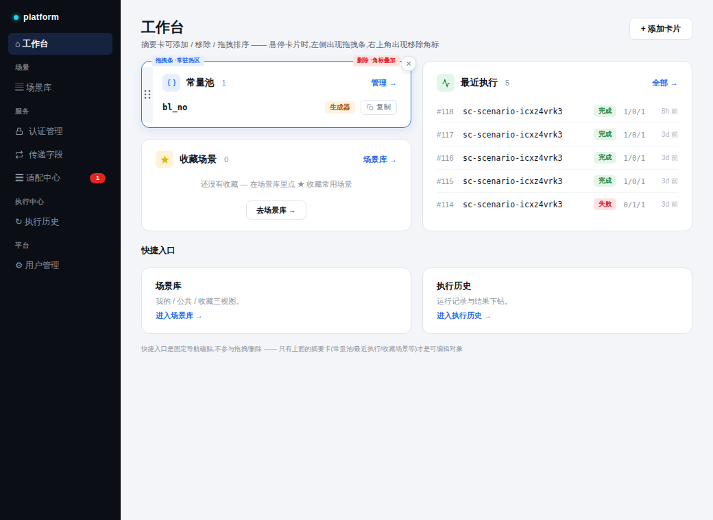
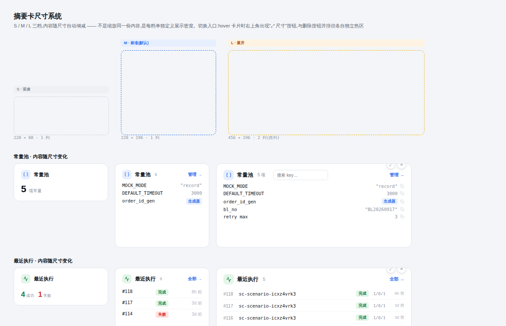

# 工作台摘要卡设计文档

> 范围:`/home` 用户工作台的摘要卡系统(常量池 / 最近执行 / 收藏场景 / 适配待办等)。基于 Signal 视觉体系与已实现的真实前端(截图对照),完成常态样式、编辑态交互(拖拽/删除)、尺寸系统(S/M/L)三部分设计。全部原型图见文末。

---

## 一、设计目标

工作台摘要卡是"卡片 = 摘要 + 管理深链"模式的落地载体——每张卡不是把完整页面搬过来,而是给一个关键信息的浓缩视图 + 一个跳转深链。这轮设计要解决三个问题:

1. **常态视觉**:卡片之间要有清晰的层次感,各功能区(标题/计数/深链/正文/操作)不互相干扰。
2. **可编辑**:用户要能添加、移除、拖拽排序卡片,交互控件的位置不能跟卡片本身的导航操作(如"管理→")打架。
3. **可伸缩**:同一张卡在不同尺寸下应该展示不同密度的内容,而不是简单缩放。

---

## 二、常态卡片:视觉层次

每张卡遵循统一结构:

- **顶部 3px 分类色边** —— 复用图标语义色(蓝/金/绿/琥珀),不引入新颜色,用户一眼扫过就能分辨卡片类型。
- **卡头与卡身用分隔线隔开** —— 标题区(图标 + 标题 + 计数)与右侧"管理→"深链天然分区,不会挤在一起。
- **hover 抬升** —— 卡片 hover 时用 `shadow-hover`(accent 色调、低阴影)语义抬升,呼应此前定稿的 chrome 阴影规则。
- **行内操作独立** —— 常量池每行常量旁的"复制"图标默认低透明度、悬浮态才增强,不会抢主内容(key/value)的视觉权重。这个细节是对照真实前端截图(常量池行内"复制"按钮)反推出来的,之前的原型遗漏了这个交互。

---

## 三、编辑态:拖拽手柄与删除按钮的位置

对照真实前端实现(截图:工作台副标题已写明"摘要卡可添加 / 移除 / 拖拽排序"),这是常态能力,不需要单独的"编辑模式"开关。因此两个控件都做成 **hover 时才显现**,默认不占视觉空间:

| 控件 | 位置 | 理由 |
|---|---|---|
| 拖拽手柄 | 卡片左边缘,16px 宽的纵向抓取条(贴内侧圆角) | 抓取面积远大于单个小图标,不用精确对准;完全在卡片内容区之外的预留区,不跟标题/正文抢位置 |
| 删除按钮 | 卡片右上角,半悬浮在边框外的圆形"✕"徽标(类似可关闭标签页) | 不放在卡头那一行跟"管理→"抢位置;因为是叠加在边框外的独立视觉元素,跟导航类操作(留在卡头原位)永远不会互相干扰 |

拖拽演示:被拖起的卡片用轻微旋转 + 阴影抬升表示"提起"状态,原位置留一个虚线空位。

添加卡片:网格末尾是常驻的"+ 添加卡片"虚线条,点开弹出类型选择面板——已添加的类型置灰显示"已添加",未添加的(如认证管理、传递字段)带"+"按钮开放添加,回答了"卡片池要不要扩展到服务类模块"的问题。

---

## 四、尺寸系统:S / M / L

同一张卡在不同尺寸下**独立定义展示密度**,不是等比缩放同一份内容:

| 档位 | 尺寸 | 内容规则 |
|---|---|---|
| S · 紧凑 | 220 × 88,占 1 列 | 只出结论(一个大数字/状态),不出列表。适合"扫一眼有没有异常"的场景 |
| M · 标准(默认) | 220 × 196,占 1 列 | 出 3~5 行核心内容,即目前的默认设计 |
| L · 展开 | 456 × 196,跨 2 列 | 更多行 + 该卡片专属的辅助操作(如常量池在 L 档多了搜索框,因为常量数量多了以后翻找是真实需求) |

用"常量池"(键值表)和"最近执行"(日志列表)两种不同数据结构分别验证了一遍,确认这套系统能覆盖不同内容形态。

尺寸切换入口:hover 工具条里"⤢ 尺寸"和"✕ 删除"两个按钮并排,各自独立热区,互不影响。S 档卡片太窄放不下工具条,改为长按/右键呼出同一菜单——能力不打折,只是入口形式变了。

---

## 五、原型图

### 5.1 常态卡片(含层次感 / hover 示例)

### 5.2 编辑模式(拖拽排序 / 移除 / 添加卡片)

### 5.3 对照真实实现 —— 拖拽条 + 删除角标定位方案

### 5.4 卡片尺寸系统(S / M / L)

