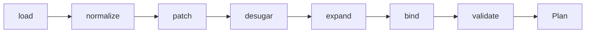
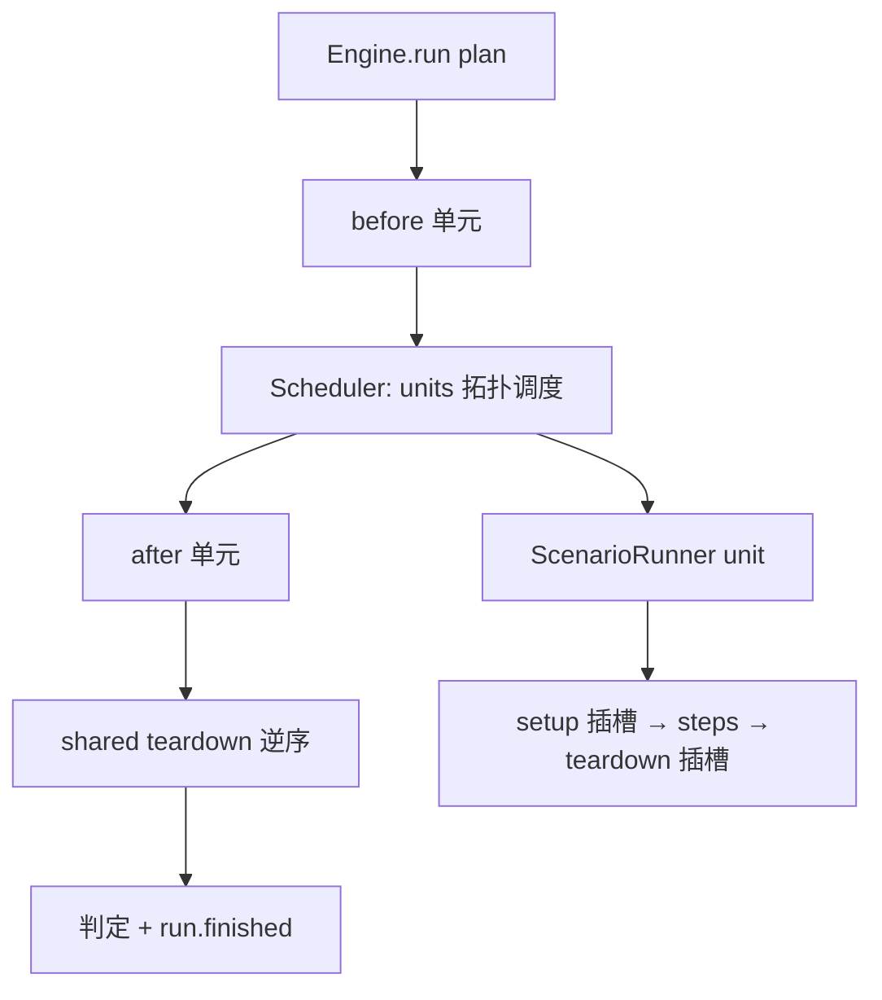

# GIMBAL 执行器重构方案 v2

Sep 25, 2026 · @Codfish

## 定位与原则

本方案取代《GIMBAL 执行器 / Suite 改造总案》中执行器部分的实现口径；plate 与平台侧只列同步点，另行讨论。总案中的结构性决策（编译期摊平、静态分析推导输入输出、单元级并发、调试收敛为插件、否决续跑与造数复用）全部保留，回收的只是为兼容而存在的设计。

1. **不留兼容层**：旧形式一次性脚本迁移，不保留语法糖、别名、双写、占位实现。
2. **概念最少**：执行器只有五个核心概念——扩展注册、Plan/Unit、调用结果、拦截 hook、事件。
3. **统一机制、不统一接口**：注册、参数声明、查找、描述导出统一；各扩展点的调用接口各自独立、强类型。
4. **一条执行路径**：单场景与 suite 都编译成 Plan，经同一个调度器执行。
5. **编译期摊平**：复杂度压进纯函数编译管线；运行期只剩拓扑调度与输入注入。
6. **拦截与观察二分**：hook 只做同步拦截并返回决策；一切观察走事件总线。
7. **引擎只改结构缝、不改语义**：状态机四阶段、策略分发、四层上下文保持不变。
8. **不新增模块**：落在现有目录；空壳删除，用到时再建。

## 相对改造总案的变更

共 14 处变更：8 处回收兼容设计，6 处结构调整。

### 回收的兼容设计

| 总案原决策 | 原理由 | 本版 |
| --- | --- | --- |
| `api` 永久合法糖 + 编译归一化（决策 10） | 存量零迁移 | 只保留 `call: {protocol, …}`；存量脚本迁移 |
| 断言路径 `$.response_body…`、scratch 键、`HTTP_BEFORE_SEND/AFTER_RECV` 不动 | 插件与断言不改 | 统一为 CallResult 形状与 `CALL_BEFORE/CALL_AFTER` |
| E2 v1 事件文件 + stdout 终态 JSON（决策 12） | 平台解析不破 | stdout 逐行事件，终态为最后一条 `run.finished` |
| 日志文本 + NDJSON 双写 | 平台过渡 | 只写结构化日志 |
| poll/sql/sleep/chaos/composite 占位改 ERROR | 保留占位 | 删除，用到时再实现 |
| `SESSION≈SUITE`、RuntimeControl、Setup/Teardown 占位类 | 过渡 | 删除 |
| run match 作为别名 | 兼容旧命令 | 删除 |
| server 舰队参数保留不激活 | 预留 | 删除 |

### 结构调整

| 项 | 总案 | 本版 | 理由 |
| --- | --- | --- | --- |
| 单场景执行路径（D-02） | 直接走 ScenarioRunner，不经 suite | 编译为单单元隐式 aggregate Plan | n\_runs/retry/parallel 只实现一次 |
| hook 语义 | 干预 + 观察双语义 | hook 只拦截；观察全部是事件订阅 | 去掉风险第 2 位的双语义设计 |
| 认证 | authenticator 按 URL pattern 独立注册 | 并入协议适配器的 `login` | 凭证形态由协议决定 |
| 引擎改动范围 | 引擎本体零改造 | 改四处结构缝：调用分派、失败拦截、Archive 键空间、生命周期插槽 | 缝不改，后续每项都要绕行 |
| preprocessor/ | 独立 | 并入 compiler/ 作为 normalize 阶段 | 少一个模块；`${auth.*}` 改运行期解析 |
| 空壳目录 | 随项启用或删除 | repository/、observability/、resource/ 立即删除 | 不留占位 |

## 核心概念

执行器由五个概念构成，其余能力都是它们的组合或注册实现。

### 1. 扩展注册

一个泛型 `Registry[T]` 承载四张表。统一的是身份、参数声明、注册方式与描述导出；调用接口各自独立。

```python
class Registry(Generic[T]):
    def register(self, name: str, params: type[BaseModel]): ...   # 装饰器
    def get(self, name: str) -> tuple[type[BaseModel], T]: ...     # 未知名字 → CompileError
    def describe(self) -> list[dict]: ...                          # name + JSON Schema
```

| 表 | 接口 | 调用时机 | 内容 |
| --- | --- | --- | --- |
| strategy | `execute(ctx, params) -> StrategyResult` | 运行期，按状态机阶段 | extract / assign / assertion / 生命周期条目 kind |
| protocol | `render` / `send` / `login` / `redact` | 运行期，CALLING 阶段 | http（首个） |
| mode | `desugar(suite, params) -> Graph` | 编译期 | aggregate / compose / fanout / chain |
| plugin | 声明订阅的事件与拦截点 | 运行期 | debugger、pause\_on\_failure、reporter、sink |

- 规则：外部可能新增、且需要按名字从声明中引用的能力，才是注册点。reporter / sink 是 plugin，不单列；调试会话命令属于 debugger 内部，不注册。
- 生命周期条目（setup / teardown 的 `kind`）从 strategy 表查找，策略声明自己的适用位置（step / 生命周期插槽）。
- 内置与外部同一种注册方式；外部经 `-P` 或 suite `plugins` 加载。`ext list --json` 即四张表的 `describe()` 之和。
- 参数在编译期用 `Params` 校验，运行期拿到的是已校验的强类型对象。

### 2. Plan / Unit

所有 run 命令都先编译出 Plan，再交调度器执行。run scenario 是只有一个单元的隐式 aggregate Plan。

```python
class Unit(BaseModel):
    id: str                    # 别名 + 展开序号，事件 / 清单 / 台账的 join 锚点
    scenario: Scenario         # 生效副本，即快照
    inputs: dict[str, Any]     # 统一注入原语：连线 / step_from / --var
    needs: list[str]           # 上游 unit id
    shared_key: str | None     # 非空即 shared，按 key 去重
    policy: UnitPolicy         # n_runs / retry / timeout / lock

class Plan(BaseModel):
    units: list[Unit]
    before: list[Unit]
    after: list[Unit]          # suite 级括号，全模式可用
    policy: PlanPolicy         # parallel / fail_fast / timeout
```

- 调试只在 Plan 恰好一个单元、n\_runs = 1 时允许，与 D-12 一致。
- suite 不改写 scenario 的业务内容，只通过补丁产出生效副本。

### 3. 调用与协议

step 只写 `call`，协议细节只存在于适配器内部；适配器产出唯一的证据形状 CallResult，下游一律只认它。

```yaml
call:
  protocol: http        # 缺省 http
  service: order
  user: buyer           # users 标签
  method: POST
  path: /orders
  body: {...}
```

```python
class CallResult(BaseModel):
    protocol: str
    request: dict          # 渲染后、已脱敏
    response: dict         # {status, meta, body}；body 归一为 JSON
    elapsed_ms: float
    auth_expired: bool = False

class ProtocolAdapter(Protocol):
    Params: type[BaseModel]                               # 该协议的 call 字段
    def render(self, spec, ctx) -> dict: ...              # 模板渲染后的请求
    def send(self, request: dict, cred) -> CallResult: ...
    def login(self, user: UserSpec, ctx) -> Credential: ...  # 认证并入协议
    def redact(self, request: dict) -> dict: ...          # 证据脱敏
```

- `render` 与 `send` 分开，是为了让 `CALL_BEFORE` 拦截（调试改待发请求）有落点。
- 断言与 extract 路径统一为 `$.response.status`、`$.response.meta.*`、`$.response.body.*`；scratch 只存一个 `call` 键。
- 凭证缓存按 (protocol, user 标签) 管理：运行开始预认证、单飞刷新；`auth_expired` 时运行时重新 `login` 并重发一次。
- services 配置带 protocol：`{name: {protocol, base_url…}}`，由对应适配器解释。

### 4. 拦截 hook

hook 是同步拦截点，返回唯一决策类型；不承担观察。

| 拦截点 | 位置 | 可返回 |
| --- | --- | --- |
| STEP\_BEFORE | step 进入 BEFORE\_REQUEST 前 | CONTINUE / SKIP / ABORT |
| CALL\_BEFORE | render 之后、send 之前 | CONTINUE（可带请求补丁）/ ABORT |
| CALL\_AFTER | send 之后、AFTER\_REQUEST 前 | CONTINUE / RETRY / ABORT |
| STRATEGY\_BEFORE | 单条策略执行前 | CONTINUE / SKIP / ABORT |
| STEP\_FAILED | step 失败后、teardown 前 | CONTINUE / RETRY / SKIP / ABORT |

```python
class Decision(BaseModel):
    action: Literal["continue", "retry", "skip", "abort"] = "continue"
    patch: dict | None = None      # 仅 CALL_BEFORE
    by: Literal["auto", "human"] = "auto"
```

- RETRY = 整步重跑（从 PENDING 走全流程），extract → promote 幂等覆盖。`by=human` 的 RETRY 后通过，标记为 repaired，不计入正常通过率。
- 多个拦截者按注册顺序串行；第一个非 continue 的决策生效。
- 并发时拦截在单元线程内联执行；插件声明 `thread_safe`，否则按插件加锁串行。

### 5. 事件与输出

事件是唯一的观察通道与对外契约；日志是诊断流，不承担契约。

```python
class Event(BaseModel):
    v: int; seq: int; ts: float
    run: str; unit: str | None; step: str | None
    kind: str        # lifecycle.* / call.* / strategy.* / debug.* / audit.*
    data: dict
```

- seq 在总线锁内分配；订阅者由现有 BATCH 单线程派发，不阻塞执行线程。
- 输出 = 事件订阅者：console（人读渲染）、jsonl（stdout）、file、sse。`--output` 只是选择 sink。
- stdout 只输出事件；最后一条 `run.finished` 携带判定结果与计数。调用方读最后一行即得结果。
- 证据出口硬约束：请求经 `redact`，body 超过上限截断并标记。
- 日志：标准 logging + contextvar（run / unit / step）+ JSON formatter，写 stderr 或文件；category 由 logger 名静态映射。
- 判断规则：值得进报告 / 台账的结果性信息 → 事件；过程叙述 → 日志；拿不准时进日志。

## 编译管线

编译是七个纯函数的串联，输入是源文件与调用参数，输出是 Plan；`compile`、`validate`、`--dry-run`、`resolve` 都是它的不同截断。



| 阶段 | 输入 → 输出 | 要点 |
| --- | --- | --- |
| load | 路径 / --where → 源 Scenario、Suite | 检索器只做直接字段；默认排除 expire |
| normalize | 源 → 强类型 | call 字段经适配器 `Params` 校验；策略与生命周期 kind 查表；原 preprocessor 并入 |
| patch | 五层 → 生效副本 | 源 → suite 补丁 → 单元补丁 → 调用参数；合并代数见下 |
| desugar | Suite → Graph | 按 mode 查表；fanout / chain 展开为 compose 形态 |
| expand | Graph → Units | 数据集行 × 注入变体 × repeat；计划清单上限闸 |
| bind | Units → 连线 | 静态分析输入输出；上游输出接下游 inputs；同名冲突报错，用 `map` 改名 |
| validate | 全图 | 循环、输入满足、users 标签存在、lock 与 shared 一致性、control 合法 |

### 合并代数

- 标量：后层覆盖前层。
- 映射（vars、services、users）：按键深合并。
- 列表：整体替换；setup / teardown 例外，按条目 `key` 合并，同 key 后层覆盖，新 key 追加。
- 显式 `null`：删除该键。
- 每次编译输出生效副本与源的 diff，供 `resolve` 展示；不做参数登记表与值来源追踪。

### 静态分析（bind 的前提）

- 输出 = scenario 作用域的 extract 目标。
- 输入 = assign 与模板引用中未被内部产出的变量；config.vars 有默认值者为可选。
- 输入面必须覆盖三种形态：`${name}` 模板、`$.path`（含 STEP 作用域回退到 SCENARIO 层）、裸名 scratch 查找。三形态覆盖写入验收标准。
- 断言中 `read_variable(SCENARIO)` 的旁路收窄为经模板引用，纳入分析。

### 三种乘法

| 字段 | 发生时机 | 计入计划清单 | 单元 id |
| --- | --- | --- | --- |
| repeat | 编译期展开 | 是，每份一个单元 | `别名#k` |
| n\_runs | 运行期重复同一单元 | 是，单元数 × n\_runs | 同一 id，事件带 run 序号 |
| retry | 失败后自动重跑 | 否，只记尝试次数 | 同一 id |

### shared 与 control

- shared 去重身份 = `key`；同 key 的生效定义必须一致，否则编译错误。
- control：`only` = 目标单元 + 传递依赖闭包；`from_node` / `to_node` 只对 chain 定义。`from_node` 跳过的上游输出须由 `--var` 提供，否则 validate 报输入不满足。

## 运行时

运行时只有三层：Engine 跑 Plan，Scheduler 调度 Unit，ScenarioRunner 跑单个 Unit；状态机与策略分发保持现状。



### Engine

- 顺序：before → units → after → shared 依赖 teardown（逆序）→ 判定。
- 判定状态：passed / failed / error / blocked / skipped / repaired；上游失败导致下游未执行记 blocked。
- 计划清单对账：实际执行单元数与编译清单一致，否则 error。
- 退出码：0 全部通过；1 有失败；2 执行错误；5 无匹配。

### Scheduler

- v1：拓扑串行 + shared 按 key 去重 + control 解析。
- v2：单元级线程池，大小 = parallel，默认 1；lock 标签在"依赖满足、即将运行"时获取，防死锁。
- n\_runs 与 retry 在调度器执行，单场景与 suite 共用。
- 一个进程同一时间只跑一个 run。

### ScenarioRunner

- 单元启动时把 `inputs` 注入为 scenario vars（统一注入原语，三处复用：连线、step\_from、resolve --unit）。
- 生命周期：setup 插槽 → steps → teardown 插槽；teardown 一定执行、逆序、与同 key setup 成对。
- 输出收集 = scenario 作用域 extract 目标，交回调度器喂下游。
- `step_from` / `step_to` 生效：区间外的 step 跳过，所需输入由 inputs 提供。

### Step 状态机中的改动

- CALLING：`adapter.render` → `CALL_BEFORE` → `adapter.send` → `CALL_AFTER` → scratch 写入 `call`。
- 失败：`STEP_FAILED` 在 teardown 前触发，按 Decision 执行；无拦截者即 continue（记失败）。
- poll 需要重发时从 scratch 的 `call.request` 自行重发，不改状态机。

### 并发共享点（v2）

| 共享点 | 处理 |
| --- | --- |
| 事件总线 | 发布加锁，seq 在同一把锁内分配 |
| Archive | 键空间化为 (unit\_id, step\_id) 并加锁；仅加锁不能解决 step\_1 互相覆盖 |
| SUITE 层 promote | 锁住"不可覆盖检查 + 写入"复合操作 |
| 凭证缓存 | 预认证 + 按 (protocol, user) 单飞刷新 |
| 插件 | 声明 thread\_safe，否则按插件加锁 |
| 协议客户端 | 按线程复用（如 httpx.Client） |

- 日志与事件都带 unit 标识；contextvar 在单元线程内天然隔离。
- 并发测试基建（竞态注入、压力）单列工作项。

## 调试

调试是一个 debugger 插件，挂在五个拦截点上；引擎只提供三个让步：执行 Decision、调试档位下挂起超时、强制 parallel = 1。

- 启用：`--debug` 装载 debugger（含 pause\_on\_failure 行为）；仅当 Plan 为单单元且 n\_runs = 1。
- 暂停方式：`--pause none | on_failure | every_step`，缺省 on\_failure；every\_step 由 STEP\_BEFORE 拦截实现，不向 step 注入策略。
- 断点地址：`<step>[:before | call_before | call_after | <策略名>]`，映射到对应拦截点。
- 会话命令：

| 类别 | 命令 | 可用位置 |
| --- | --- | --- |
| 控制 | continue / step / abort | 任意暂停点 |
| 查看 | read（上下文变量、最近 CallResult） | 任意暂停点 |
| 改值 | write（变量）、patch（待发请求） | patch 仅 CALL\_BEFORE |
| 失败处理 | retry / skip | STEP\_FAILED |

- 会话通道抽象为收发命令的接口，两种实现：CLI 终端（v1 极简：回车继续、q 退出）与 server HTTP（`POST /runs/{id}/debug`）。
- 等待超时按 abort；所有命令与结果记为 `debug.*` 事件，可整理为用例变体草稿。
- server 会话鉴权是硬前置：改值是特权面，token 模式必须先实现。
- 不做：breakpoint / inspect 策略化、suite 级调试、完整 REPL。

## CLI 与 server

所有 run 命令都是"选择 → 编译 → Engine.run(Plan)"，区别只在如何构造 Plan；命令语义沿用 run-commands.md，只列变化。

| 命令 | 构造 Plan 的方式 |
| --- | --- |
| run scenario | 路径 / --where 命中的 scenario → 隐式 aggregate Plan；策略类参数写入 PlanPolicy / UnitPolicy |
| run suite | suite 声明 → 按 mode desugar；只接受 control 覆盖，不接受策略类与调试参数 |
| run launch | 按 kind 分派到上两者 |
| run server | 请求体 = 内容 + 调用参数，同 launch |
| run show | 只读展示步骤索引 |
| compile / validate / resolve | 编译管线的截断输出；resolve --unit 导出单元的生效 scenario + inputs |
| ext list --json | 四张注册表的 describe() |

- 删除 run match。
- 输出：stdout 永远是事件行；`--output console` 是人读渲染，`jsonl` 为机器消费。
- server：单 run、单进程；接口 `POST /runs`、`GET /runs/{id}`、`GET /runs/{id}/events`（SSE，id = seq，支持 Last-Event-ID 与心跳）、`POST /runs/{id}/cancel`、`POST /runs/{id}/debug`。
- 删除 workers / queue\_size / register\_to / heartbeat / metrics\_port / pidfile 等未激活参数。

## 目录与删除清单

不新增顶层模块；preprocessor/ 并入 compiler/ 后模块数减少，三个空壳直接删除。

| 目录 | 承载 |
| --- | --- |
| schema/ | Scenario、Suite、Call、CallResult、LifecycleEntry、Plan、Unit、Event、Decision、调用参数 |
| compiler/ | 编译管线七阶段；吸收 preprocessor/ |
| suite/ | mode 的 desugar 实现、检索器 selector |
| scheduler/ | 拓扑调度、线程池、lock、n\_runs / retry |
| core/ | Engine、ScenarioRunner、状态机、拦截 hook、事件总线、Registry |
| strategy/ | 策略实现；协议适配器表挂在 call 实现旁 |
| log/ | 结构化日志与事件 sink（console / jsonl / file / sse） |
| cli/ | 命令入口，只做参数到 Plan 的构造 |

### 删除

- 目录：repository/、observability/、resource/（阶段 7 需要时再建）、preprocessor/（并入 compiler/）。
- 占位策略：poll、sql、sleep、chaos、composite。
- 死代码：`context/resolver.py` 的 SpecResolver。
- 类型与字段：Setup / Teardown 占位类、RuntimeControl、`Scope.SESSION`、step 的 `api` 字段。
- 旧 scratch 键：`request_method` / `url` / `headers` / `body`，统一为 `call`。
- 旧 hook 名：`HTTP_BEFORE_SEND` / `HTTP_AFTER_RECV`；观察型 hook 全部改为事件订阅。
- CLI：run match、server 舰队参数、launch 中无效的 `--fail-fast` 注入。
- `Engine._run_suite` 与嵌入式 `list[Scenario]` 的 Suite schema。

## 一次性迁移与三侧同步点

不留兼容层的代价是三侧同步切换；迁移集中在批次 1，一次完成，平台不再等到批次 6。

### 执行器侧迁移脚本

1. step `api` → `call: {protocol: http, …}`。
2. 断言 / extract 路径：`$.response_body…` → `$.response.body…`，状态码、响应头同理。
3. setup / teardown → LifecycleEntry 列表。
4. 现有 4 个插件（auth\_headers / collector / response\_body\_extract / test\_report）改为事件订阅或拦截；auth\_headers 的职责并入 http 适配器。

验收：迁移前先补特征化测试（assign 取值流、extract promote、halt\_at、per-step service 路由），迁移后同一批用例结果一致。

### plate 同步

- EndpointSpec 加 `protocol` 判别字段，默认 http。
- step 镜像与 convert 直接产出 `call`，不再产出 `api`。
- setup / teardown 镜像类同步为 LifecycleEntry。
- 注意 field\_states 三处镜像清单。

### 平台同步

- 结果解析：从 stdout 整体 JSON 改为读最后一条 `run.finished` 事件。
- 平台存储的 case.json 按同一脚本迁移（`api` → `call`、断言路径）。
- engine.log 改读结构化日志。
- 执行链重写（PG 队列、单元台账、SSE、调试页）仍在批次 6，不受影响。

## 实施批次、风险与待确认

六个批次，批次 1 完成地基与全部迁移，之后每批只加能力、不再动契约。

| 批次 | 内容 | 验收门 |
| --- | --- | --- |
| 1 地基 | Registry 与四张表；schema（Call、CallResult、LifecycleEntry、Event、Decision）；http 适配器（含认证）；拦截 / 事件二分；输出协议与 sink；删除清单；迁移脚本；plate / 平台同步 | 迁移后用例结果与特征化测试一致；plate 测试全绿；平台读 `run.finished` 正常 |
| 2 编译与单路径 | 编译管线（无依赖展开）；Plan / Unit；Engine + 调度器 v1；run scenario / suite / launch 走 Plan；compile / validate / resolve；aggregate 模式 | 单场景与 aggregate suite 端到端 |
| 3 编排 | 静态分析与 bind；compose / fanout / chain；shared；control；before / after；ext list | 三模式端到端；三形态连线测试 |
| 4 并发 | 调度器 v2；六个共享点；n\_runs / retry / lock；并发测试基建 | parallel 真跑 + 竞态测试 |
| 5 调试 | debugger 插件；STEP\_FAILED 决策；step\_from；server 会话与鉴权 | 经 server 单步调试一个运行中场景 |
| 以后 | matrix、barrier、poll / sql、资源与句柄层、依赖反推 | — |

### 风险

| 风险 | 后果 | 控制 |
| --- | --- | --- |
| 静态分析漏形态 | 静默错绑，不报错 | 三形态覆盖进验收；测试投入最重 |
| 一次性迁移不完整 | 用例批量失效 | 特征化测试先行；迁移脚本可重复执行 |
| 三侧同步切换 | 批次 1 平台与 plate 必须同改 | 三侧改动都小，集中在一个窗口完成 |
| 并发下的拦截插件 | 插件内部竞态 | thread\_safe 声明 + 默认按插件加锁 |
| 合并代数含糊 | 生效配置与预期不符 | 规则成文 + resolve 输出 diff |
| 范围回弹 | "以后"项回流 | 以后项只在批次 5 之后评估 |

### 待确认

- [ ] `call.protocol` 缺省为 http，还是必须显式声明？
- [ ] Decision 用 `by: human` 标记人工修复，还是由 debugger 发出的决策自动视为人工？
- [ ] 生命周期条目从 strategy 表查找（不单开第五张表）是否认可？
- [ ] 批次 1 的三侧同步是否放在同一个窗口完成？
