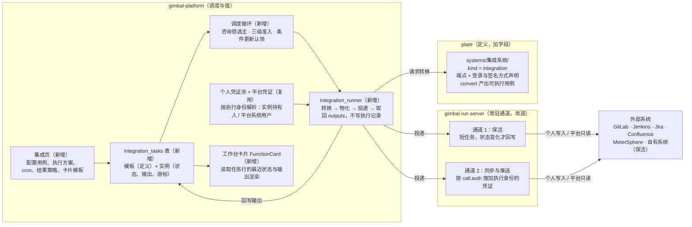

# GIMBAL 外部系统集成架构设计

2026-10-08 · Codfish

## 结论摘要

**方案可行，且不需要新增模块。** 现有代码已覆盖约七成能力：个人凭证池（加密存储 + 连通测试）、按 URL 路由的登录器、服务别名绑定个人凭证、执行方案、PG 持久化队列、`gimbal run server` 执行通道、场景输出快照、证据脱敏、可组装的工作台和通知。

真正要补的有五处：

1. **执行器认证施加写死了内部签名方式**。`call.user` 只会注入 `token = md5(token+timestamp)` + `timestamp` 两个头；plate 端点上的 `binding.auth` 字段有声明但没有被执行。这是「认证按现有实现即可适配」这一判断里唯一不成立的部分。
2. **场景输出没有对外暴露**。执行器内部已有 `ScenarioRunResult.outputs`，但 server 的返回和明细行都不带它。
3. **平台执行链与执行记录强绑定**。队列任务、行台账、事件、案卷都挂在 `executions` 上，集成任务需要一条不写执行记录的轻量执行路径。
4. **平台没有任何调度器**，也没有动态卡片。工作台卡片是前端静态注册表。
5. **plate 无法区分集成系统与被测系统**。`ServiceDefinition` 是封闭模型，没有类型字段。

执行身份分两种模式：**写操作一律用个人凭证**，按订阅者各自执行；**只读的共享任务可用平台凭证**，只执行一次、结果共享。「公共任务」共享的是定义，不是某个人的执行。

改动规模估计：执行器小改两处；plate 一个字段加若干系统定义；平台一张任务表（模板 / 实例两层）+ 一个平台系统用户 + 一个调度服务 + 一个通用卡片组件 + 一个集成页。

## 已定的设计决策

本设计以 2026-10-08 讨论中已确认的以下决策为前提：

| # | 决策 |
| --- | --- |
| 1 | 每个集成都实现为一个 scenario 业务过程，封装为「功能」，渲染为一张工作台卡片 |
| 2 | 平台负责把 scenario（之后是 suite）渲染为卡片；plate 负责被集成系统的接口定义与封装管理 |
| 3 | 触发走独立的定时任务配置，不进入执行记录 |
| 4 | 执行与调度不新起模块：调度是平台进程内组件，执行复用 gimbal 实例 |
| 5 | **写操作以个人身份进行；只读的共享任务可使用平台凭证，由 operator / admin 管理**（修订：原为「外部操作一律以个人身份进行，不用统一服务账号」） |
| 6 | 每个系统维护自己的登录方式；暂用账号登录或个人 token，日后支持 OAuth 再切换 |
| 7 | 涉及系统：GitLab、Jenkins、MeterSphere、Jira、Confluence，以及自有系统的保活查询 |
| 8 | 公共任务共享的是定义（模板），不共享凭证；个人模式下每个订阅者有自己的实例，用自己的凭证执行 |
| 9 | 平台凭证由一个不可登录的平台系统用户持有，复用现有凭证池，不改表结构 |
| 10 | 平台模式只允许只读端点，由代码在保存与执行前强制检查 |

下文中的「功能」与「集成任务」指同一个东西：scenario + 执行方案 + 执行身份 + 触发 + 输出映射 + 卡片模板。它分两层存储：**模板**保存定义，**实例**保存某个执行人的运行状态。

## 现状盘点：可直接复用的能力

基于 `feat/plate-s1` 分支（已包含 `feat/executor-v2.1-fusion`）核对。

| 能力 | 现状 | 代码位置 | 在集成中的用途 |
| --- | --- | --- | --- |
| 个人凭证池 | 按 owner 隔离，alias 唯一；用户名、密码 Fernet 加密存储；带 token_type、expires_in | `platform/backend/app/models/auth_session.py` | 每人每系统一条个人凭证；平台系统用户的平台凭证也存在同一张表 |
| 凭证连通测试 | 按 URL 选登录器试登录，返回是否拿到 token | `services/auth_probe.py`，`/auths/{id}/test` | 录入凭证时立即校验 |
| 登录方式 | 按 URL 前缀注册的登录器：通用 HTTPS 登录、预置 token（URL 为空时把密码当 token）、GitHub OAuth、内部系统 wl/yhr/yz | `app/auth/authenticators/`，执行器侧 `gimbal/auth/authenticators/` 同源一份 | 「每个系统维护自己的登录方式」；个人 token 走预置 token 模式 |
| 服务别名 | `base_url` + `credential_alias`；凭证别名引用**执行者本人**的凭证池，同一别名被不同人执行时各用各的凭证 | `models/service_alias.py` | 外部系统地址登记与个人身份绑定，无需新结构 |
| 执行方案 | 数据集行选择、注入条目、服务绑定（url / authAlias）、nRuns 等；有预检接口 | `models/composer_run_scheme.py`，`routers/run_precheck.py` | 功能的「输入」部分 |
| 持久化队列 | PG `FOR UPDATE SKIP LOCKED` 认领、租约 + 心跳、孤儿回收、协作取消 | `services/execution_queue.py` | 调度与租约的实现参照 |
| 执行通道 | 平台为每次执行拉起 `gimbal run server`，`POST /runs` + SSE 收事件 | `services/gimbal_server_session.py`，`gimbal/core/server_debug.py` | 集成任务的执行载体 |
| 物化 | 纯函数：服务地址优先级链、凭证注入 `config.users`、carry 注入 | `services/run_materialize.py` | 集成用例原样复用 |
| 场景输出 | 场景作用域变量快照（extract 目标为 SCENARIO），调度器已用它给下游单元喂值 | `gimbal/core/scenario_runner.py` `outputs` | 功能输出的数据来源 |
| 凭证模板 | `${auth.<tag>.token}` 在预处理阶段解析并触发登录 | `gimbal/preprocessor/scenario_preprocessor.py` | 认证头的临时写法 |
| 证据脱敏 | 按键名匹配 authorization / cookie / x-auth-token / token / secret / password | `gimbal/protocols/result.py` | 日志与证据中的凭证遮掩 |
| 工作台 | 卡片注册表 + 卡片市场 + 拖拽 + S/M/L 尺寸 + 每卡错误隔离 + `refreshMs` 轮询；布局按用户存服务端 | `frontend/src/components/workbench/registry.ts` | 功能卡片的宿主 |
| 通知 | 按类型开关、批量合并 | `services/notifications.py` | 凭证失效、连续失败提醒 |
| plate 系统定义 | Markdown 方言：`systems/<系统>/system.md`（系统声明 + 默认配置）+ `endpoints/*.md`；端点 `binding` 已有 `auth` 枚举（none / bearer / basic / cookie / custom）与静态 `headers` | `systems/`，`gimbal_plate/dialect/models.py` | 集成系统按被测系统同样方式接入 |

## 缺口分析

| # | 缺口 | 现状证据 | 影响 | 归属 |
| --- | --- | --- | --- | --- |
| G1 | 认证施加方式写死 | `CallExecutor.login()` 只产出 `token=md5(token+timestamp)` 与 `timestamp` 两个头；plate 转换只透传 `binding.headers`，不传 `binding.auth` | 外部系统需要 `Authorization: Bearer`、Basic 或请求级签名，按 `call.user` 走会被注入错误的头 | 执行器 + plate 转换 |
| G2 | 场景输出不出执行器 | `_detail_row` 与 `/runs/{id}` 只有状态与计数，没有 `outputs` | 平台拿不到游标、单号，卡片无数据可渲染 | 执行器 |
| G3 | 执行链绑定执行记录 | `ExecutionJob.execution_id` 外键指向 `executions`；`_fanout` 写行台账、事件、`case.json` | 集成任务若走现有链路会写满执行记录，违反决策 3 | 平台 |
| G4 | 无调度器 | 后端无定时组件，lifespan 只启动执行队列 worker | 定时触发无处挂载 | 平台 |
| G5 | 无动态卡片 | `workbenchRegistry` 是前端静态数组，每张卡一个专用组件 | 功能无法变成卡片 | 平台前端 |
| G6 | 系统类型不可区分 | `ServiceDefinition`（`gimbal:system` 块）为封闭模型，只有 name / title / version / description | 集成系统会混进服务画像、覆盖统计、被测接口列表 | plate |
| G7 | 认证失败不可识别 | 明细行只有 `error` 文本与 `error_phase` | 无法自动暂停任务，失效凭证会被反复重试 | 执行器 |
| G8 | 案卷含明文凭证 | `case.json` 落盘含明文 `users`，靠保留期清理 | 集成任务高频执行时明文留盘量大 | 平台 |

此前讨论中有一处判断需要修正：执行器的证据已经做了脱敏，「日志报告未脱敏」不成立；真正的明文风险在 G8 的案卷文件，以及默认键表覆盖不到的签名头（如 MeterSphere 的 accessKey、signature）。

## 总体架构

三个模块各守原有边界：**plate 管定义，平台管值与调度，gimbal 管执行**。新增的全部是平台内部组件，没有新模块。

平台内的主链是：集成页写入任务配置，调度循环扫描到期任务并认领，`integration_runner` 执行后把输出回写到任务行，卡片读取任务行渲染。执行时，runner 先请求 plate 转换用例，再按执行身份注入凭证（个人模式取实例持有人的凭证，平台模式取平台系统用户的凭证），投递到 gimbal 常驻通道；gimbal 按端点声明的认证方式调用外部系统。

| 模块 | 职责 | 本方案的改动 |
| --- | --- | --- |
| plate | 集成系统的端点、登录与签名方式定义；端点是否只读的声明；转换为可执行用例 | `ServiceDefinition.kind`；`call.auth` 透传；新增集成系统目录 |
| gimbal | 执行集成用例，施加认证，返回输出 | 认证施加分派；暴露 `outputs`；认证错误分类 |
| platform | 任务模板与实例、调度、个人与平台凭证、卡片 | 一张两层任务表、平台系统用户、只读检查、调度循环、runner、通用卡片、集成页 |

## 详细设计

### 1. plate：集成系统定义（G6）

- 每个被集成系统一个目录：`systems/gitlab/`、`systems/jenkins/`、`systems/jira/`、`systems/confluence/`、`systems/metersphere/`，结构与 `systems/fin/` 相同：`system.md` + `endpoints/*.md`。
- `ServiceDefinition` 增加 `kind` 字段，取值 `sut`（被测系统，缺省）或 `integration`。这是一次 M2 变更，按「不留兼容层、一次性适配」处理。
- 平台按 `kind` 过滤：服务画像、覆盖统计、编排时的被测接口列表默认只显示 `sut`；编辑集成用例时显示 `integration`。
- `gimbal:defaults` 中的 `users` 只写登录地址与字段形态，不写任何凭证值。
- 自有系统保活不新增定义，直接用现有端点编排。

### 2. 认证施加（G1）

认证拆成两半：**获取**（登录器拿到 token，已有）和**施加**（token 怎么放进每个请求，缺失）。

- plate 转换把 `binding.auth` 透传为 `call.auth`。
- `CallExecutor.login()` 按 `call.auth` 分派：
  - `bearer`：`Authorization: <token_type> <token>`
  - `basic`：`Authorization: Basic base64(username:password)`，password 位可放 API token（Jenkins）
  - `custom`：按名称查签名器注册表，签名器拿到会话后返回要并入的头
- 现有 md5 签名注册为一个具名签名器，内部系统改为声明使用它。
- 现有 fin 端点声明的是 `auth: bearer`，实际依赖 md5 签名（fin 23 个端点中 19 个如此声明）。G1 落地时这些声明要一次性改正，否则内部系统会被注入错误的头。反过来，自举用的 platform 系统 126 个端点中 123 个声明 bearer，平台也确实使用标准 Bearer 认证，但当前执行器只会注入 md5 头，所以 G1 同时是自举线的前置条件。
- 签名器名称放在系统级声明（`gimbal:system` 或 `gimbal:defaults`），端点可覆盖，避免每个端点重复。
- 登录器目前在平台与执行器各有一份，新增的登录实现两边都要加，直到物理合并。

G1 落地前的临时写法：端点 `headers` 写 `Authorization: Bearer ${auth.<标签>.token}`，不设 `call.user`。零改动可用，但把凭证标签写进了定义，只适合验证阶段。

### 3. 身份模式与平台凭证

每个任务声明一种执行身份。核心规则只有一条：**写操作必须用个人身份**，外部系统里的每次写入都能追溯到具体的人。

| | 个人模式 `personal` | 平台模式 `platform` |
| --- | --- | --- |
| 凭证 | 实例持有人自己的凭证池 | 平台系统用户的凭证池 |
| 执行 | 每个订阅者一个实例，各自执行 | 只有一个实例，执行一次，结果所有订阅者共享 |
| 允许的端点 | 读写都可以 | 只读 |
| 典型用途 | Jira 建单、MR 评论、个人视角的待办 | 保活、公共的构建状态、MR 列表 |
| 改定义 | 模板 owner | 模板 owner、operator / admin |
| 立即执行 | 实例持有人 | 任意订阅者，带冷却时间 |
| 暂停 / 恢复 | 实例持有人 | 模板 owner、operator / admin |
| 凭证失效通知 | 实例持有人 | operator / admin |

- **只读由代码强制**：平台模式的任务在保存和每次执行前检查，scenario 引用的所有端点必须满足 `binding.side_effect_free()`（目前判定为 GET）或端点元信息标了 `query_safe: true`（如用 POST 实现的查询）。不满足则拒绝保存或执行。取数视图已有同一套护栏，直接复用。
- **平台凭证的存放**：新建一个平台系统用户，它不能登录平台，由它持有一份凭证池。凭证仍存在 `auth_sessions` 中，`owner_id` 指向这个系统用户，加密、连通测试、登录器全部复用。执行时把系统用户的 id 传给 `_resolve_exec_auths`，执行链不变，表结构不变。
- **平台凭证的管理**：只有 operator / admin 能查看与维护平台凭证池。
- **平台账号的权限范围**：平台模式的结果对所有订阅者可见，所以平台账号在 Jira、GitLab 等系统中只能授予「全团队都可以看」的权限。这需要在外部系统侧配置，集成页的平台凭证配置处给出提示。
- **追溯到人**：外部系统日志里看到的是平台账号，平台侧用模板的 `updated_by` 记录谁创建、谁修改了平台模式任务。

### 4. 功能数据模型：模板与实例

「公共」共享的是定义，不是某个人的执行。平台新增一张表 `integration_tasks`，用 `template_id` 区分两层：**模板行**保存定义，**实例行**保存某个执行人的运行状态。平台模式的任务只有一个实例，执行人是平台系统用户；个人模式的任务每个订阅者一个实例，owner 自己也是一个实例。

| 字段 | 所在层 | 含义 |
| --- | --- | --- |
| id、name | 模板 | 标识与显示名 |
| owner_id、visibility | 模板 | 定义的所有者；`private` / `public` |
| identity_mode | 模板 | `personal` / `platform` |
| scenario_id、scheme_id | 模板 | 执行哪条用例、用哪个执行方案 |
| target_system | 模板 | 主要对接的 plate 系统名，用于限流分组 |
| trigger_cron | 模板 | 执行周期 |
| output_mapping、state_mapping | 模板 | 卡片取哪些输出；哪些输出带入下一次执行 |
| result_policy | 模板 | `latest`（每次覆盖）或 `on_change`（状态变化才写，保活用） |
| card | 模板 | 卡片模板、字段映射、各尺寸的显示规则（JSONB） |
| updated_by | 模板 | 定义的最近修改人 |
| template_id、holder_id | 实例 | 指向模板；执行人（个人模式为订阅者，平台模式为平台系统用户） |
| enabled、next_run_at | 实例 | 是否启用、下次执行时间 |
| state、paused_reason | 实例 | `idle` / `running` / `paused`；暂停原因：`auth_failed`、`missing_credential`、`manual` |
| running_since、run_token | 实例 | 运行租约，超时回收用 |
| last_run_at、last_status、last_error | 实例 | 最近一次结果；last_error 只存摘要 |
| last_outputs | 实例 | 最近一次输出（JSONB） |
| state_vars | 实例 | 跨次状态（如增量游标），属于执行人自己 |
| last_manual_run_at | 实例 | 手动刷新的冷却判断 |
| fail_streak | 实例 | 连续失败次数 |

- **实例不保存定义副本**：模板修改后，所有实例下次执行即生效，避免定义分叉。
- **订阅即创建实例**：用户把公共的个人模式任务加到工作台时，为他生成一个实例。他缺少对应系统的凭证时，实例为 `paused` / `missing_credential`，卡片提示去配置。订阅平台模式任务不生成实例，只在布局里加卡片。
- **不建执行历史表**，符合决策 3。需要排查时，执行器自己的引擎日志仍可按需开启。
- **不建订阅表**：工作台布局已按用户存服务端，卡片 id 用 `fn:<模板 id>`；渲染时按「模式 + 当前用户」定位到对应实例。
- **权限**：模板只有 owner 能改（平台模式另含 operator / admin）；实例只有持有人能操作，平台模式的操作规则见上表。

### 5. 调度与执行（G3、G4）

- **调度对象是实例**：调度循环在 lifespan 中启动，每 15 秒扫描一次 `enabled`、`state=idle`、`next_run_at<=now` 的实例。PG 下用 `pg_try_advisory_lock` 保证只有一个进程调度；SQLite 开发环境为单进程，跳过加锁。
- **认领**：条件更新 `UPDATE … SET state='running' WHERE id=? AND state='idle'`。即使有两个调度者，也只有一个能认领成功。
- **准入**：认领前检查三个上限，超限则顺延到下个周期：全局（= 执行通道数）、单系统、单执行人×单系统。平台模式的执行人是平台系统用户，平台凭证天然成为单独一组，不会挤占个人的配额。
- **手动执行**：走同一套认领与准入。平台模式由任意订阅者触发，受实例上 `last_manual_run_at` 的冷却时间限制；个人模式只有持有人能触发。
- **执行通道**：`gimbal run server` 内部用一把锁串行执行，所以并发数等于常驻 server 实例数。默认两条常驻通道：一条给保活（短任务），一条给同步与推送，避免长同步卡住保活。
- **执行路径**：新增 `integration_runner`，组合现有零件，不写任何执行记录：
  1. 读实例 + 模板 + 执行方案
  2. 平台模式先做只读检查，不通过则失败收口
  3. plate 转换
  4. 组装数据驱动值，叠加实例的 `state_vars`
  5. `materialize_run_copy`：服务地址链 + 按执行身份解析凭证（个人模式为 `holder_id`，平台模式为平台系统用户）
  6. 投递到通道，等待结果
  7. 取 `outputs`，按 result_policy 回写实例
- 不落 `case.json`，事件不入库（G8）。
- `_resolve_exec_auths`、`_compose_scenario`、`_built_in_users` 需从私有提升为公共函数，与此前 `referenced_services` 的处理方式一致。
- **超时回收**：`running_since` 超过任务超时上限，状态回 `idle`，`last_status=timeout`。
- 「线程池」在平台中实现为 asyncio 任务加信号量，平台本身是异步服务，效果等价。

### 6. 输出与跨次状态（G2）

- 执行器：明细行与 `/runs/{id}` 增加 `outputs`，使用同一张脱敏键表处理。
- 输出来源是场景作用域变量。用例作者用 extract 把值提升到 SCENARIO 作用域即可，与执行能力梳理中的 A1（导出标记 → produces）同一方向，不在 scenario 上另加输出声明。
- `state_mapping` 把指定输出复制到 `state_vars`，下次执行时注入为变量，实现增量拉取的游标。
- 物化函数增加一个可选的变量叠加参数，仍保持纯函数。

### 7. 卡片（G5）

新增一个通用卡片组件 `FunctionCard.vue`，遵守现有工作台卡片的六条规范（独立摘要组件、懒加载、三态由卡槽统一提供、每卡错误隔离、复用接口取数、深链语义）。模板按前端结构化渲染原则组织：每种模板是一个渲染类，绑定一组卡片实例数据；新增模板只需注册一个新类，不改工作台。

**模板与尺寸**。工作台规定 S 只出结论、M 出明细、L 加辅助操作，每个模板按三档定义显示内容：

| 模板 | 用途 | S（1/4） | M（1/2） | L（整行） |
| --- | --- | --- | --- | --- |
| status | 保活、构建状态 | 状态灯 | 状态灯 + 最近执行时间 + 错误摘要 | M 的内容 + 最近状态变化时间 + 操作 |
| kv | 挑选若干输出键展示 | 第一个键 | 全部映射键 | 全部映射键 + 操作 |
| counter | 待处理数 | 数字 | 数字 + 标签 + 最近执行时间 | M 的内容 + 操作 |
| list | MR、构建、缺陷列表 | 条数 | 前 5 条 | 前 10 条，每条带链接 + 操作 |

**卡片状态**。卡片在模板渲染之外，统一叠加以下状态：

| 状态 | 判定 | 卡片表现 |
| --- | --- | --- |
| 未执行 | 实例无 `last_run_at` | 灰色，提示「等待首次执行」 |
| 执行中 | `state=running` | 保留上次结果，加执行中标记 |
| 正常 / 失败 | `last_status` | 按模板渲染；失败时显示错误摘要 |
| 凭证失效 | `paused` / `auth_failed` | 醒目提示；个人模式链接到我的凭证，平台模式提示联系 operator |
| 缺少凭证 | `paused` / `missing_credential` | 提示「缺少某系统凭证，去配置」 |
| 过期 | `last_run_at` 早于 2 个周期 | 结果置灰，标「数据可能过期」 |
| 已移除 | 模板被删或对当前用户不可见 | 显示「该功能已移除或不可见」，可直接删卡 |

过期状态必须有：调度器停摆时，保活卡片不能一直停在绿色。

**操作**。卡片上的「立即执行」「暂停 / 恢复」按身份模式的操作规则显示（见第 3 节表格）。无权限的操作不显示，卡片始终保留「查看详情」，跳转集成页。

**取数契约**。提供一个批量接口：工作台把当前布局里所有 `fn:` 开头的卡片 id 一次发出，返回每张卡的摘要，只含状态、时间与按 `output_mapping` 投影后的字段，不返回整行任务数据。轮询周期默认 30 秒，由批量接口统一承担，卡片不各自轮询。

**卡片市场**。在静态注册表之外，追加当前用户可见的模板（自己的 + 公共的）作为动态条目。

**第二期**：字段格式化（每个映射字段声明标签与格式：数字、时间、链接、枚举到颜色）；status 模板的自定义判定规则（某个输出字段的值映射为红 / 黄 / 绿）。第一期 status 直接用执行成败判定。

**第一期不做**：带参数执行（如现场输入参数造一笔订单）；同一任务的多种视图（一个模板只对应一份卡片配置，订阅者不能自定义）。

### 8. 凭证失效与通知（G7）

- 执行器：调用返回 401 / 403，或预处理阶段登录失败，在明细行标 `error_kind: auth`。
- 平台：`auth` 类错误把实例置为 `paused`、原因 `auth_failed`，不再按周期重试，避免锁号。
- 通知对象按模式区分：个人模式通知实例持有人；平台模式通知 operator / admin（新增通知类型，沿用现有按类型开关）。
- 恢复：个人模式在持有人更新自己的凭证后，自动恢复引用该凭证的实例；平台模式在平台凭证池更新后恢复。平台已有同类机制可参照：取数视图的凭证重存复活钩子。
- 订阅时缺少凭证的实例为 `missing_credential`，用户补齐凭证后同样自动恢复。
- 非认证类失败只累计 `fail_streak`，连续达到阈值时通知，不暂停。

### 9. 集成页

- **任务列表**：我的模板、公共模板、我订阅的实例。
- **新建与编辑模板**：选用例（限 `integration` 类系统的用例）、选执行方案、选身份模式、配置 cron、结果策略、输出映射、卡片模板。选平台模式时，保存前即做只读检查，并指出哪些端点不满足。
- **我的凭证**：按系统显示我的个人凭证状态，直接复用凭证池与连通测试。
- **平台凭证**：仅 operator / admin 可见，维护平台系统用户的凭证池，并提示平台账号在外部系统中只应授予全团队可见的权限。
- **立即执行**：结果直接回显，便于调试；权限与冷却规则同卡片。

## 各集成系统落地方式

认证方式按常见部署形态列出，落地前需要按你们实际部署的版本逐个验证。

| 系统 | 典型功能 | 身份模式 | 凭证获取 | 认证施加 | 卡片模板 | 额外开发 |
| --- | --- | --- | --- | --- | --- | --- |
| 自有系统保活 | 查询接口探活 | 平台 | 现有登录器 | 现有 md5 签名器 | status，on_change | 无 |
| GitLab | 拉取 MR、提交（公共视角）；我的待评审 MR；拉取 NEIGHBOR 文件；MR 评论 | 公共拉取用平台；个人待办与评论用个人 | 个人 token（预置 token 模式） | bearer | list / counter | 无 |
| Jenkins | 拉取构建状态 | 平台 | 用户名 + API token，无需登录调用 | basic | status / list | 无（API token 请求一般免 crumb，需验证） |
| Jira | 拉取需求与缺陷状态；建缺陷单 | 公共拉取用平台；建单用个人 | Data Center：个人 token；Cloud：邮箱 + API token | DC：bearer；Cloud：basic | counter / list | 无 |
| Confluence | 拉取设计文档；release 后归档 | 拉取用平台；归档用个人 | 同 Jira | 同 Jira | list | 无 |
| MeterSphere | 拉取接口定义与用例；回写结果（视定位） | 拉取用平台；回写用个人 | accessKey + secretKey | 每个请求单独签名 | list | 一个签名器；签名头名需加入脱敏键表 |

- 知识类拉取（GitLab 的 NEIGHBOR、Jira 需求、Confluence 文档、MeterSphere 接口定义）的输出只进评审草稿，不直接写 plate，遵守「编写 → 评审 → 入库」主线。这部分依赖 Markdown 方言就绪，排在最后。
- Jenkins 的触发方向不走集成任务，仍由 Jenkins 调用 gimbal CLI。

## 风险与约束

| 风险 | 后果 | 应对 |
| --- | --- | --- |
| G1 改动会改变内部系统的认证行为 | fin 等端点声明为 bearer、实际靠 md5，改完后若未同步修正声明，现有用例全部认证失败 | 签名器改造与 fin 声明修正放在同一次提交，用现有 fin 用例回归 |
| 平台凭证逐渐变成统一服务账号 | 写操作绕开个人身份，外部系统无法追溯到人 | 平台模式只读由代码强制检查；写操作只能走个人模式 |
| 平台账号权限过大 | 平台模式的结果对所有订阅者可见，等于把平台账号能看的数据开放给全员 | 外部系统侧只给平台账号授予全团队可见的权限；集成页配置处提示 |
| 只读判定依赖端点声明 | POST 实现的查询若漏标 `query_safe`，平台模式无法使用；误标则可能写入 | `query_safe` 随端点定义走评审入库；平台模式保存时列出每个端点的判定依据 |
| 用错误密码反复登录 | 外部系统锁定账号 | 认证失败立即暂停实例，不重试；凭证更新后才恢复 |
| 个人模式执行次数随订阅人数增长 | 外部系统请求量与登录次数成倍增加 | 共享的只读拉取优先用平台模式；准入按执行人×系统限流 |
| 高频登录触发风控或审计噪声 | 短周期任务每次都登录 | 保活用平台模式，只执行一次；需要时把 token 与过期时间作为输出回写复用 |
| 长同步任务占住通道 | 保活延迟，卡片误报 | 保活与同步分两条常驻通道；卡片有过期状态兜底 |
| 明文凭证留盘 | `case.json` 含明文 | 集成路径不写案卷 |
| 外部系统接口版本差异 | Jira Cloud 与 DC、MeterSphere 各版本认证不同 | plate 中按实际部署版本定义；登录与签名方式在系统级声明 |
| SQLite 开发环境无咨询锁 | 本地多进程可能重复调度 | 条件更新认领已能防止重复执行；开发环境默认单进程 |

## 分期计划

第一期以平台模式的保活卡片跑通整条链路：它不需要新增外部系统定义，也不依赖 G1，同时能验证平台凭证与只读检查。个人模式的模板 / 实例拆分放在第二期，与首批外部系统一起验证。

1. **P1 链路打通（平台模式保活）**
   - 执行器：明细行与 `/runs/{id}` 暴露 `outputs`（G2）；认证类错误标记（G7）
   - 平台：`integration_tasks` 表（模板与实例两层一次建好）、平台系统用户与平台凭证池、只读检查、调度循环、`integration_runner`、两条常驻通道、批量卡片接口、`FunctionCard` 的 status 模板与全部卡片状态、集成页基础版（含平台凭证管理）
   - 验收：自有系统保活卡片在工作台按周期刷新；停掉被测服务后卡片变红，只写一次状态变化；停掉调度器后卡片在 2 个周期后显示过期；含非只读端点的任务无法以平台模式保存
2. **P2 认证施加 + 个人模式 + 首批外部系统**
   - 执行器与 plate：G1 认证分派、`call.auth` 透传、md5 签名器具名化，fin 声明一次性修正
   - plate：`ServiceDefinition.kind`（G6）；GitLab、Jenkins 系统定义
   - 平台：个人模式与订阅生成实例、`missing_credential` 状态、手动执行冷却；kv / counter / list 模板；凭证失效暂停与按模式通知；跨次状态（游标）
   - 验收：平台模式拉取 Jenkins 构建状态与 GitLab 公共 MR 列表；个人模式拉取「我的待评审 MR」，两个用户订阅后各自看到自己的结果；故意填错 token 时实例暂停并通知持有人
3. **P3 Jira 推送**
   - 依赖：执行器报告重构完成，且保活结果可用于判断「环境失败」
   - 验收：失败用例以个人身份建单，同一失败不重复建单（单号映射存于实例的跨次状态）
4. **P4 MeterSphere 与知识类拉取**
   - MeterSphere 签名器；知识类拉取输出到评审草稿
   - 依赖：Markdown 方言就绪；Confluence 归档另需 plate release 落地

P1 与 roadmap 中 task 3（执行器与执行链）的输出、错误分类有重叠，建议并入 task 3 的 3c 一起做，避免平台执行链被改两次。

## 待拍板事项

- [ ] **认证施加方式的表达**：A. 扩展 `binding.auth` 枚举（如增加 `signed`），签名器名放在系统级声明；B. 保留 `custom`，另加 `auth_signer` 字段指定名称。建议 B，枚举语义不变，名称可扩展。
- [ ] **系统类型字段**：在 `ServiceDefinition` 加 `kind`（建议），还是用标签区分。加字段是 M2 变更，但查询与过滤最直接。
- [ ] **执行通道数量**：默认两条常驻通道（保活一条、同步推送一条）是否合适；或改为每次执行临时拉起 server。
- [ ] **执行历史**：第一期只保留最近一次结果；是否需要保留最近 N 次用于排查。
- [ ] **手动刷新冷却时间**：平台模式任意订阅者可触发，冷却时间取多少（建议 1 分钟，或取周期的 1/10 中较大者）。
- [ ] **平台凭证的管理角色**：只限 operator / admin，还是允许模板 owner 为自己的平台模式任务录入凭证。建议只限 operator / admin，避免个人凭证被当作平台凭证使用。
- [ ] **与 task 3 的合并**：P1 中执行器输出暴露、错误分类是否并入 task 3c 一起实施。
- [ ] **MeterSphere 的定位**：持续同步、结果回写，还是一次性迁移来源。这决定 P4 的范围。

## 实施进度

**P1 链路打通(平台模式保活)✅ 已完成(2026-10-10,按评审 2026-10-09 定稿口径实施)**

- **迁移 0015**:`integration_tasks` 两层单表(模板行 template_id NULL / 实例行;评审 E6 预留 `target_type` + `suite_id`,scenario 先行)+ `users.is_system` + 平台系统用户种子(`__platform__`,随机口令 + is_system 登录双保险;登录 401、用户列表/roster 过滤)。迁移前 PG 全量备份(`data.bak-pg-before-0015-*.sql`)。
- **cron 解析器** `cron_expr.py`:5 段子集(`*`/`*/n`/`a`/`a-b`/`a-b/n`/逗号列表),`next_fire` 分段跳月/日/时(4 年兜底 2/29),`describe_cron` 人话摘要;14 例单测含越界/坏形状。
- **后台任务注册表** `background_tasks.py`(评审 E8):草稿巡检并入 + 集成调度 15s 一拍,统一 supervisor/异常隔离/优雅停止。
- **调度循环** `scheduler_tick`:半常驻通道空闲收口(评审 E4-A:执行后保留 5 分钟)→ running 租约超时回收(15 分钟)→ **短持** `pg_try_advisory_lock`(评审 E5:取锁-扫描-释放,固定锁号)→ 条件更新认领 → 准入(全局=通道数 2/单系统/执行人×系统)→ spawn 执行。
- **integration_runner**(不写执行记录,决策 3):复用 run_dispatcher 公共化零件(`compose_scenario`/`resolve_exec_auths`/`built_in_users`/`find_dataset_by_id`,与 referenced_services 同一处理)→ plate convert → `materialize_run_copy`(方案 serviceBindings URL + 别名链)→ 半常驻 `gimbal run server` 通道执行(case 落临时目录,执行后删除 —— G8 不落明文案卷);结果回写实例:latest/on_change(评审 E7:P1 判定基准 = last_status 翻转)+ fail_streak≥3 通知 admin;outputs/state_vars 过脱敏键表(评审 E1:token 不落库)。
- **只读护栏**(方案 §3 双闸):保存前 + 执行前,场景全部步骤 method ∈ GET/HEAD/OPTIONS(POST+query_safe 随 P2 接 plate 元数据);P1 只开放平台模式(personal 422 随 P2)。
- **路由** `/api/integration/*`:模板 CRUD(owner 改/删,平台模式含 admin;软删 removed_at=评审 E7)/ 立即执行(60s 冷却,结果回显)/ 批量卡片 `/cards`(fn:<id> 批量,只回状态摘要)/ 平台凭证 CRUD(admin;挂平台系统用户,复用 auth_sessions 加密)。
- **前端**:`FunctionCard.vue`(status 模板 S/M/L:状态灯/最近执行/错误摘要/L 档周期+立即执行;状态叠加:未执行/执行中/正常/失败/过期>1h/已移除;30s 批量取数,错误隔离)+ 工作台动态条目(`fn:` 卡进市场与布局,layout 放行 fn: 前缀;模板不可见时合成占位 def 走「已移除」态)+ `IntegrationCenter.vue` 集成页(列表/新建弹层含服务端校验回显/立即执行;平台凭证区 admin-only)+ 侧栏「集成中心」入口。
- **测试**:后端 `test_integration.py` 14 例(cron/只读闸/脱敏/CRUD/软删/可见性/卡片批量/凭证 admin 闸/手动执行含冷却与 E1 落库断言)+ 前端 FunctionCard 4 例/IntegrationCenter 3 例/Sidebar 计数 +1。回归:后端 **848 绿**、前端 **140 文件 1192 绿**、vue-tsc 干净。
- **浏览器验收(真 SUT、真引擎)**:GET 探活场景(sc-keepalive)+ 方案 serviceBindings 指向本机后端 → 集成页建功能「平台保活探针」(*/1 分钟、on_change、公共)→ 调度器 15s 内自动首跑 → 补齐场景必填后「立即执行」**真引擎通过**(半常驻通道拉起 gimbal server → convert → 物化 → GET /api/health → passed 回写,last_outputs 落 run_result 摘要)→ 工作台卡片市场上板,状态灯「正常 · 最近执行 刚刚」→ 平台凭证增删(确认挂 `__platform__`)。验收抓到并修 2 个真问题:新建弹层场景下拉 `page_size:200` 超 API 上限 422 置空(改 100);`_iso` 对 aware datetime 产出 `+00:00Z` 双时区后缀致前端解析失败(UTC 归一后拼 Z)。
- **评审待拍板项的落地选择**:E3 采纳(G2 outputs 暴露移出 P1,随 task 3c/P2);E4-A 半常驻;E7 软删 + on_change=状态翻转;#5 冷却 `max(60s, 周期/10)` 简化为固定 60s(P1);#6 平台凭证限 admin;G7(auth 错误分类)随 task 3c —— P1 失败只计 fail_streak 不暂停。

**信息架构调整(2026-10-10,用户拍板;与 Suite 侧同轮,详见《suite-refactor-design》修订记录「信息架构调整轮」)**

- **集成中心侧栏入口迁出「执行」组**:独立为「集成」组(侧栏组序:场景 → 用例集 → 服务 → 执行 → 集成 → 平台)。此前集成中心挂在「执行」组下,与"执行"域语义不符 —— 集成是独立的运维/外部系统域。
- 同轮 Suite 侧变更(与本方案相关的联动面):侧栏新增「用例集」组(我的用例集 `/suites`、公共用例集 `/suites/public` 新页);`isActive` 补前缀让位规则(存在更长前缀入口时父路径不激活,通用规则,集成入口不受影响);`Sidebar.test` 六处计数/顺序/组标签断言同步(可点条目 16→17、四组→六组)。
- 本轮为纯前端 IA 调整,不改任何集成接口与数据模型;前端 vitest 140 文件 1197 绿、vue-tsc 干净。
