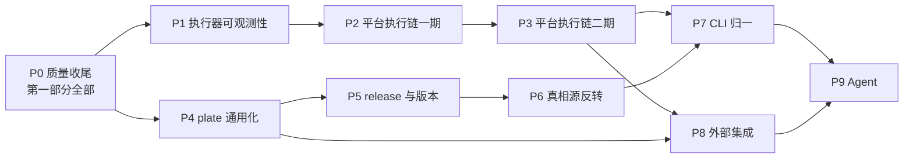

# GIMBAL 待实现功能与路线图

- 日期：2026-09-28（同日修订：按「当前问题 / 新增需求」两部分重组，并入全量缺口盘点结论）
- 基线：`feat/executor-v2.1-fusion` @ `07831974`
- 修订依据：2026-09-28 缺口盘点——对照《GIMBAL执行能力功能点与归属》《GIMBAL执行器-suite-策略设计定稿与变更清单》《GIMBAL执行器重构-v2.1-融合实施案》三份设计文档 × 三侧代码逐项核对。原 A2（平台后端测试同步）、A7（生命周期编译期校验）已随 `07831974` / `fc48a86d` 完成，移入「已完成核对记录」。
- 结构约定：
  - **第一部分「当前问题」**：已在版本中存在或声明、但有缺陷 / 未兑现 / 不一致的内容。修复它们不引入新的行为面。
  - **第二部分「新增需求」**：尚未实现的新能力开发与集成，**含平台侧对执行器新增功能（事件流、suite、调试、乘法参数等）的集成**。
- 原则：
  - 不新增模块，全部落在现有目录与服务中；
  - 每个阶段都有验收门，状态只在验证之后更新；
  - Agent（task 6）排在平台稳定之后。

---

## 一、现状速览

| 模块 | 状态 | 说明 |
|---|---|---|
| gimbal 执行器 | 核心完成 | v2 五核心概念、七阶段编译、调度乘法、并发、调试、事件 seq/jsonl、call 归一均已落地；存量问题见第一部分，能力补全见第二部分 2.3 |
| platform | 功能面完整，执行链仍是旧接法 | 编排、存储、权限、carry、方案、台账均已具备；执行器的新能力一项都未接入（第二部分 2.2） |
| plate | 结构定义扎实，其余职责未展开 | EndpointSpec、声明树、字段状态、QueryView 已具备；结构仍是 HTTP 形态，release 只有占位 |

HTTP 单场景链路（平台编排 → plate `/convert` → gimbal 执行）目前是通的（call 形态全链统一，`07831974`）。

基线验证记录（`07831974`）：gimbal+plate `pytest tests/` 1056 通过；平台后端 pytest 719 通过。

---

# 第一部分：当前问题（存量缺陷与收尾）

> 判定标准：代码里已经存在、或设计已声明为既定行为，但实际是空壳、死代码、校验缺口或文档失真。此处修复**不新增行为面**。

## Q 类：质量与验证

| # | 功能点 | 模块 | 说明 |
|---|---|---|---|
| Q1 | 统一验证入口 | 全局 | 在干净克隆上一次跑完 gimbal、plate、平台后端、平台前端的全部测试，作为合并门 |
| Q2 | 跨模块契约测试 | platform | 平台 → 真实 plate `/convert` → gimbal 端到端，不用 PlateMock 的 echo 模式 |
| Q3 | 配置卫生 | platform | `backend/.env` 在版本控制中且写死 `GIMBAL_BIN=D:\...` 本机路径；移出版本控制并提供 `.env.example`，测试经 fixture 显式设置 |
| Q4 | validate 机器可读输出 | gimbal | validate、compile、resolve 输出 JSON 格式的错误，附错误码与定位（路径、字段） |
| Q5 | 前端测试可在任意环境运行 | platform | lockfile 含 21 处 npmmirror 引用；registry 需可配置，默认官方源 |

## R 类：执行器收尾与清理

| # | 功能点 | 说明 | 证据位置 |
|---|---|---|---|
| R1 | 删除 `run match` | 空命令：参数校验后即结束，静默 exit 0；帮助文本仍在引导使用。它还是 ParallelOpt/RetryOpt/TimeoutOpt 的唯一消费者 | `cli/commands/run_match.py:117-122`、`cli/params.py:29` |
| R2 | abandon join 上限跟随协议超时 | `_ABANDON_JOIN_TIMEOUT_SEC` 写死 30s；应取单元内各 step 协议超时最大值 + 固定余量 | `scheduler/plan.py` |
| R3 | 残留别名清理 | StrategyPhase 历史别名（`BEFORE_REQUEST`/`AFTER_REQUEST`）仍存在**且被用作字段默认值**；`validate_plan = p_validate` 别名 | `schema/strategy.py:37-39,64,74`、`compiler/pipeline.py:741` |
| R4 | strategy/README 与代码对齐 | README 仍宣称 poll/sql/chaos/composite 为占位实现，实际四个文件不存在（目录仅 assertion/assign/call/extract/sleep） | `strategy/README.md:64-68` |
| R5 | 悬空配置删除 | `poll_timeout` / `poll_interval` 配置字段无任何消费者 | `config/models.py:47-48` |
| R6 | 注解失真与死分支 | `execute_run_file` 的 Literal 注解为 `"suite"` 实传 `"graph"`；selector 里 `adapter.validate_json(payload) if False else ...` 恒走 else | `cli/commands/run_target.py:78,209`、`suite/selector.py:72` |

## S 类：声明未兑现与校验缺口（盘点新增）

> 来源：定稿 D3 / D-16 / D-17 / C7 声明了、代码挂起或半实现。S4 的处置依赖待拍板 D-6。

| # | 功能点 | 说明 | 证据位置 |
|---|---|---|---|
| S1 | users 标签存在性校验 | dry-run / compile 期不校验引用的 users 标签是否在 `config.users` 声明；docstring 自认挂起。运行期未知 tag 仅靠 lazy login 失败兜底 | `compiler/pipeline.py:700` |
| S2 | 并发尾部写同名变量检查 | D3 要求的「并发单元写 suite 层同名变量」检测无实现 | `compiler/`（无对应检查） |
| S3 | 预认证不全 | preprocess 期只 eager 登录 `${auth.<tag>.*}` 模板引用的 tag；经 `call.user` 字段引用的用户仍是调用时 lazy 登录（C7 半边） | `preprocessor/scenario_preprocessor.py:166-183`、`strategy/builtin/call.py:166` |
| S4 | SuiteStart/SuiteEndEvent 死类型 | 事件类型已定义、全仓库无发布方；reporter/插件无法感知 suite 边界。**发布还是删除随 D-6 拍板**（发布则与第二部分 N2 合并实现） | `events/types.py:52-53,142-151` |
| S5 | 台账缺 skipped 列 | `run.finished` 携带 skipped 计数，平台 Execution 表只有 total/passed/failed，skipped 只留在 result.json 工件。可随 0007 迁移一并补列 | `gimbal_launcher.py:59`、`models/execution.py:59-61` |

## 已完成核对记录（自原基线 `3af3056` 起）

| 原编号 | 项 | 完成提交 | 证据 |
|---|---|---|---|
| A2 | 平台后端 10 个测试失败 | `07831974` | 平台后端 719 通过。build_argv 已 `-o jsonl`；夹具已 call 形态；断言路径 `$.call.response.*`；取消/熔断两例根因 = 行级 JSONL 停写（M6 设计变更）后测试断言未跟上，已改断言 DB 行终态 |
| A7 | 生命周期条目编译期校验 | `fc48a86d` | `p_normalize` 增 `_validate_lifecycle_entries`（按 strategy 表查 kind + Params 校验，含 `${}` 模板容忍）；sleep 注册为首个内置生命周期动作 |

### 2026-09-28 第一部分执行记录（P0 批次）

除 S4（处置随 D-6 拍板）外，Q/R/S 类全部完成。全量合并门 `scripts/verify_all.sh`
三步全绿：gimbal+plate **1076** / 平台后端 **727** / 平台前端 **1133**。

| 项 | 内容 | 证据摘要 |
|---|---|---|
| Q1/A1 | 统一验证入口 | `scripts/verify_all.sh`（支持步骤选择）；注入失败用例 rc=1、清理后 rc=0 |
| Q2/A3 | 跨模块契约测试 | `tests/test_plate_gimbal_contract.py` 4 用例（真 plate ASGI+lifespan → 真注入 → 真 gimbal CLI；含 call 形态守卫） |
| Q3/A4 | 配置卫生 | `.env` 出库+`.gitignore`+`.env.example`；GIMBAL_BIN 未设 717 绿（2 引擎守卫 skip）；PYTHONPATH 注入不可行（logging.py 遮蔽）成文 |
| Q4/A6 | validate 机器可读输出 | `compiler/errors.py` ErrCode+location；三命令 `-o json`；五类错误码断言（7 CLI 测试） |
| Q5/A10 | 前端 registry | lockfile 21 处镜像→官方源；`.npmrc` 默认官方可覆盖 |
| R1/A5 | run match 删除 | 文件+注册+帮助+README 清理；三个死 Opt 随删 |
| R2/A8 | join 上限跟随协议超时 | `_abandon_join_timeout` = max(step 协议超时)+5s；3 测试 |
| R3/A9 | 别名清理 | StrategyPhase 别名删（默认值换中立名）；validate_plan 别名删 |
| R4-R6 | 卫生批 | README 对齐/悬空配置删除/Literal 修正/死分支删除 |
| S1 | users 标签校验 | p_validate 第 6 项（模板+call.user+setup/teardown；Engine auth_tags 通道放行注册表现存标签） |
| S2 | 并发同名写检查 | p_bind SUITE_VAR_CONFLICT；豁免 needs 先后/跨括号/同源 repeat 变体（变体组经 desugar 传递） |
| S3 | 预认证补全 | preprocess 引用面扩 call.user；3 测试 |
| S5 | skipped 列 | 0007 迁移（已上远端 PG head）；模型/计数器 delta/API 暴露；2 测试 |

S4（SuiteStart/SuiteEndEvent 死类型）仍待 D-6 拍板后处置。各 Goal 的详细验收
记录见《GIMBAL-CodingAgent-Goals-2026-09-28》各节状态行。

---

# 第二部分：后续新增需求

## 2.1 执行器可观测性（日志与报告订阅的基础）

| # | 功能点 | 说明 |
|---|---|---|
| B1 | 执行上下文标签 | 在 run、单元、step、调用四个边界设置 contextvar：run、unit、attempt、scenario、step、module（取 `meta.module`）、service、protocol、endpoint |
| B2 | 事件信封盖标签 | 总线发布时从 contextvar 取值写入事件信封；事件基类加可选字段，各事件类不改 |
| B3 | 日志结构化与分类 | 日志记录带上同一组标签；按 logger 名静态映射 `category`（call/auth/strategy/compiler/scheduler/plugin/debug…） |
| B4 | 声明式订阅规格 | `subscribe: [{events/logs, where, sink}]`，编译为总线过滤函数加输出通道；CLI、suite 配置、server 请求共用一种写法 |
| B5 | 报告定义 | 报告 = 选择（订阅规格）+ 投影（JSONPath 字段）+ 呈现（html/markdown 模板或表格列）；现有 junit、allure 等报告器保留 |
| B6 | 事件导入与回放 | 一次执行的事件流可以事后导入、查询、重放给报告器 |

> 事件持久化的归属说明：执行器侧不落盘（jsonl = stdout 流；server 事件缓冲为内存、600s TTL 回收），持久化由平台入库承担（2.2 的 C1+C2），CLI 单机场景由 B6 回放承担——定稿 E3 的「事件日志保存」按此口径兑现，不再单独立项。

## 2.2 平台执行链接入执行器新能力（3c）

**C-1 集成执行器已有能力**

| # | 功能点 | 说明 |
|---|---|---|
| C1 | 流式读取 jsonl | 子进程模型不变，从「结束后倒扫末 10 行」改为「边运行边逐行读取」——当前中间逐行事件全部丢弃，是 C2/C3/C9 的共同前置 |
| C2 | 事件与日志入库 | 统一表：execution、seq、时间、类型、level、category、module、service、unit、step、message，原始内容存 JSONB；标签列建索引；`call.exchange` 等大字段单独存 |
| C3 | 台账从事件投影 | 行状态、计数改为由执行器事件投影，不再由平台自行写入 |
| C4 | 乘法下沉 | 撤掉平台自己的 nRuns、并发循环（当前每条目独立 spawn 子进程 + Semaphore），改为把 n_runs/retry/parallel 传给执行器。**前置：N4（gimbal CLI 参数入口）** |
| C5 | suite 编排页 | 生成 graph（aggregate/compose/fanout/chain，shared、括号、control）；参数表单由 `ext list --json` 的 schema 生成。**前置：N5（mode params_schema）**；suite 横切面（N1/N2）是否纳入随 D-6 拍板 |
| C6 | 调试页 | 代理执行器 server 的 `/runs/{id}/debug`，支持断点、read/write/patch、retry/skip，平台持有并传递鉴权令牌。**要求一并建模调试运行类型**：RunRequest 增 debug 形态，后端强制「单单元且 n_runs=1」（引擎 `schema/plan.py:115` 约束） |
| C7 | 报告定义接入 | 平台存储、复用报告定义（B5），按用户或团队管理 |

**C-2 平台自身的执行基础设施**

| # | 功能点 | 说明 |
|---|---|---|
| C8 | 单元级台账迁移（0007） | `execution_rows` 改为单元行：unit_id（别名 + 展开序号，与执行器一致）、branch 维度、attempts。**一并补 skipped 计数列（S5）** |
| C9 | 平台 → 浏览器 SSE | 用 SSE 推送已入库的事件，替代每秒轮询；支持 Last-Event-ID 续传 |
| C10 | 日志分析页 | 按模块标签（category、module、service、unit、step、level）组合筛选、全文搜索、聚合统计 |
| C11 | PG 队列 | 用 `FOR UPDATE SKIP LOCKED` 取任务，替换进程内的 `_in_flight`、`_cancel_requested` 与信号量；支持重启恢复、多 worker |
| C12 | 执行进程模型切换 | 每次执行起一个执行器 server 实例（总案决策 15）；取消、调试、事件统一走 HTTP 与 SSE |
| C13 | 灰度与对账 | 新旧执行链按执行粒度切换，同一场景两条链结果逐字段对账后放量，保留回滚路径 |

## 2.3 执行器能力补全（盘点新增）

> 来源：定稿定义了、v2.1 批次表未承接、此前两版路线图也漏列的条目。N1/N2 受 D-6 拍板约束；N4/N5/N6 分别是 C4/C5/C6 的前置，已在上文标注。

| # | 功能点 | 说明 | 依赖 / 时机 |
|---|---|---|---|
| N1 | suite 横切面四字段 | `checks: [{on: Selector, strategy}]`、`plugins/metrics: [{name, params}]`、`gates: [{metric, op, value}]`——schema 与运行期消费（判定阶段读取 gates、横切注入 checks）均未实现（定稿 D6 与套件结构） | **D-6 拍板**；若做，随 C5（P3） |
| N2 | SUITE 生命周期事件发布 | 让 S4 的死类型活过来（suite 边界事件 + 插件按 suite 阶段注册，定稿 D7）；若 D-6 裁撤横切面，则 S4 改为删除事件类型 | **D-6 拍板**；与 N1 同批 |
| N3 | D8 配置规范 | 参数登记表（级别、合并方式、允许来源、作用范围）+ 值来源追踪；p_patch 五层补丁接线（当前恒等挂起，`--var` 走 extras 旁路） | 独立，建议 P3 前后；代数已有单测钉死 |
| N4 | CLI 参数入口 | `run scenario` / `run suite` 增 `--n-runs` / `--retry` / `--parallel` 参数（定稿 D-16 的 scenario 半边；当前 n_runs 无任何 CLI 入口） | **C4（P2-05）前置** |
| N5 | mode params_schema 注册 | 定稿 A7 未落地：mode 表 params_schema 恒 None，`ext list --json` 输出空——C5「表单由 schema 生成」会渲染不出内容 | **C5（P3-05）前置** |
| N6 | 调试命令结构化 | 定稿 A6 的 `schema/debug.py`：会话命令从自由文本 + 正则解析升级为结构化 schema（write/patch 的参数校验） | 低优先，可随 C6 调试页一并 |
| N7 | platform_uploader 退役 | 引擎侧上报 reporter 在平台无接收端点；方向已被 C1+C2（平台拉流）取代。**随 D-7 拍板退役，不补接收端** | D-7 拍板 |

## 2.4 plate 结构通用化（3b 的 plate 侧）

| # | 功能点 | 说明 |
|---|---|---|
| D1 | EndpointSpec 中立外壳 | 保留 id/system/service/name/metadata、请求与响应 declarations 树、query_views |
| D2 | `api` 改为 `binding` | `{protocol, ...该协议的字段}`；HTTP 的 binding = 现有 ApiSpec 字段 |
| D3 | 响应按结果判别 | `responses` 从「按状态码」改为「按协议的结果判别」，每种结果一棵响应声明树 |
| D4 | 路由索引按协议分派 | 每个协议自己定义接口的唯一定位字段，替代固定的 (service, method, path) |
| D5 | binding schema 来源 | 过渡期：从执行器 `ext list --json` 获取各协议参数 schema（方案 A）；P6 翻转为 plate 真源 |
| D6 | 执行器 services 配置带协议 | `services: {name: {protocol, base_url...}}`，替代 `dict[str, str]` |
| D7 | 编排器渲染适配 | 平台编排器从渲染 ApiSpec 改为按协议渲染 binding |
| D8 | 接入适配器约定 | 外部来源进入 plate 的中间形态与归一化落点（EndpointSpec / EndpointDoc / 用户故事），为 H 类拉取做准备 |
| D9 | 第二协议落地验证 | 选一个真实的第二协议，只注册 binding 和适配器，不改外壳，以此验证 D1–D4 |

## 2.5 release 与版本管理（task 4）

| # | 功能点 | 说明 |
|---|---|---|
| E1 | 冻结流程 | import 入 registry 并校验 → 序列化目标系统全部 EndpointSpec → 生成 manifest（含 content_hash）→ 原子写入 `plate_artifacts/<系统>/<版本>/`，latest 为指针 |
| E2 | 水合与按版本查询 | 构件用当前 schema 类 `model_validate` 水合，各导出视图按 release_id 查询 |
| E3 | 值记录关联版本 | platform 的 endpoint_value / scenario_case 记录 release_id |
| E4 | 用例变更插件 | 黑盒契约：`(endpoint_id, from_version, to_version, old_value_json) → new_value_json`；支持批量迁移与惰性迁移 |
| E5 | 首个 release 冻结 | 在 D 完成之后冻结，不冻结即将要改的结构 |
| E6 | plate 版本支持（POST） | 按版本提交与读取定义 |

## 2.6 真相源反转

| # | 功能点 | 说明 |
|---|---|---|
| F1 | plate 发布 schema 构件 | 随 release 产出执行态 schema（JSON Schema）构件 |
| F2 | gimbal 离线加载 | gimbal 本地加载指定版本的构件，不在运行时依赖 plate 的 HTTP 服务，保持可独立运行 |
| F3 | gimbal 模型去向 | 决定 Scenario/Step/Call/Plan 等 pydantic 类是由构件生成、仅用构件校验，还是按「gimbal 内部走 JSON」的设想移除 |
| F4 | 消除镜像维护 | 移除 field_states 三处镜像（plate schema / platform validate / resolve_state） |
| F5 | binding schema 翻转 | 协议 binding 的真源从执行器（方案 A）翻转到 plate（方案 B） |

> 注：定稿 D1「执行指令（Plan）定义归 plate（过渡期 gimbal schema）」的最终归属由本线承接（F1/F2 的构件机制），不在 P2/P3 平台线内处理。

## 2.7 CLI 归一（task 5）

| # | 功能点 | 说明 |
|---|---|---|
| G1 | 组件注册约定 | 各包通过入口点把命令组挂到统一的 `gimbal` 入口 |
| G2 | plate 命令组 | `gimbal plate ...`：plate HTTP 服务的薄客户端（查询、release、导出） |
| G3 | platform 命令组 | `gimbal platform ...`：平台 API 的薄客户端（场景、执行、台账、日志查询） |
| G4 | 统一输出契约 | 所有命令支持 JSON 输出、结构化错误码，写操作支持 dry-run |

## 2.8 外部系统集成（Jenkins / Jira / Confluence）

| # | 功能点 | 方向 | 落点 |
|---|---|---|---|
| H1 | 推送类插件约定 | 推送 | 执行器插件：凭证由平台下发、推送失败不影响测试判定、重试策略 |
| H2 | Jenkins | 触发 + 推送 | 由 Jenkins 调用执行器 CLI 或平台 API；结果用现有 junit 报告器输出 |
| H3 | Jira 推送 | 推送 | 失败自动提缺陷，回写用例或需求的执行状态（订阅 `run.finished` 等事件） |
| H4 | Confluence 推送 | 推送 | 按报告定义（B5）生成或更新报告页 |
| H5 | Jira / Confluence 拉取 | 获取 | 经 plate 接入适配器（D8）拉取需求与 PRD，归一化入 plate；关联 `meta.requirementRef` |
| H6 | Webhook 与定时同步 | 触发 | 平台后端接收 Jira Webhook 触发执行；定期拉取同步 |

## 2.9 远期与后置储备

**明确后置的执行器能力（设计已裁定，勿重复立项）**：

- matrix 模式、barrier 同步起跑（定稿 D-08/D-09「以后」）
- poll / sql 策略真实现（sql 先要数据源资源类型；依赖句柄层）
- 资源与句柄层：句柄获取（SSH/shell/DB/MQ）、句柄描述结构与可重建声明、E7 安全闸（shell 白名单 / 审计事件）
- 依赖反推（consumes/produces 自动推导依赖图；前置条件按能力声明）
- 「以后再议」字段：environments、expect_fail、池条目检索条件、schemaVersion 等待评估字段
- 否决项 X-01~X-15（检查点续跑、造数复用、suite 调试等）不再列入任何阶段

**并行线**：

| # | 功能点 | 说明 |
|---|---|---|
| I1 | 自举 Agent | 把 gimbal-platform 自身作为第二个被测系统接入 plate，按「流量 → 定义/用例 → 编排 → 执行」走通，记录摩擦日志与基准数字 |
| I2 | Agent（task 6） | 平台稳定后再做 |
| I3 | plate 远期职责 | EndpointDoc 与用户故事、多形态业务描述归一化、评审功能、知识暴露（MCP、Mock、API doc） |

---

## 三、实施顺序

P1 → P3（平台线）与 P4 → P6（plate 线）可以并行：平台与执行器的交接物是 `call`，不受 plate 结构影响；两条线唯一的交汇点是平台编排器（D7）。

### P0 质量与收尾（= 第一部分全部）
- 内容：Q1–Q5、R1–R6、S1–S5（S4 的「发布」分支若 D-6 拍板要做，移入 P3 的 N2；S5 可并入 0007 迁移随 P2 执行，但列在 P0 待办以防 0007 排期靠后时单独补列）
- 理由：先让验证覆盖三个模块、存量声明全部兑现或清除，后续每个阶段才有可信的验收门
- 验收门：干净克隆下四类测试全部通过；`run match` 已删除；validate 输出 JSON；users 标签与同名写检查生效

### P1 执行器可观测性
- 内容：B1–B4、B6；S3（预认证补全）可并入本批（同在 preprocessor/auth 一带）
- 理由：事件信封决定平台要存什么结构，必须先于平台入库定形
- 验收门：并行加 repeat 的运行中，每条事件和日志都能按 unit/attempt/step/module/category 区分；订阅规格能从 CLI 与 suite 配置生效

### P2 平台执行链一期（不改进程模型）
- 内容：C1、C2、C3、C4、C8（含 S5 补列）、C9、C10；**前置 N4 在本批先行**
- 理由：不动子进程模型，就能交付实时进度、日志入库、按模块筛选
- 验收门：执行期间页面实时推进；日志分析页可按模块标签筛选；平台不再自己循环 nRuns

### P3 平台执行链二期（进程模型切换）
- 内容：C11、C12、C13，然后 C6（含调试运行类型建模）、C5（前置 N5；N1/N2 视 D-6 拍板）、B5、C7；N3（D8 配置规范）建议同窗
- 理由：调试页与取消依赖执行器 server 模式；PG 队列与进程模型切换是同一件事
- 验收门：平台重启后执行可恢复；在平台上单步调试一个运行中的场景；suite 编排页可执行 graph；新旧链对账一致

### P4 plate 通用化（与 P1–P3 并行）
- 内容：D1–D9
- 前置决策：确定第二协议目标
- 验收门：第二协议只注册 binding 和适配器即可端到端执行，EndpointSpec 外壳与执行器核心零改动；编排器可渲染两种协议

### P5 release 与版本
- 内容：E1–E6
- 验收门：冻结 fin 系统首个 release；按版本号取回的内容逐字节一致；结构变更一次后，存量值经变更插件迁移成功

### P6 真相源反转
- 内容：F1–F5
- 前置决策：F3（gimbal pydantic 类的去向）
- 验收门：gimbal 仅凭 plate 构件即可校验与执行；field_states 镜像清单移除

### P7 CLI 归一
- 内容：G1–G4
- 验收门：一个 `gimbal` 入口覆盖三个组件；所有命令具备 JSON 输出与错误码

### P8 外部集成
- 内容：H1–H6
- 说明：推送方向（H1–H4）依赖最少，有急用时可以提前到 P2 之后；拉取方向（H5）依赖 plate 接入约定（D8）
- 验收门：Jenkins 流水线触发并展示结果；失败自动在 Jira 建单；Confluence 报告页按报告定义生成

### 并行线：自举 Agent（I1）
- 时机：P4 完成后启动，作为 plate 通用化与后续反转的实际检验
- 验收：接入平台自身不需要改 schema；摩擦日志每条都能映射到 P4–P7 的验收项

### P9 Agent（task 6）
- 时机：平台稳定（P3 完成）且 CLI 归一（P7）之后

---

## 四、待拍板事项

| # | 事项 | 影响阶段 | 建议 |
|---|---|---|---|
| 1 | 第二协议的具体目标（gRPC / Dubbo / MQ / 数据库 / shell） | P4 | 用真实协议驱动通用化，避免抽象错位 |
| 2 | 协议 binding schema 的真源 | P4 → P6 | 过渡期执行器为真源（方案 A），P6 翻转为 plate（方案 B） |
| 3 | 反转后 gimbal pydantic 类的去向 | P6 | 由构件生成，或仅用构件校验，或移除改走 JSON |
| 4 | 调试页是否提前 | P3 | **已拍板（2026-09-29）：不提前** —— P3-04 排在 C11/C12 之后，普通执行先切 server 模型，调试页复用同一通道 |
| 5 | 外部集成推送方向是否提前 | P8 | 有急用时可提前到 P2 之后 |
| 6 | **suite 横切面（checks/gates/metrics/plugins）与 SUITE 生命周期事件是否仍要** | S4 处置、N1/N2、C5 范围（P3） | **已拍板（2026-09-29）：保留** —— 随 C5 一批实现（N1 schema+运行期消费、N2/S4 suite 边界事件复活），编排页含 checks/gates 编辑器与 metrics/plugins 配置面 |
| 7 | **platform_uploader 退役时机** | N7（P2 后） | 其职责被 C1+C2 平台拉流取代，平台无接收端点；建议 P2 落地后退役，而非补接收端 |
