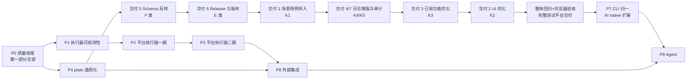

# GIMBAL 待实现功能与路线图

> 2026-10-07 修订（S1-0 清理 A6）：D2 / D5 / E1 / G2 / P4 按 `claude/plate-design.md`（修订九版）更新；与本注冲突的旧表述以该设计为准。
> 2026-10-10 修订：按用户路线图（`roadmap-2026-09.md` 2026-10-10 补充版）并入**平台交付阶段**（PD，见 2.10 与 §PD）——task 1 / task 3（3a/3b/3c）已完成、plate S1 可合入、外部集成 P1 已打通；交付阶段内**反转先于 Release**（推翻本文 P5→P6 旧顺序）；CLI 归一（P7）与 Agent（P9）移为交付后的 AI native 扩展阶段。

- 日期：2026-09-28（同日修订：按「当前问题 / 新增需求」两部分重组，并入全量缺口盘点结论）
- 基线：`feat/executor-v2.1-fusion` @ `07831974`
- 基线更新（2026-10-10）：`feat/plate-s1` @ `87e8a1a3`（当日起三服务部署基线；远端 PG alembic=0015_integration_tasks）
- 修订依据：2026-09-28 缺口盘点——对照《GIMBAL执行能力功能点与归属》《GIMBAL执行器-suite-策略设计定稿与变更清单》《GIMBAL执行器重构-v2.1-融合实施案》三份设计文档 × 三侧代码逐项核对。原 A2（平台后端测试同步）、A7（生命周期编译期校验）已随 `07831974` / `fc48a86d` 完成，移入「已完成核对记录」。
- 结构约定：
  - **第一部分「当前问题」**：已在版本中存在或声明、但有缺陷 / 未兑现 / 不一致的内容。修复它们不引入新的行为面。
  - **第二部分「新增需求」**：尚未实现的新能力开发与集成，**含平台侧对执行器新增功能（事件流、suite、调试、乘法参数等）的集成**。
- 原则：
  - 不新增模块，全部落在现有目录与服务中；
  - 每个阶段都有验收门，状态只在验证之后更新；
  - Agent（task 6）排在平台稳定之后。

---

## 一、现状速览

| 模块 | 状态 | 说明 |
|---|---|---|
| gimbal 执行器 | 核心完成 | v2 五核心概念、七阶段编译、调度乘法、并发、调试、事件 seq/jsonl、call 归一均已落地；存量问题见第一部分，能力补全见第二部分 2.3 |
| platform | 交付期 | 执行链已切 server（P3.6 默认链）；suite 重构第 1–4 步（管理页与列表 / 预检接执行器编译 / 新建画布 / 横切断言表单，`87e8a1a3`）与外部集成 P1（平台模式保活链路，`3dfe7026`）已落地；工作台卡片重构（task 1）完成 |
| plate | S1 主体完成，可合入 | EndpointSpec、声明树、字段状态、QueryView 具备；结构与 Markdown 方言切换完成（第四轮修复评估待执行）；release 仍占位，由 S1.5 承接 |

HTTP 单场景链路（平台编排 → plate `/convert` → gimbal 执行）目前是通的（call 形态全链统一，`07831974`）。

基线验证记录（`07831974`）：gimbal+plate `pytest tests/` 1056 通过；平台后端 pytest 719 通过。

部署验证记录（2026-10-10，`87e8a1a3`）：三服务探针绿（后端 `/api/health`、plate `/healthz`、vite `/`）；`0015_integration_tasks` 已上远端 PG；integration 路由 / `IntegrationCenter.vue` / `SuiteCompose.vue` 活体验证通过。

---

# 第一部分：当前问题（存量缺陷与收尾）

> 判定标准：代码里已经存在、或设计已声明为既定行为，但实际是空壳、死代码、校验缺口或文档失真。此处修复**不新增行为面**。

## Q 类：质量与验证

| # | 功能点 | 模块 | 说明 |
|---|---|---|---|
| Q1 | 统一验证入口 | 全局 | 在干净克隆上一次跑完 gimbal、plate、平台后端、平台前端的全部测试，作为合并门 |
| Q2 | 跨模块契约测试 | platform | 平台 → 真实 plate `/convert` → gimbal 端到端，不用 PlateMock 的 echo 模式 |
| Q3 | 配置卫生 | platform | `backend/.env` 在版本控制中且写死 `GIMBAL_BIN=D:\...` 本机路径；移出版本控制并提供 `.env.example`，测试经 fixture 显式设置 |
| Q4 | validate 机器可读输出 | gimbal | validate、compile、resolve 输出 JSON 格式的错误，附错误码与定位（路径、字段） |
| Q5 | 前端测试可在任意环境运行 | platform | lockfile 含 21 处 npmmirror 引用；registry 需可配置，默认官方源 |

## R 类：执行器收尾与清理

| # | 功能点 | 说明 | 证据位置 |
|---|---|---|---|
| R1 | 删除 `run match` | 空命令：参数校验后即结束，静默 exit 0；帮助文本仍在引导使用。它还是 ParallelOpt/RetryOpt/TimeoutOpt 的唯一消费者 | `cli/commands/run_match.py:117-122`、`cli/params.py:29` |
| R2 | abandon join 上限跟随协议超时 | `_ABANDON_JOIN_TIMEOUT_SEC` 写死 30s；应取单元内各 step 协议超时最大值 + 固定余量 | `scheduler/plan.py` |
| R3 | 残留别名清理 | StrategyPhase 历史别名（`BEFORE_REQUEST`/`AFTER_REQUEST`）仍存在**且被用作字段默认值**；`validate_plan = p_validate` 别名 | `schema/strategy.py:37-39,64,74`、`compiler/pipeline.py:741` |
| R4 | strategy/README 与代码对齐 | README 仍宣称 poll/sql/chaos/composite 为占位实现，实际四个文件不存在（目录仅 assertion/assign/call/extract/sleep） | `strategy/README.md:64-68` |
| R5 | 悬空配置删除 | `poll_timeout` / `poll_interval` 配置字段无任何消费者 | `config/models.py:47-48` |
| R6 | 注解失真与死分支 | `execute_run_file` 的 Literal 注解为 `"suite"` 实传 `"graph"`；selector 里 `adapter.validate_json(payload) if False else ...` 恒走 else | `cli/commands/run_target.py:78,209`、`suite/selector.py:72` |

## S 类：声明未兑现与校验缺口（盘点新增）

> 来源：定稿 D3 / D-16 / D-17 / C7 声明了、代码挂起或半实现。S4 的处置依赖待拍板 D-6。

| # | 功能点 | 说明 | 证据位置 |
|---|---|---|---|
| S1 | users 标签存在性校验 | dry-run / compile 期不校验引用的 users 标签是否在 `config.users` 声明；docstring 自认挂起。运行期未知 tag 仅靠 lazy login 失败兜底 | `compiler/pipeline.py:700` |
| S2 | 并发尾部写同名变量检查 | D3 要求的「并发单元写 suite 层同名变量」检测无实现 | `compiler/`（无对应检查） |
| S3 | 预认证不全 | preprocess 期只 eager 登录 `${auth.<tag>.*}` 模板引用的 tag；经 `call.user` 字段引用的用户仍是调用时 lazy 登录（C7 半边） | `preprocessor/scenario_preprocessor.py:166-183`、`strategy/builtin/call.py:166` |
| S4 | SuiteStart/SuiteEndEvent 死类型 | 事件类型已定义、全仓库无发布方；reporter/插件无法感知 suite 边界。**发布还是删除随 D-6 拍板**（发布则与第二部分 N2 合并实现） | `events/types.py:52-53,142-151` |
| S5 | 台账缺 skipped 列 | `run.finished` 携带 skipped 计数，平台 Execution 表只有 total/passed/failed，skipped 只留在 result.json 工件。可随 0007 迁移一并补列 | `gimbal_launcher.py:59`、`models/execution.py:59-61` |

## 已完成核对记录（自原基线 `3af3056` 起）

| 原编号 | 项 | 完成提交 | 证据 |
|---|---|---|---|
| A2 | 平台后端 10 个测试失败 | `07831974` | 平台后端 719 通过。build_argv 已 `-o jsonl`；夹具已 call 形态；断言路径 `$.call.response.*`；取消/熔断两例根因 = 行级 JSONL 停写（M6 设计变更）后测试断言未跟上，已改断言 DB 行终态 |
| A7 | 生命周期条目编译期校验 | `fc48a86d` | `p_normalize` 增 `_validate_lifecycle_entries`（按 strategy 表查 kind + Params 校验，含 `${}` 模板容忍）；sleep 注册为首个内置生命周期动作 |

### 2026-09-28 第一部分执行记录（P0 批次）

除 S4（处置随 D-6 拍板）外，Q/R/S 类全部完成。全量合并门 `scripts/verify_all.sh`
三步全绿：gimbal+plate **1076** / 平台后端 **727** / 平台前端 **1133**。

| 项 | 内容 | 证据摘要 |
|---|---|---|
| Q1/A1 | 统一验证入口 | `scripts/verify_all.sh`（支持步骤选择）；注入失败用例 rc=1、清理后 rc=0 |
| Q2/A3 | 跨模块契约测试 | `tests/test_plate_gimbal_contract.py` 4 用例（真 plate ASGI+lifespan → 真注入 → 真 gimbal CLI；含 call 形态守卫） |
| Q3/A4 | 配置卫生 | `.env` 出库+`.gitignore`+`.env.example`；GIMBAL_BIN 未设 717 绿（2 引擎守卫 skip）；PYTHONPATH 注入不可行（logging.py 遮蔽）成文 |
| Q4/A6 | validate 机器可读输出 | `compiler/errors.py` ErrCode+location；三命令 `-o json`；五类错误码断言（7 CLI 测试） |
| Q5/A10 | 前端 registry | lockfile 21 处镜像→官方源；`.npmrc` 默认官方可覆盖 |
| R1/A5 | run match 删除 | 文件+注册+帮助+README 清理；三个死 Opt 随删 |
| R2/A8 | join 上限跟随协议超时 | `_abandon_join_timeout` = max(step 协议超时)+5s；3 测试 |
| R3/A9 | 别名清理 | StrategyPhase 别名删（默认值换中立名）；validate_plan 别名删 |
| R4-R6 | 卫生批 | README 对齐/悬空配置删除/Literal 修正/死分支删除 |
| S1 | users 标签校验 | p_validate 第 6 项（模板+call.user+setup/teardown；Engine auth_tags 通道放行注册表现存标签） |
| S2 | 并发同名写检查 | p_bind SUITE_VAR_CONFLICT；豁免 needs 先后/跨括号/同源 repeat 变体（变体组经 desugar 传递） |
| S3 | 预认证补全 | preprocess 引用面扩 call.user；3 测试 |
| S5 | skipped 列 | 0007 迁移（已上远端 PG head）；模型/计数器 delta/API 暴露；2 测试 |

S4（SuiteStart/SuiteEndEvent 死类型）仍待 D-6 拍板后处置。

### 2026-09-29 P3 收尾执行记录（C11/C12/C13 + C6）

| 项 | 内容 | 落点 |
|---|---|---|
| C11 | PG 队列 | 0009 迁移 execution_jobs；execution_queue.py（SKIP LOCKED 认领/租约回收/取消 DB 位+快速通道/worker 循环含 ensure_workers 惰性入口）；dispatch 入队化；进程内注册表（_in_flight/_cancel_requested/_tasks_by_execution/全局 launch 信号量）退役；重启恢复=queued 留存续跑+无 job 僵尸收口 |
| C12 | 进程模型切换 | gimbal_server_session.py（每执行一个 ``run server`` 实例：token/端口/SSE 消费/取消/无残留回收）；graph_dispatch 双链；引擎配套 cancel 端点+外层取消传播+RunsRequest 乘法；修 P2 多 case 事件 seq 冲突丢失（execution 级单调分配器） |
| C13 | 灰度与对账 | settings.EXEC_CHAIN（legacy=回滚路径）+ dispatch chain_override + config_json.chain 留档 + scripts/reconcile_chain.py（双链逐字段 diff+事件量级比对） |
| C6 | 调试页 | 引擎 schema/debug.py 结构化命令（N6）+debug/output 端点；平台 RunRequest.debug 强校验（单 case/nRuns=1/非 graph,恒 server 链）+三个代理端点（token 不出后端）；前端 RunConfigPanel 调试模式 + DebugConsole 调试台 + 直达路由 |

已知边界：①server 链 spawn 用 settings.GIMBAL_BIN——指向旧安装时缺新参数
（e2e 测试已钉当前解释器;部署需同步升级该 venv 或置空走 ``-m gimbal``）；
②SQLite 测试链的 claim 无 SKIP LOCKED（单连接无抢占面,PG 才有多 worker 语义）；
③调试 write/patch 的值以 JSON 形态经代理透传,敏感值不进事件流（引擎侧只记键）。
各 Goal 的详细验收
记录见《GIMBAL-CodingAgent-Goals-2026-09-28》各节状态行。

---

# 第二部分：后续新增需求

## 2.1 执行器可观测性（日志与报告订阅的基础）

| # | 功能点 | 说明 |
|---|---|---|
| B1 | 执行上下文标签 | 在 run、单元、step、调用四个边界设置 contextvar：run、unit、attempt、scenario、step、module（取 `meta.module`）、service、protocol、endpoint |
| B2 | 事件信封盖标签 | 总线发布时从 contextvar 取值写入事件信封；事件基类加可选字段，各事件类不改 |
| B3 | 日志结构化与分类 | 日志记录带上同一组标签；按 logger 名静态映射 `category`（call/auth/strategy/compiler/scheduler/plugin/debug…） |
| B4 | 声明式订阅规格 | `subscribe: [{events/logs, where, sink}]`，编译为总线过滤函数加输出通道；CLI、suite 配置、server 请求共用一种写法 |
| B5 | 报告定义 | 报告 = 选择（订阅规格）+ 投影（JSONPath 字段）+ 呈现（html/markdown 模板或表格列）；现有 junit、allure 等报告器保留 |
| B6 | 事件导入与回放 | 一次执行的事件流可以事后导入、查询、重放给报告器 |

> 事件持久化的归属说明：执行器侧不落盘（jsonl = stdout 流；server 事件缓冲为内存、600s TTL 回收），持久化由平台入库承担（2.2 的 C1+C2），CLI 单机场景由 B6 回放承担——定稿 E3 的「事件日志保存」按此口径兑现，不再单独立项。

## 2.2 平台执行链接入执行器新能力（3c）

**C-1 集成执行器已有能力**

| # | 功能点 | 说明 |
|---|---|---|
| C1 | 流式读取 jsonl | 子进程模型不变，从「结束后倒扫末 10 行」改为「边运行边逐行读取」——当前中间逐行事件全部丢弃，是 C2/C3/C9 的共同前置 |
| C2 | 事件与日志入库 | 统一表：execution、seq、时间、类型、level、category、module、service、unit、step、message，原始内容存 JSONB；标签列建索引；`call.exchange` 等大字段单独存 |
| C3 | 台账从事件投影 | 行状态、计数改为由执行器事件投影，不再由平台自行写入 |
| C4 | 乘法下沉 | 撤掉平台自己的 nRuns、并发循环（当前每条目独立 spawn 子进程 + Semaphore），改为把 n_runs/retry/parallel 传给执行器。**前置：N4（gimbal CLI 参数入口）** |
| C5 | suite 编排页 | 生成 graph（aggregate/compose/fanout/chain，shared、括号、control）；参数表单由 `ext list --json` 的 schema 生成。**前置：N5（mode params_schema）**；suite 横切面（N1/N2）是否纳入随 D-6 拍板 |
| C6 | 调试页 | 代理执行器 server 的 `/runs/{id}/debug`，支持断点、read/write/patch、retry/skip，平台持有并传递鉴权令牌。**要求一并建模调试运行类型**：RunRequest 增 debug 形态，后端强制「单单元且 n_runs=1」（引擎 `schema/plan.py:115` 约束） |
| C7 | 报告定义接入 | 平台存储、复用报告定义（B5），按用户或团队管理 |

**C-2 平台自身的执行基础设施**

| # | 功能点 | 说明 |
|---|---|---|
| C8 | 单元级台账迁移（0007） | `execution_rows` 改为单元行：unit_id（别名 + 展开序号，与执行器一致）、branch 维度、attempts。**一并补 skipped 计数列（S5）** |
| C9 | 平台 → 浏览器 SSE | 用 SSE 推送已入库的事件，替代每秒轮询；支持 Last-Event-ID 续传 |
| C10 | 日志分析页 | 按模块标签（category、module、service、unit、step、level）组合筛选、全文搜索、聚合统计 |
| C11 | PG 队列 | 用 `FOR UPDATE SKIP LOCKED` 取任务，替换进程内的 `_in_flight`、`_cancel_requested` 与信号量；支持重启恢复、多 worker |
| C12 | 执行进程模型切换 | 每次执行起一个执行器 server 实例（总案决策 15）；取消、调试、事件统一走 HTTP 与 SSE |
| C13 | 灰度与对账 | 新旧执行链按执行粒度切换，同一场景两条链结果逐字段对账后放量，保留回滚路径 |

## 2.3 执行器能力补全（盘点新增）

> 来源：定稿定义了、v2.1 批次表未承接、此前两版路线图也漏列的条目。N1/N2 受 D-6 拍板约束；N4/N5/N6 分别是 C4/C5/C6 的前置，已在上文标注。

| # | 功能点 | 说明 | 依赖 / 时机 |
|---|---|---|---|
| N1 | suite 横切面四字段 | `checks: [{on: Selector, strategy}]`、`plugins/metrics: [{name, params}]`、`gates: [{metric, op, value}]`——schema 与运行期消费（判定阶段读取 gates、横切注入 checks）均未实现（定稿 D6 与套件结构） | **D-6 拍板**；若做，随 C5（P3） |
| N2 | SUITE 生命周期事件发布 | 让 S4 的死类型活过来（suite 边界事件 + 插件按 suite 阶段注册，定稿 D7）；若 D-6 裁撤横切面，则 S4 改为删除事件类型 | **D-6 拍板**；与 N1 同批 |
| N3 | D8 配置规范 | 参数登记表（级别、合并方式、允许来源、作用范围）+ 值来源追踪；p_patch 五层补丁接线（当前恒等挂起，`--var` 走 extras 旁路） | 独立，建议 P3 前后；代数已有单测钉死 |
| N4 | CLI 参数入口 | `run scenario` / `run suite` 增 `--n-runs` / `--retry` / `--parallel` 参数（定稿 D-16 的 scenario 半边；当前 n_runs 无任何 CLI 入口） | **C4（P2-05）前置** |
| N5 | mode params_schema 注册 | 定稿 A7 未落地：mode 表 params_schema 恒 None，`ext list --json` 输出空——C5「表单由 schema 生成」会渲染不出内容 | **C5（P3-05）前置** |
| N6 | 调试命令结构化 | 定稿 A6 的 `schema/debug.py`：会话命令从自由文本 + 正则解析升级为结构化 schema（write/patch 的参数校验） | 低优先，可随 C6 调试页一并 |
| N7 | platform_uploader 退役 | 引擎侧上报 reporter 在平台无接收端点；方向已被 C1+C2（平台拉流）取代。**随 D-7 拍板退役，不补接收端** | D-7 拍板 |

## 2.4 plate 结构通用化（3b 的 plate 侧）

| # | 功能点 | 说明 |
|---|---|---|
| D1 | EndpointSpec 中立外壳 | 保留 id/system/service/name/metadata、请求与响应 declarations 树、query_views |
| D2 | `api` 改为 `binding` | 判别联合（discriminator=protocol）；HttpBinding 为首个实例（含 body_type，自 RequestSpec 移入）。以 `claude/plate-design.md` 6.2 为准（2026-10-07 修订） |
| D3 | 响应按结果判别 | `responses` 从「按状态码」改为「按协议的结果判别」，每种结果一棵响应声明树 |
| D4 | 路由索引按协议分派 | 每个协议自己定义接口的唯一定位字段，替代固定的 (service, method, path) |
| D5 | binding schema 来源 | binding 模型属于框架自描述，随批次 C 从执行器收回 plate（真源 = plate，契约测试防漂移）；不再走执行器 `ext list` 过渡方案（2026-10-07 修订） |
| D6 | 执行器 services 配置带协议 | `services: {name: {protocol, base_url...}}`，替代 `dict[str, str]` |
| D7 | 编排器渲染适配 | 平台编排器从渲染 ApiSpec 改为按协议渲染 binding |
| D8 | 接入适配器约定 | 外部来源进入 plate 的中间形态与归一化落点（EndpointSpec / EndpointDoc / 用户故事），为 H 类拉取做准备 |
| D9 | 第二协议落地验证 | 选一个真实的第二协议，只注册 binding 和适配器，不改外壳，以此验证 D1–D4 |

## 2.5 release 与版本管理（task 4）

| # | 功能点 | 说明 |
|---|---|---|
| E1 | 冻结流程 | 统一加载器解析 Markdown → 全量校验 → 内容寻址冻结：全局对象池 `plate_artifacts/objects/<hash>.json`（排除默认值的规范序列化）+ `plate_artifacts/<系统>/releases/<release_id>/manifest.json`（对象 hash、call 投影、模板 / 方言 / M2 版本）；release_id = `YYYY.MM.N`（年月 + 当月序号）（2026-10-07 修订，见 plate-design 7.1） |
| E2 | 水合与按版本查询 | 构件用当前 schema 类 `model_validate` 水合，各导出视图按 release_id 查询 |
| E3 | 值记录关联版本 | platform 的 endpoint_value / scenario_case 记录 release_id |
| E4 | 用例变更插件 | 黑盒契约：`(endpoint_id, from_version, to_version, old_value_json) → new_value_json`；支持批量迁移与惰性迁移 |
| E5 | 首个 release 冻结 | 在 D 完成之后冻结，不冻结即将要改的结构 |
| E6 | plate 版本支持（POST） | 按版本提交与读取定义 |

## 2.6 真相源反转

| # | 功能点 | 说明 |
|---|---|---|
| F1 | plate 发布 schema 构件 | 随 release 产出执行态 schema（JSON Schema）构件 |
| F2 | gimbal 离线加载 | gimbal 本地加载指定版本的构件，不在运行时依赖 plate 的 HTTP 服务，保持可独立运行 |
| F3 | gimbal 模型去向 | 决定 Scenario/Step/Call/Plan 等 pydantic 类是由构件生成、仅用构件校验，还是按「gimbal 内部走 JSON」的设想移除 |
| F4 | 消除镜像维护 | 移除 field_states 三处镜像（plate schema / platform validate / resolve_state） |
| F5 | binding schema 翻转 | 协议 binding 的真源从执行器（方案 A）翻转到 plate（方案 B） |

> 注：定稿 D1「执行指令（Plan）定义归 plate（过渡期 gimbal schema）」的最终归属由本线承接（F1/F2 的构件机制），不在 P2/P3 平台线内处理。

## 2.7 CLI 归一（task 5）

| # | 功能点 | 说明 |
|---|---|---|
| G1 | 组件注册约定 | 各包通过入口点把命令组挂到统一的 `gimbal` 入口（**plate 例外**：独立 `plate` 入口，见 G2 / 8x） |
| G2 | plate 命令组 | **独立 console script `plate`**（根 pyproject entry point），不用 `gimbal plate` 子命令——避免执行器包反向依赖 plate（与 test_v3_no_reverse_import 守卫的单向纪律一致，S3 执行器独立部署不被连带）。命令：new / term search / check / diff / gaps / review / reload / release（2026-10-07 修订，见 plate-design 附录 D） |
| G3 | platform 命令组 | `gimbal platform ...`：平台 API 的薄客户端（场景、执行、台账、日志查询） |
| G4 | 统一输出契约 | 所有命令支持 JSON 输出、结构化错误码，写操作支持 dry-run |

## 2.8 外部系统集成（Jenkins / Jira / Confluence）

| # | 功能点 | 方向 | 落点 |
|---|---|---|---|
| H1 | 推送类插件约定 | 推送 | 执行器插件：凭证由平台下发、推送失败不影响测试判定、重试策略 |
| H2 | Jenkins | 触发 + 推送 | 由 Jenkins 调用执行器 CLI 或平台 API；结果用现有 junit 报告器输出 |
| H3 | Jira 推送 | 推送 | 失败自动提缺陷，回写用例或需求的执行状态（订阅 `run.finished` 等事件） |
| H4 | Confluence 推送 | 推送 | 按报告定义（B5）生成或更新报告页 |
| H5 | Jira / Confluence 拉取 | 获取 | 经 plate 接入适配器（D8）拉取需求与 PRD，归一化入 plate；关联 `meta.requirementRef` |
| H6 | Webhook 与定时同步 | 触发 | 平台后端接收 Jira Webhook 触发执行；定期拉取同步 |

## 2.9 远期与后置储备

**明确后置的执行器能力（设计已裁定，勿重复立项）**：

- matrix 模式、barrier 同步起跑（定稿 D-08/D-09「以后」）
- poll / sql 策略真实现（sql 先要数据源资源类型；依赖句柄层）
- 资源与句柄层：句柄获取（SSH/shell/DB/MQ）、句柄描述结构与可重建声明、E7 安全闸（shell 白名单 / 审计事件）
- 依赖反推（consumes/produces 自动推导依赖图；前置条件按能力声明）
- 「以后再议」字段：environments、expect_fail、池条目检索条件、schemaVersion 等待评估字段
- 否决项 X-01~X-15（检查点续跑、造数复用、suite 调试等）不再列入任何阶段

**并行线**：

| # | 功能点 | 说明 |
|---|---|---|
| I1 | 自举 Agent | 把 gimbal-platform 自身作为第二个被测系统接入 plate，按「流量 → 定义/用例 → 编排 → 执行」走通，记录摩擦日志与基准数字 |
| I2 | Agent（task 6） | 平台稳定后再做 |
| I3 | plate 远期职责 | EndpointDoc 与用户故事、多形态业务描述归一化、评审功能、知识暴露（MCP、Mock、API doc） |

**I1 细化（2026-10-10 并入，AI native 评估口径）**：

- **约束**：Agent 只能使用 Gimbal 对外暴露面（plate HTTP、gimbal CLI、平台 API、文档），不许读源码绕行；读了即记缺口。
- **首个任务**：把 gimbal-platform 作为被测系统接入 plate（当前 systems 下仅 fin），走流量 → 定义/用例 → 编排 → 执行。
- **摩擦日志固定类目**：猜测（→plate/release 线）/ 绕行（→CLI 归一）/ 无法定位（→调试模式与 event）/ 人工介入（超出打标签+评审）/ 重复劳动（→变更插件或 hook）。每条需能映射到对应阶段的验收标准。
- **固定基准任务集**：每个里程碑后重跑，看人工介入次数、首次执行通过率、失败定位耗时、达到入库标准（3–5 次稳定通过）的用例比例。
- **边界**：被测平台独立部署实例与库；这条线不提前长成 task 6，其产出（摩擦日志 + 基准数字）即 task 6 的需求输入。

**task 3/4/5 的「Agent 可消费」验收项**（并入时归档，多数已随 Q4/G4/B6/C6 落地）：命令与接口有机器可读输出（JSON）、错误结构化带错误码；写操作支持 dry-run / validate；调试模式按步返回请求/响应/上下文变量/断言结果；event 可事后查询、支持回放一次执行；plate 知识与平台走同一 HTTP 服务暴露。

**plate 侧后续路线（2026-10-10 并入，按触发条件启动）**：S1 期间知识的撰写只用本地编辑器（Obsidian / VS Code）+ `gimbal plate check` + git，不在用例编排平台上做编辑或评审界面。

| 项 | 内容 | 启动条件 | 前置 |
|---|---|---|---|
| 评审 / 标注界面 | 评审能力（规则与接口）归属 plate：确认或驳回 Agent 提议的映射和词条、给字段挂 Term、查看结构化差异和评审简报、签发版本。以读为主，写入是小粒度操作，由 plate 转换为对块内部的修改。plate 是无认证的内部服务，需要识别用户的界面放在有用户体系的一侧（平台前端或 CLI），只调用 plate 的评审类内部接口 | 自举切片证明链路有价值，并且有非开发人员需要参与标注 / 评审 | plate 的评审类内部接口（操作人由调用方传入）、M2 导出为 JSON Schema（F1） |
| 完整的 Markdown 编辑器 | CodeMirror 6 源码模式（不用所见即所得，以保证块无损往返），前端本地校验 + 索引快照补全，跨对象规则在保存时校验 | 有非开发人员需要在线撰写长文档时才做 | 评审界面已上线 |
| 方言 LSP | 校验与补全做成语言服务器，供 VS Code / web 编辑器复用 | 多人使用不同编辑器时 | — |
| 向量检索兜底 | 带词典前缀的切片向量索引，作为 release 构件生成 | 词典图检索出现覆盖不足，且有具体必要性 | 嵌入模型选型（fin 数据敏感，需评估本地部署） |
| 系统间关系 | 跨系统的用户故事与共享术语，参考 DDD context mapping；当前版本限单系统，`systems/common` 只放共享词条 | 出现真实的跨系统用户故事 | — |

> 注意（2026-10-02）：plate 是内部服务，只以内部接口提供，不做认证，也不自带需要登录的前端。访问控制靠内网部署边界；写入归属由调用方在请求中写明操作人。评审界面若落在平台前端，属于平台新增页面，启动时单独评估。

## 2.10 平台交付阶段新增项（2026-10-10）

> 依据 `feat/plate-s1` @ `87e8a1a3` 评估开出的交付批次：task 1（工作台卡片）、task 3（3a/3b/3c）已完成，plate S1 可合入，外部集成 P1 已打通——当前处于面向功能收敛的平台期。完成 7 项交付范围并做一轮整体优化后，作为「完整测试平台」交付。7 项中第 5/6 项复用既有 F/E 类条目，其余 5 项新增编号如下：

| # | 功能点 | 说明 |
|---|---|---|
| K1 | 场景用例导入 | 承接原 task 2 的整场景导入；导入用例直接带 release_id（须在 Release 之后做，结构定下来后才能拍板反序列化的默认值决策） |
| K2 | UI 优化 | 部分页面仍简陋；放最后做，因 F/E/K 类会改动页面，先做会返工 |
| K3 | 已有功能优化 | 主要是 Suite 与外部集成;plate S1.5a 校验口子已于 2026-10-10 收口(check --all / responses 空 / 列表块 service / 合并与复合键 / S4 / T5 / T3·T6 common / F3 行号,plate 622 绿、真实树 check --all 零 finding,见 `claude/plate-s1-review.md` 第 4 节) |
| K4 | 日志增强 | 结构化，以及自定义筛选和查询（C10 日志分析页的深化） |
| K5 | 审计 | 在现有 `services/audit.py`（仅记特权写）基础上扩展记录口径，不新建模块；筛选模型可与 K4 共用 |

交付范围第 5 项 = Schema 反转（F1–F5，含批次 C 降级的字段级对拍）；第 6 项 = Release 相关（E 类按「平台按版本编排与执行优先：S1.5 的快照 / ref / `/convert` 钉住版本；E4 用例变更插件至少定契约」的口径排期，承接原 task 4.2/4.3）。

**动工前置（第 5 项）**：先用一条真实带分支的结算流程验证 step 分支表达力（plate 评审第 9 项）。

---

## 三、实施顺序

P1 → P3（平台线）与 P4 → P6（plate 线）可以并行：平台与执行器的交接物是 `call`，不受 plate 结构影响；两条线唯一的交汇点是平台编排器（D7）。P0–P4 已全部完成（见执行进度记录），当前主干进入 PD 平台交付阶段；P8 外部集成的持续优化并入交付第 3 项（K3），P7/P9 为交付后的 AI native 扩展阶段。

### P0 质量与收尾（= 第一部分全部）
- 内容：Q1–Q5、R1–R6、S1–S5（S4 的「发布」分支若 D-6 拍板要做，移入 P3 的 N2；S5 可并入 0007 迁移随 P2 执行，但列在 P0 待办以防 0007 排期靠后时单独补列）
- 理由：先让验证覆盖三个模块、存量声明全部兑现或清除，后续每个阶段才有可信的验收门
- 验收门：干净克隆下四类测试全部通过；`run match` 已删除；validate 输出 JSON；users 标签与同名写检查生效

### P1 执行器可观测性
- **状态（2026-09-29）：全部完成** —— B1/B2/B3（ee1e3649）+ B4/B6（e9892afc）；验证 1182 绿（含 tests/unit/observability 43 用例）
- 内容：B1–B4、B6；S3（预认证补全）可并入本批（同在 preprocessor/auth 一带）
- 理由：事件信封决定平台要存什么结构，必须先于平台入库定形
- 验收门：并行加 repeat 的运行中，每条事件和日志都能按 unit/attempt/step/module/category 区分；订阅规格能从 CLI 与 suite 配置生效

### P2 平台执行链一期（不改进程模型）
- **状态（2026-09-29）：全部完成** —— N4（1ea4caaf）→ C8/C2 0008 迁移（b01468a0）→ C1 流式（27ddc8b7）→ C3/C4 投影+下沉（d74f1494）→ C9/C10 SSE+日志页（ee0016b9）；验证 1182/758/131 三步全绿
- 内容：C1、C2、C3、C4、C8（含 S5 补列）、C9、C10；**前置 N4 在本批先行**
- 理由：不动子进程模型，就能交付实时进度、日志入库、按模块筛选
- 验收门：执行期间页面实时推进；日志分析页可按模块标签筛选；平台不再自己循环 nRuns

### P3 平台执行链二期（进程模型切换）
- **状态（2026-09-29）：实现全部完成，放量欠账见 P3.5** —— 主体批（C5/N5/N1/N2/S4 + B5/C7 + N3）+ 收尾批（C11 PG 队列、C12 进程模型、C13 灰度对账、C6 调试页，同日四笔提交 24ede79b/225732c7/3b5e7a78/dcc7b760）；全量门 gimbal 1198 / backend 769 / frontend 1133；执行记录见第一部分后「2026-09-29 P3 收尾执行记录」。**C13 的「对账一致」验收仅有单测级证据，基准场景集的真实对账运行记入 P3.5-3；「重启后执行可恢复」的语义漏洞（恢复=整单重跑）记入 P3.5-2**
- 内容：C11、C12、C13，然后 C6（含调试运行类型建模）、C5（前置 N5；N1/N2 视 D-6 拍板）、B5、C7；N3（D8 配置规范）建议同窗
- 理由：调试页与取消依赖执行器 server 模式；PG 队列与进程模型切换是同一件事
- 验收门：平台重启后执行可恢复；在平台上单步调试一个运行中的场景；suite 编排页可执行 graph；新旧链对账一致

### P3.5 server 链放量前置（2026-09-24 复审新增，同日完成）

> 三个缺陷均为放量 `EXEC_CHAIN=server` 的硬阻塞，源自复审探针与代码核实，此前规划未覆盖。

**状态（2026-09-29）：全部完成。** D-8 拍板方案 A（每并发槽位一实例）。回归四件套
`tests/test_p35_rollout_fixes.py` 全绿；线上对账 verdict=match。

| # | 缺陷 | 修法（已实施） | 验证 |
|---|---|---|---|
| P3.5-1 | **server 链多行并发失败**：多行共用一个 server 实例 × 引擎 `/runs` 单 run 设计（409）→ parallel>1 输家行 `gimbal_rejected`（探针：3 行 parallel=3 → 1 过 2 拒） | `ServerSessionPool`（每并发槽位一实例，槽位 0 预热 fail-fast、1..N-1 行执行期锁外并行冷启动、失败回退槽位；单行/调试退化为单实例）。附带修复：预热不占位导致双实例同写 server-engine.log 互截 | 探针回归：3 行×parallel=3 全过、请求×3、事件完整（run.finished×3 / scenario.end×3） |
| P3.5-2 | **恢复整单重跑**：job 回队后无进度感知 → ①重复打被测系统；②事件 seq 从 1 撞已有被静默丢弃；③行重插撞 `uq_execution_row_seq` | 行级断点三件套：fanout 启动读 `execution_rows` 已终态行并跳过（不重跑不重计数）；`_EventIngester.seed_from_db()` 事件 seq 从 DB max 续接（日志负轴同理）；行落库 IntegrityError 回退 update（顺修回退分支裸 ISO 字符串绑定 PG 必炸的潜伏 bug）+ graph 图行 upsert | 回归：模拟 seq=1 行崩溃残留重入队 → 只重跑该行、事件 seq 从 7 续接无丢失、行 upsert 无冲突 |
| P3.5-3 | **对账无运行证据**：C13 只有单测级验证 | 回归形态：同配方（3 行×parallel=3）legacy/server 等价测试逐字段比对；**线上实跑** `reconcile_chain.py --parallel 3`（新增 --parallel 透传；顺修两处脚本缺陷：kind='log' 行混入聚合致 NoneType 崩、类型差容忍未按自述实现）| dev PG 实跑 **verdict=match, diffs=[]**（exec 278/279，3/3 行 passed 双链一致） |

**对账实测额外抓到并修复的产品 bug**：`_EventIngester._flush` 在飞批次被 finalize 取消时，
CancelledError 非 `Exception` 子类绕过回填 → 整批事件静默丢失（线上表现为 server 链尾部事件
缺失）。修复=BaseException 回填+非 Exception 再抛（收尾 flush 重试）；定向竞态回归钉死。

运维前置同步兑现：`.env` `GIMBAL_BIN` 置空（旧 venv 0.1.0 不可 pip 升级，走 `python -m gimbal`
仓库引擎），后端已重启验证。**翻 `EXEC_CHAIN=server` 的前置至此全部就绪。**

- 验收门：parallel>1 多行执行在 server 链全行通过 ✓；恢复任务不重跑已终态行、事件无丢失、行无约束冲突 ✓；基准集对账 verdict=match 有记录 ✓

### P3.6 P3 收尾十项（2026-09-29 复审定单，同日完成）

> 复审对 P3 的十条收尾意见（放量后的清账批次）。

**状态（2026-09-29）：全部完成。** verify_all 四步门全绿：gimbal+plate **1200** /
backend **779**(2 skip) / frontend **131 文件** / bootstrap **140**。附带裁定：测试环境
conftest 钉 `EXEC_CHAIN=legacy`（大量用例按 legacy 假引擎编写；server 链由 chain_override/
debug 专项用例覆盖，默认链的生产行为由 config 决定）；双链等价断言的 attempts 字段只设下界
（负载敏感值，满套件下引擎偶发重试会 +1）。

| # | 项 | 落地 |
|---|---|---|
| 1 | 实例池全局上限 | `EXEC_MAX_SERVER_INSTANCES=8`（config）；槽位 = min(parallel, 行数, 上限)，防 parallel≤200 时一次冷启动上百进程（余行排队等空闲槽位） |
| 2 | 对账基准扩充 | pytest 等价五形态全绿：**graph**（两单元 chain 图，顺修 `graph_dispatch` 传 `carry_context={}` 空 dict 在 step 引用 service 时炸 AttributeError 的潜伏 bug，改显式 None）、**断言失败**、**多 step 带 extract**（extract→跨步 assign→断言的引擎正规数据流）、**step 超时**（协议超时 2s×慢 SUT）、**取消**（在飞行自然跑完/余行 canceled 双链一致）；线上脚本对账 ×3 形态（通过/失败/extract）verdict=match |
| 3 | 默认链切 server | `EXEC_CHAIN` 默认=server（config.py）；活体验证 exec 280 chain=server done 3/3。legacy 保留为回滚路径，稳定一段时间后删除（不留兼容层）——删除时机随后续拍板 |
| 4 | 恢复语义成文 + graph 恢复策略 | **恢复语义**：cases 链=行级断点（已终态行不重跑；中断行 at-least-once 重跑，可能重复发请求——可接受边界）；graph 链=**at-most-once**（整图一个 run，重放=全量重复副作用不可接受 → 已开跑（存在事件）的恢复直接 failed 收口，config_json.dispatcherError 留档）。实现在 `_fanout_graph` 开跑检查 |
| 5 | 日志分类细化 | category 新增 **step**（gimbal.core.runner/scenario_runner，状态机）、**resolve**（preprocessor 预处理）、**context**（context.* 通道）；`InterceptHandler` bind 原始 stdlib logger 名（此前统一显示 "logging" 全归 core，第三方库与引擎日志不可区分） |
| 6 | 调用类事件信封补全 | 总线盖章补 `run_id`（与标签 run 同值；run 边界内事件二者必齐）；endpoint 标签回退推导（view_hints.endpoint_id 缺失时 service/method/path 合成，如 "svc GET /ping"）；0010 迁移补 endpoint 标签列（活体验证 exec 280 http.request/call.exchange 均带） |
| 7 | 事件表 payload → JSONB | 0010 迁移（0008 建表 sa.JSON 与模型 JsonVar 漂移）：PG `ALTER TYPE jsonb USING payload::jsonb`（存量 6266 行无损），SQLite JSON==TEXT 无变化；endpoint 列同迁移 |
| 8 | verify_all 前端计数 | 汇总行取**末个非空行**（vitest --silent 尾部空行导致裸 tail -n 1 取空） |
| 9 | 自举测试纳入验证 | verify_all 第四步 `bootstrap`：从自举目录跑（根目录跑 gimbal_bootstrap 包不可导入且 tests 目录名与根 tests 撞）；live 实测对账门不入合并门（依赖运行中服务+干净数据，文件内已有 GIMBAL_SB_USERNAME 守卫），141/142 绿 |
| 10 | -o 参数语义统一 | validate/compile/resolve 从布尔开关（裸 `-o`）改 **OutputFormat 取值**（`-o json`，与 run/events 一致）；`-o jsonl` 显式拒绝（执行事件流格式仅用于 run 系列） |

### P4 plate 通用化（与 P1–P3 并行）
- **状态（2026-10-10）：S1 主体完成，可合入**（结构切换 / 自描述收回等主体已在 `feat/plate-s1`；第四轮修复评估待执行——空值兜底 / 冷启动 diff / wheel 打包等尾巴）。story 派生与执行随批次 E 降级进 S1.5，由交付阶段第 6 项（Release）承接
- 内容：D1–D9（按 `claude/plate-design.md` 实施批次 S1）
- 前置决策：无（第二协议目标延至 D9 启动时再定）
- 验收门（2026-10-08 修订十二对齐 S1.5 降级现状）：`systems/platform` 自举纵向切片**管道走通**（编写 → 评审 → 入库 → 编排），存量定义零改动；story → Scenario 派生与执行已随批次 E 降级进 S1.5，验收不含「执行过闸门」；D9（真实第二协议验证外壳）移入后置储备（2026-10-07 修订）

### P5 release 与版本
- **顺序裁定（2026-10-10）：并入交付阶段为第 6 项（DL6），排在反转（DL5）之后**——反转在 Release 之前，避免冻结一份马上要搬家的定义；E5「D 完成之后冻结首个 release」仍有效
- 内容：E1–E6；按交付口径，平台侧「按版本编排与执行」（S1.5 的快照 / ref / `/convert` 钉住版本）优先，E4 用例变更插件至少定契约
- 验收门：冻结 fin 系统首个 release；按版本号取回的内容逐字节一致；结构变更一次后，存量值经变更插件迁移成功

### P6 真相源反转
- **顺序裁定（2026-10-10）：并入交付阶段为第 5 项（DL5），提前到 Release（DL6）之前启动**；动工前置 = 先用一条真实带分支的结算流程验证 step 分支表达力（plate 评审第 9 项）
- 内容：F1–F5（含批次 C 降级的字段级对拍）
- 前置决策：F3（gimbal pydantic 类的去向）
- 验收门：gimbal 仅凭 plate 构件即可校验与执行；field_states 镜像清单移除

### PD 平台交付阶段（2026-10-10 定，插在 plate 线与 CLI 归一之间）

> 当前处于面向功能收敛的平台期：完成下列 7 项并做一轮整体优化后，作为「完整测试平台」交付。之后 P7（CLI 归一）与 P9（Agent）为 AI native 扩展阶段。

**交付范围（7 项）与建议顺序：5 → 6 → 1 → 4/7 → 3 → 2，最后整体回归 + 浏览器验收**

| 顺序 | 项 | 对应条目 |
|---|---|---|
| 1 | Schema 反转：执行态真源从 `gimbal/schema` 切到 plate（含批次 C 降级的字段级对拍） | F1–F5（DL5） |
| 2 | Release 相关功能：平台按版本编排与执行（S1.5 的快照 / ref / `/convert` 钉住版本），用例变更插件至少定契约 | E1–E6（DL6，承接原 task 4.2/4.3） |
| 3 | 场景用例导入：整场景导入，导入用例直接带 release_id | K1（承接原 task 2） |
| 4 | 日志增强：结构化，以及自定义筛选和查询 ＋ 审计：扩展 `services/audit.py` 记录口径（筛选模型与日志共用） | K4 / K5 |
| 5 | 已有功能优化：主要是 Suite 与外部集成；plate S1.5a 校验口子可并入 | K3 |
| 6 | UI 优化：部分页面仍简陋 | K2 |

顺序理由：反转在 Release 之前（避免冻结一份马上要搬家的定义）；导入在 Release 之后（结构定下来后才能拍板反序列化的默认值决策）；UI 和功能优化放最后（前面几项会改动页面，先做会返工，且 Suite 与集成实际使用一段后问题更准）。

### P7 CLI 归一（交付后 AI native 扩展）
- 内容：G1–G4
- 验收门：一个 `gimbal` 入口覆盖三个组件；所有命令具备 JSON 输出与错误码

### P8 外部集成
- **状态（2026-10-10）：P1 已打通**——平台模式保活链路（`3dfe7026`，integration 模板/实例两层 + 定时任务，0015 迁移）；持续优化并入交付阶段第 3 项（K3），H2–H6 深度集成保留本阶段
- 内容：H1–H6
- 说明：推送方向（H1–H4）依赖最少，有急用时可以提前到 P2 之后；拉取方向（H5）依赖 plate 接入约定（D8）
- 验收门：Jenkins 流水线触发并展示结果；失败自动在 Jira 建单；Confluence 报告页按报告定义生成

### 并行线：自举 Agent（I1）
- 时机：P4 完成后启动，作为 plate 通用化与后续反转的实际检验
- 验收：接入平台自身不需要改 schema；摩擦日志每条都能映射到 P4–P7 的验收项

### P9 Agent（task 6）
- 时机：平台稳定（P3 完成）且 CLI 归一（P7）之后

---

## 四、待拍板事项

| # | 事项 | 影响阶段 | 建议 |
|---|---|---|---|
| 1 | 第二协议的具体目标（gRPC / Dubbo / MQ / 数据库 / shell） | P4 | 用真实协议驱动通用化，避免抽象错位 |
| 2 | 协议 binding schema 的真源 | P4 → P6 | 过渡期执行器为真源（方案 A），P6 翻转为 plate（方案 B） |
| 3 | 反转后 gimbal pydantic 类的去向 | P6 | 由构件生成，或仅用构件校验，或移除改走 JSON |
| 4 | 调试页是否提前 | P3 | **已拍板（2026-09-29）：不提前** —— P3-04 排在 C11/C12 之后，普通执行先切 server 模型，调试页复用同一通道 |
| 5 | 外部集成推送方向是否提前 | P8 | 有急用时可提前到 P2 之后 |
| 6 | **suite 横切面（checks/gates/metrics/plugins）与 SUITE 生命周期事件是否仍要** | S4 处置、N1/N2、C5 范围（P3） | **已拍板（2026-09-29）：保留** —— 随 C5 一批实现（N1 schema+运行期消费、N2/S4 suite 边界事件复活），编排页含 checks/gates 编辑器与 metrics/plugins 配置面 |
| 7 | **platform_uploader 退役时机** | N7（P2 后） | **已执行（2026-09-29）：随 P2 收口退役（085557f9）** |
| 8 | **P3.5-1 修法**：server 链多行并发——A=每并发槽位一实例 / B=合成 aggregate graph 单 run | P3.5-1，阻塞 server 链放量 | **已拍板（2026-09-29）：方案 A** —— ServerSessionPool 落地（增量小、保留行模型）；B 作为后续优化保留 |

---

## 五、执行进度记录

| 阶段 | 状态 | 完成日 | 提交 | 验证 |
|---|---|---|---|---|
| P0 | 完成 | 2026-09-28 | 多笔 | verify_all 1076/727/1133 |
| api-to-call 清理 | 完成 | 2026-09-28 | 6e474dab..6eb57191 | verify_all 1101/727/1133 |
| P1（B1-B4/B6） | 完成 | 2026-09-29 | ee1e3649/e9892afc | 1150+ 全绿 |
| P2（N4/C1-C4/C8-C10） | 完成 | 2026-09-29 | b01468a0..ee0016b9 | 1182/758/131 三步全绿 |
| D-7 退役 + N5 | 完成 | 2026-09-29 | 085557f9 | 同上 |
| D-4/D-6 拍板 | 完成 | 2026-09-29 | 6884acb5 | — |
| N1/N2/S4 横切面 | 完成 | 2026-09-29 | 4cf9aeb1 | 1170 绿 |
| P3-05 C5 编排页 | 完成 | 2026-09-29 | d27d499b | 758/131 全绿 |
| P3-08 N3 配置规范 | 完成 | 2026-09-29 | 773ec1ff | 1177 绿 |
| P3-06/07 B5/C7 报告定义 | 完成 | 2026-09-29 | 80b02153 | 1182/758 全绿 |
| P3-01/02 C11/C12 | 完成 | 2026-09-29 | 225732c7 / 3b5e7a78 | 队列 6 专项 + server 链端到端；见 P3 收尾执行记录 |
| P3-03 C13 | 完成 | 2026-09-29 | 3b5e7a78 | EXEC_CHAIN 开关 + reconcile_chain.py；回滚=开关回 legacy |
| P3-04 C6 调试页 | 完成 | 2026-09-29 | 24ede79b / 3b5e7a78 | 校验/代理/结构化 422 + 前端调试台；N6 一并落地 |
| P3.5 放量前置 | 完成 | 2026-09-29 | 槽位实例池 + 行级断点 + 对账实跑 | D-8=方案A；回归四件套全绿；线上对账 verdict=match（exec 278/279）；顺修 _flush 取消竞态与 GIMBAL_BIN 置空；翻 EXEC_CHAIN=server 前置全部就绪 |
| P3.6 收尾十项 | 完成 | 2026-09-29 | 十项（见 §P3.6） | 池上限/对账五形态/graph 恢复 at-most-once/分类细化/信封补全/0010 JSONB+endpoint/verify_all 四步门/默认链切 server（exec 280 活体）/-o 统一 |
| suite 重构第 1–4 步 + 外部集成 P1 + 全站风格 | 完成 | 2026-10-10 | `87e8a1a3`（含 `4f9edcc0`…`3dfe7026` 等 9 提交） | 0015_integration_tasks 已上远端 PG；三服务部署探针绿；integration 路由 / IntegrationCenter / SuiteCompose 活体验证；task 1 / task 3（3a/3b/3c）完成、plate S1 可合入的评估据此作出 |
