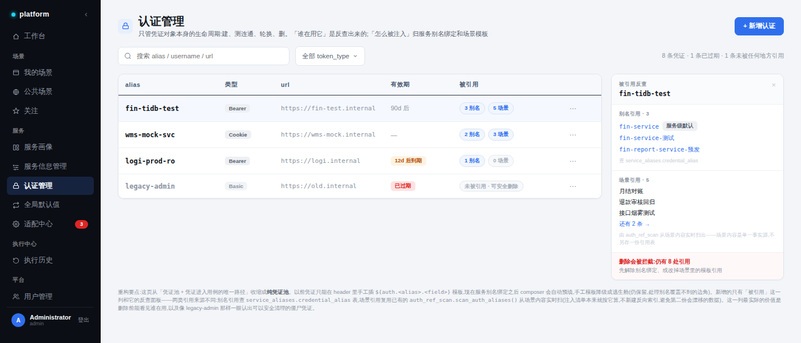
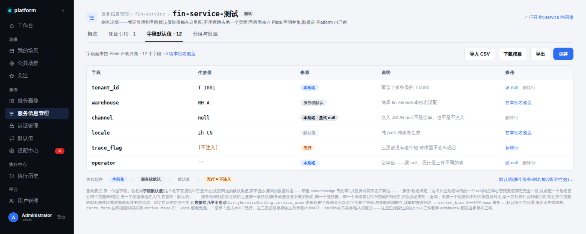
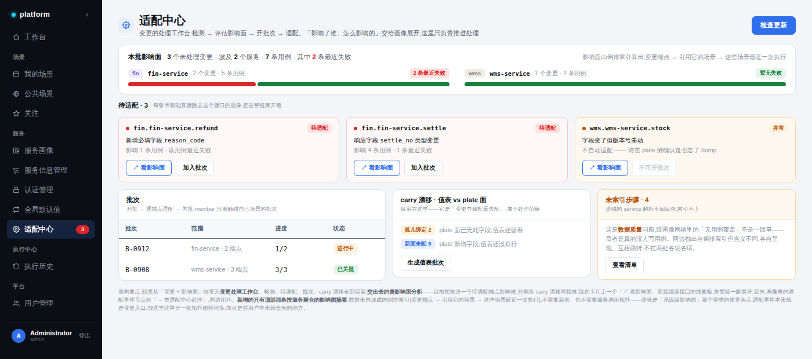

# 配套页面重构 — 认证管理 / 字段默认值 / 适配中心

> **范围**：服务画像与服务信息管理落地后，三个既有页需要做的收缩、改名与新增。
> **前置**：《服务画像 — 设计与改造方案》已在实现中。本文不重复那份方案的边界原则与画像本身的设计，只写这三页；凡引用处标 `[画像方案 §x]`。
> 本文涉及代码的部分均对齐 `src/gimbal-platform` 当前实现。
>
> **修订（2026-09-20，实施评审 + 交付回写）**：
> 1. 凭证引用源从两类扩为**四类**（§1.3）：steps 模板之外，补上**方案绑定**
>    （`composer_run_schemes.payload.serviceBindings.authAlias`，硬依赖）与
>    **config.users 快照**（自足副本，卫生信号非依赖）—— 原稿漏了前者的
>    409 口径、漏了后者的面板价值。
> 2. DELETE 409 定为**窄口径**（§1.4.3/§1.5）：仅本人场景的模板/方案绑定
>    引用硬拦；别名绑定、同名他场景、快照只提示 —— 名字引用按执行者本人
>    池解析，阻断过度。
> 3. impact-summary 定为**参数化纯读**（§3.6）：客户端把 catalog/diff 已拿
>    到的 pending endpointIds 传入，不在 GET 里隐藏基线写副作用；服务归组
>    键 = 端点自身的目录 service，不扫场景 payload。
> 4. C2 补两条键归一（§2.5）：`fields` 面与 `carry_drift` 都按 `derive_base`
>    归一 —— 前者是当时分支上已可触发的缺陷（别名选中后面恒空），后者的
>    误报会经漂移面板生成「删光别名绑定」的批次草案。
> 5. **交付状态**：先行小修（两条归一）、C1、C2、C3（auths 反查 + composer
>    预填）全部落地；`service_aliases` 表已随画像 P1 交付（§4.3 的
>    `carry_profile_ref` 列按画像 §5.6 挂起不建，本文原稿的该行废止）。
>
> **修订（2026-09-20，原型图对齐轮）**：初版实现按本文文字 + 项目既有
> signal 设计系统落地，未逐像素复刻 `images/` 三张原型。对齐审计后补齐
> 六处并拍板四条冲突：
> 1. **命名冲突**：H-auths-v2 / H-adaptations-v2 两图标「全局默认值」，
>    H-alias-detail 与画像方案三张图（services / board / grid）均图「默认值」
>    —— 5:2 维持 §2.2 拍板的「默认值」。
> 2. **服务信息管理树形表**（画像方案 H-services）维持画像 §4 的左栏两层树
>    + 顶部分组筛选 + 平铺表（该方案已显式否掉树形表原型，不回退）。
> 3. **轮换 / 到期时间不实现**：后端无轮换接口、模型只有 `expires_in`
>    时长无过期时刻；有效期列维持时长展示，统计行的「已过期」段不列。
> 4. **用例覆盖数维持顶部摘要**：原型把「全站 N 条用例覆盖」画进待适配卡，
>    实现聚合口径在服务级（impact-summary），不为此下钻到端点级。
> 补齐六处：Auths 副标题「N 条未被任何引用」+ 零引用行灰字「未被引用 · 可安全
> 删除」+ 行操作收进 `⋯` 下拉；反查抽屉底部淡红「删除会被拦截」预警
> （references 接口透出 `owner_id`，与 DELETE 409 同口径）；适配中心摘要条
> 淡蓝底 + 粗体标题 + 待适配区头「查看完整 diff ›」；未索引重构为琥珀区 +
> 白卡橙左边条 + 「去场景处理 ›」；别名详情头部凭证绑定徽章 + 编辑器表底
> 统计行；「默认值」来源 chip 跳 `/carry-config?path=` 命中行高亮。

---

## 0. 为什么这三页必须跟着动

画像把**「关联」和「影响面」**这件事集中收走了。三个兄弟页今天各自留着半套自己的实现——认证管理把「凭证怎么进用例」也管了，传递字段把「服务绑定」单独开了一页，适配中心用 carry 漂移间接推影响面。画像上线后这些半套实现就变成**第二个说法**，正好撞上 `[画像方案 §0]` 那条「不做第二个事实源」。

所以三页的改造动作是同一个形状：**把职责收窄到它真正独占的那一份，把关联性交给画像，然后各自补一个自己位置上最便宜的新东西。**

| 页 | 今天承担的 | 改造后承担的 | 交出去的 | 新增的 |
|---|---|---|---|---|
| 认证管理 `/auths` | 凭证池 **+ 凭证进入用例的唯一路径** | 纯凭证池（建 / 测连通 / 轮换 / 删） | 注入路径 → 别名绑定 + 场景模板 | 被引用列 + 反查面板 |
| 传递字段 `/carry-config` | 全局默认 **+ 服务绑定**，独立一页 | 改名**字段默认值**，一拆为二 | 服务/别名绑定 → 别名详情 tab | 无（纯迁移 + 改名） |
| 适配中心 `/adaptations` | 变更检测 **+ 影响面推断** | 变更处理工作台 | 逐条影响面 → 画像线索板 | 按服务聚合的本批影响面摘要 |

**三页新增的代码加起来，只有认证管理的反查和适配中心的聚合摘要两处是真的新逻辑，而且都建立在既有资产上，不新建任何索引表。**唯一的新表 `service_aliases` 是画像方案已经规划的，见 §4.3。

---

## 1. 认证管理 → 纯凭证池



### 1.1 收缩了什么

今天凭证要进到用例里，只有一条路：在 header 里手工插 `${auth.<alias>.<field>}` 模板。这条路既是唯一入口，也意味着认证管理这一页隐含地承担了「怎么用」的说明责任。

服务别名绑定上线后，composer 在用户选定别名时**自动预填**对应凭证的模板引用。手工模板**不删除，降级为逃生舱**——别名覆盖不到的边角情况（临时凭证、一次性调试、跨别名混用）仍然要能手写。

这条收缩的判据：`${auth.x.y}` 写在场景内容里，它是「这次编排打算怎么用凭证」；凭证对象本身是「这套凭证长什么样」。前者归场景，后者归这一页，中间的绑定关系归别名。认证管理不该同时管三样。

### 1.2 新增：被引用列 + 反查面板

表格加一列「被引用」，两个 chip：`N 别名` / `N 场景`。点开右侧滑出反查面板，分两段列出来源，并给出删除拦截提示。

这一列最实际的价值不是炫技，是**删除前能看见谁在用**，以及像图里 `legacy-admin` 那样一眼认出可以安全清理的僵尸凭证——「已过期 + 未被引用 = 可安全删除」是个很强的信号，今天完全看不到。

### 1.3 四类引用的来源不同，必须分开算（修订 1 扩充）

| 引用类型 | 数据来源 | 方式 | 依赖性质 |
|---|---|---|---|
| 别名引用 | `service_aliases.credential_alias` | 查表（表已随画像 P1 交付） | 名字引用，各执行者解析各自池 |
| 模板引用 | `composer_scenarios.payload` steps | **实时扫**，复用既有 `services/auth_ref_scan.py` 的 `scan_auth_aliases(steps)` | 硬：dispatch 按执行者池覆盖注入 |
| **方案绑定引用**（修订补） | `composer_run_schemes.payload.serviceBindings[*].authAlias` | 查表逐方案读 | 硬：方案启动的 run 显式并入注入清单 |
| **config.users 快照**（修订补） | `definition.config.users` 同名键 | 实时扫（键集合即引用面） | **非依赖**：快照自足不随池轮换 —— 卫生信号（哪些场景揣着旧密码副本） |

场景引用**坚决不建反向索引表**。理由写在那个模块自己的 docstring 里：「注入清单的自动部分以此为准 —— 场景内容是单一事实源」。注入清单本来就按实时扫算，再存一份反向表就会有两个说法，而且是**会漂移**的两个说法（场景改了、表没同步）。

> 代价要说清楚：实时扫是 O(场景数 × payload 大小) 的全表扫描。内部平台量级可接受，且这个面板是点开才算、不在列表页默认渲染。真到了扫不动的那天，正确的做法是**扩 `scenario_endpoint_refs` 的写路径**（它已经是同事务维护的倒排索引，加一个 `auth_alias` 维度即可），而不是另起一张表。

### 1.4 可见性边界（这是实现时最容易做错的一处）

`AuthSession` 是 **owner 作用域**的：

```python
__table_args__ = (UniqueConstraint("owner_id", "alias", name="uq_auth_owner_alias"),)
```

而 `ComposerScenario` 有 `visibility: private | public`。两者相乘产生三个必须明确回答的问题：

1. **凭证别名只在 owner 内唯一。**所以场景里的 `${auth.fin-tidb-test.*}` 跟我凭证池里的 `fin-tidb-test` 是**名字相同**，不是对象引用。反查本质是按名字匹配，UI 文案要如实说「引用了同名别名的场景」，不能说成「引用了这条凭证」。
2. **反查会跨到看不见的场景。**必须：**计数照给，名字按可见性过滤**，剩余的显示为「另有 N 条不可见」。只给总数不泄露标题，用户既知道「删不得」，又拿不到别人的私有场景名。
3. **`service_aliases.credential_alias` 存的是别名名字（字符串），不是 `auth_sessions.id`。**这是刻意的：同一条别名绑定被不同用户使用时，各自解析到**自己凭证池里的同名凭证**。这正是多用户编排想要的语义——绑定是共享的，凭证是私人的。代价是它不是外键，没有数据库级完整性；所以删除拦截必须在应用层做，并且是**软提示不是硬约束**（别人池子里的同名凭证你管不着）。

### 1.5 改造清单

| 层 | 动作 | 状态 |
|---|---|---|
| 后端 | `services/auth_references.py`（新）：四类引用一次扫描；`GET /auths/{alias}/references` → `{alias_refs, scenario_refs: {visible, hidden_count}}`（snake 契约对齐本路由既有风格） | ✅ 已交付 |
| 后端 | 别名侧查 `service_aliases`；场景侧模板 + 方案绑定 + config.users 键；名字按 `can_read_scenario` 过滤（admin 全量 / public / owner） | ✅ 已交付 |
| 后端 | `DELETE /auths/{id}` **窄口径** 409（修订 2）：仅本人场景的模板/方案绑定引用硬拦，detail 带 `ownScenarioIds`；其余类型不阻断 | ✅ 已交付 |
| 后端 | 列表接口双计数（`alias_ref_count` / `scenario_ref_count`，快照不进计数） | ✅ 已交付 |
| 前端 | `views/Auths.vue` 「被引用」列双 chip + 反查侧板（Drawer；别名行深链 `/service-admin/:alias?tab=credential`，kinds 分色 + 不可见计数） | ✅ 已交付 |
| 前端 | composer 侧：步骤服务命中绑定 → 认证选择器**预填**绑定凭证（来源提示 + 不在本人池仍可插入），手工选择保留为逃生舱 | ✅ 已交付（C3a） |
| 不动 | Fernet 加密、测连通、轮换、`owner_id` 权限边界，全部原样 | — |

---

## 2. 传递字段 → 字段默认值，并且一拆为二



### 2.1 为什么改名

「传递字段」这个名字在编排语境里是**歧义的**：用户会以为它是步骤间的数据传递，而那是 `extract` / `assign` 干的事。它实际是什么？**按层回退的默认取值**。

所以改叫**字段默认值**——名字直接说出它是什么，不需要再解释。

### 2.2 一拆为二，各归其位

| 原来 | 改造后 | 理由 |
|---|---|---|
| `/carry-config` 页里的「服务绑定」区 | 并进**别名详情**的「字段默认值」tab | 锚点和心智跟凭证绑定完全一致。以前配一个别名要在两个页面来回跳：凭证在一处、字段在另一处，而它们绑定的是同一个东西 |
| `/carry-config` 页里的「全局默认」区 | 保留侧边栏入口，直接叫**默认值** | 它是跨服务的兜底层，确实需要一个独立入口 |

关于**为什么不是「全局默认值」**：服务级和别名级在使用上是**同一条路径**——服务就是没有后缀的别名，同一个选择器、同一个详情页，用户感知不到分层。拿「全局」去跟一个他感知不到的分层做对比，等于制造一个他必须先理解才能忽略的概念。这一层到底什么时候生效，写在那个页面的副标题里（「哪个服务 / 别名都没配时生效」）比塞进导航标签更说得清。

### 2.3 三层回退，以及数据层几乎不用动

```
本别名  →  服务级默认(derive_base 归一)  →  默认值  →  无行 = 不注入
```

绑定层从两层变三层，但**数据层基本不动**：

```python
class CarryServiceBinding(Base):
    service_name: Mapped[str] = mapped_column(String(128), index=True)
    #              ^^^ 本来就是字符串键，别名名字也是字符串
```

`CarryServiceBinding.service_name` 今天的注释写的是「目录服务名（`derive_base` 解析产物，非用户引用键）」——**放宽取值域**即可：允许存别名全名。读取时按 `本别名 → derive_base(别名) → 默认值` 三层回退，与凭证查找同构。

`carry_face` 拉字段面时同样用 `derive_base` 归一到 base 服务再问 Plate——**Plate 那侧完全无感**，因为别名是 Platform 的概念，Plate 只认目录服务。

`routers/carry.py` 的现有路由 `/bindings/{service}` 直接复用，`{service}` 位置传别名名字即可；`put_bindings` 的整体替换语义不变。

### 2.4 三态必须保持独立列承载

| 状态 | 表内表现 | 注入行为 |
|---|---|---|
| 有行，有值 | `T-1001` | 注入该值 |
| 有行，值为 NULL | `null` + 「本别名 · 显式 null」 | 注入 JSON `null` |
| 有行，空串 | `""` | 注入空字符串 |
| **无行** | `(不注入)` + 「无行」 | 请求里**不出现这个键** |

这三态**不能靠输入框区分**（空输入框到底是空串还是没配？），必须用 `isNull` + `hasRow` 两个独立标志承载。模型注释已经把语义写死了：「行存在即声明注入，`value=NULL` 注入 JSON null（显式空）；行不存在才是『未配置』，走降级链。配置页 placeholder 依赖此语义。」

**这是已经踩过的坑，迁移时最容易回退。**页面上把「来源」做成独立一列，就是为了让这三态各有各的显式位置。

### 2.5 改造清单

| 层 | 动作 | 状态 |
|---|---|---|
| 后端 | `CarryServiceBinding.service_name` 取值域放宽到别名名（**无 schema 变更**，注释已改；运行时三层链已随画像 P1 落在 `carry_injection`，本页只动配置面读侧） | ✅ 已交付 |
| 后端 | 读侧回退在**前端编辑器组件**组装（`ServiceBindingEditor`：本键 / base 绑定 / 默认值三源一次拉齐，「来源」列 + placeholder 透出继承层）；store 保持单键语义，无新接口 | ✅ 已交付 |
| 后端 | `routers/carry.py` `/bindings/{service}/fields` 先 `derive_base` 归一再问 Plate（**修订 4**：交付前是分支上的现存缺陷 —— 别名选中后面恒空且 `degraded=False`；目录不可达时退化为原样过滤，不瘫痪） | ✅ 已交付 |
| 后端 | `carry_store.carry_drift` 键归一（**修订 4 新增**）：别名键对 base 的面做 diff，只报 orphaned，`baseService` 标注「别名 → base」；否则误报会经漂移面板生成「删光别名绑定」的批次草案 | ✅ 已交付 |
| 前端 | `views/CarryConfig.vue` 拆分：绑定区整体提取为 `components/carry/ServiceBindingEditor.vue`（锁定键 + CSV 三件套随行走），落在键详情页 `views/ServiceAliasDetail.vue`（`/service-admin/:alias`，base 服务同页编辑）；默认值区留原路由 | ✅ 已交付 |
| 前端 | 侧边栏 `components/Sidebar.vue`：`传递字段` → `默认值`，服务组按 §4.1 重排（画像 / 服务信息 / 认证 / 默认值 / 适配） | ✅ 已交付 |
| 不动 | CSV 三件套语义、`adminOnly` 权限边界、carry 漂移检测（留在适配中心，见 §3） | — |

---

## 3. 适配中心 → 变更处理工作台



### 3.1 收缩：影响面交出去

今天想知道一个待适配端点**影响了谁**，只能靠 carry 漂移间接推。改造后每张待适配卡加一个 `↗ 看影响面`，直接跳该接口的线索板，告警链一眼展开；反向，画像里的适配事件节点给 `→ 去适配中心处理`，两边闭环。

职责因此收窄成一句话：**检测 → 评估 → 开批次 → 适配**。「影响了谁、怎么影响的」交给画像展开，这里只负责**推进处理**。

检测、待适配、批次、carry 漂移**全部保留**。特别是 carry 漂移要留在这里——它是「变更导致配置失配」，属于处理范畴，不是画像的探索范畴。

### 3.2 新增：按服务聚合的本批影响面摘要

顶部一条摘要 + 每服务一根条：

> **3** 个未处理变更 · 波及 **2** 个服务 · **7** 条用例 · 其中 **2** 条最近失败

算法完全建立在既有资产上，**不需要新表、不需要服务调用拓扑**：

```
待适配变更的 endpoint_id
  → adaptation_service.impact(db, endpoint_id)        # 已存在，走倒排索引
  → distinct scenario_id
  → derive_base / deriveSystem 归组到服务             # 已存在，不新起匹配规则
  → 每个 scenario 的最近一次 Execution                # 已存在
```

四步用到的四样东西**今天全都在**：`impact()` 在 `services/adaptation_service.py:185`，倒排索引在 `models/scenario_endpoint_ref.py` + `services/endpoint_ref_index.py`（写路径由 `scenario_store` 同事务维护），服务归组在 `services/service_names.py`，执行记录在 `models/execution.py`。

### 3.3 它就是「系统级影响面」的便宜落点

`[画像方案 §6]` 把系统级拓扑判为本期不做，同时指出了便宜的替代：在适配中心按服务聚合。**这一节就是那个替代的兑现。**

为什么放这里对：适配事件本来就是变更入口，用户为了处理变更**本来就会来**。在他已经在的地方给出「这次波及几个服务」，比为了同一个问题单开一张拓扑图轻得多——而且诚实：它回答的是「**这批变更**波及谁」，不假装自己是运行时调用拓扑。

### 3.4 「未索引步骤」与画像的「无用例覆盖」必须分清

这两个数字都出自倒排索引，但**含义相反**，放在两个页面上更容易被混为一谈，所以必须显式区分：

| 指标 | 位置 | 含义 | 该做什么 |
|---|---|---|---|
| 未索引步骤 | 适配中心（琥珀色独立卡） | 步骤的 service 解析不回目录，**索引不上** | 数据质量问题：修步骤的服务名 |
| 无用例覆盖 | 画像热力网格（②格黄） | **真的没人写用例** | 测试缺口：去写用例 |

页面上两边互相跳转，但**各自呈现、各说各的**，不在两处用同一套措辞。`unindexed_steps()` 今天已经被适配中心用着（`GET /adaptations/unindexed-steps`），这里只是把它从混在列表里提成一张有明确说明的独立卡。

### 3.5 可见性边界（第二个容易做错的地方）

```python
# routers/executions.py:53
base = select(Execution).where(Execution.owner_id == user.id)
```

执行记录是**严格 owner 作用域的，管理员也不例外**。而「其中 2 条最近失败」这个数字，如果沿用这条查询，每个管理员看到的数会不一样——**同一批变更，不同人看到不同的风险评估**，这比不显示更糟。

**决定：聚合摘要里的「最近失败」跨 owner 统计，并在 UI 上标明是全站口径。**

依据是 `routers/adaptations.py` 的检测与处理类路由已经全是 `AdminUser` 门禁（`catalog/diff`、`impact`、`unindexed-steps`、开批次、`apply_op` / `skip_op` / `rollback` 都是；唯一的例外是 `GET /batches` 列表用 `CurrentUser`，让 member 只看到触碰自己场景的批次）。新的 `impact-summary` 归入 `AdminUser` 那一侧，所以跨 owner 读执行记录**没有新开权限面**。但实现时必须**另写查询，不要复用 `/executions` 的 owner 过滤**，并且只取聚合数（count / 最近状态），不返回执行详情或场景标题——避免越过 `visibility` 边界泄露内容。

同理，「7 条用例」也应是全站计数；点进去看清单时才按 `visibility` 过滤，不可见的计为「另有 N 条」，与 §1.4 的处理一致。

### 3.6 改造清单

| 层 | 动作 | 状态 |
|---|---|---|
| 后端 | `GET /adaptations/impact-summary`（AdminUser）→ `{services: [{name, changeCount, caseCount, recentFailCount}], totals: {...}}`（**修订 3**：pending endpointIds 由客户端传入，纯读不复算 diff） | ✅ 已交付 |
| 后端 | 实现在 `adaptation_service.impact_summary`：端点 → 目录 service 归组（轻列表权威，**不扫场景 payload**）+ 倒排索引 distinct 场景（锚点行含）+ 跨 owner 最近执行终态聚合（只回聚合数） | ✅ 已交付 |
| 后端 | 无新表、无新索引、无 schema 变更 | — |
| 前端 | `views/AdaptationCenter.vue`：顶部摘要条（全站口径标注）+ 每服务条（跳画像）；待适配卡 `↗ 看影响面`（endpoint→service 映射来自目录轻列表，anomaly 卡无映射不显示）；`?focus=` 深链高亮 | ✅ 已交付 |
| 前端 | 线索板适配节点 `→ 去适配中心处理`（带 focus 反链，附录闭环）；ImpactDrawer 的「开批次」入口保留未动 | ✅ 已交付 |
| 前端 | 「未索引步骤」独立琥珀卡，文案显式区分于画像的「无用例覆盖」 | ✅ 已交付 |
| 不动 | 批次生命周期、`apply_op` / `skip_op` / `rollback`、carry 漂移面板、`AdminUser` 门禁；侧边栏未处理数角标（既有 `stores/adaptations` + admin-only，语义已符合 §4.1） | — |

---

## 4. 三页共同的改造面

### 4.1 路由与导航

| 路由 | 今天 | 改造后 |
|---|---|---|
| `/auths` | 认证管理 | 不变（内容收缩） |
| `/carry-config` | 传递字段 | **默认值**（只剩兜底层） |
| `/services/config/aliases/:alias` | — | 新增：别名详情（字段默认值 tab 落这里） |
| `/adaptations` | 适配中心 | 不变（内容收缩 + 摘要） |

侧边栏「服务」组最终四项：`服务画像` / `服务信息管理` / `认证管理` / `默认值`，外加 `适配中心` 带未处理数角标。

### 4.2 后端新增汇总

| 接口 | 用途 | 依赖 |
|---|---|---|
| `GET /auths/{alias}/references` | 反查面板 | `service_aliases` 表 + `auth_ref_scan`（既有） |
| `DELETE /auths/{id}` 加 409 | 删除拦截 | 同上 |
| `GET /adaptations/impact-summary` | 本批影响面 | `impact()` + `derive_base` + Execution（全既有） |
| `/carry/bindings/{service}` 取值域放宽 | 别名级字段默认值 | **无新接口，无 schema 变更** |

**一张新表都没有**——唯一需要的 `service_aliases` 是画像方案已经规划的。

### 4.3 `service_aliases` 是这三页的共同前置

```sql
alias_name        VARCHAR PRIMARY KEY   -- 别名全名，如 fin-service-测试
base_service      VARCHAR               -- derive_base 结果，必须落在 Plate 目录内
group_tag         VARCHAR NULL          -- 横向分组（环境是它最常见的一种用法）
credential_alias  VARCHAR NULL          -- 指向凭证别名的名字，非外键（见 §1.4.3）
carry_profile_ref VARCHAR NULL          -- 可选，指向共享的一套字段默认值
owner_user_id     INT NULL
```

三页对它的依赖各不相同，可以分别上：

- **认证管理**只依赖 `credential_alias` 列 → 没有这张表时，「别名引用」chip 显示为 `—`，场景引用照常工作
- **字段默认值**不依赖这张表（`CarryServiceBinding.service_name` 直接存别名字符串），但**别名详情页**依赖它来列出别名
- **适配中心**完全不依赖它

这意味着**适配中心可以独立先上**，不等任何前置。

### 4.4 数据迁移

三页的迁移都是**加法**，无破坏性变更：

| 项 | 迁移动作 |
|---|---|
| `carry_service_bindings` 存量行 | **原样有效**。存量都是 base 服务名，在新的三层回退里自然落到「服务级默认」那层 |
| `carry_global_defaults` | 原样，只改 UI 标签 |
| `auth_sessions` | 无变更 |
| 适配中心 | 无变更 |

唯一需要留意的是 `CarryServiceBinding.service_name` 的注释（「目录服务名，非用户引用键」）**必须同步改掉**，否则下一个读代码的人会按旧语义写校验。

### 4.5 分期

| 期 | 交付 | 依赖 | 状态（2026-09-20） |
|---|---|---|---|
| **先行** | fields 归一 + drift 归一（修订 4，分支现存缺陷修复） | 零 | ✅ 已交付 |
| **C1** | 适配中心：影响面摘要 + 未索引卡 + 跳画像入口 + focus/板反链 | 零前置（画像路由已在） | ✅ 已交付 |
| **C2** | 传递字段改名 + 一拆为二 + 三层回退读侧 | `service_aliases`（已交付） | ✅ 已交付 |
| **C3** | 认证管理反查（四类引用）+ 删除拦截（窄口径）+ composer 预填 | `service_aliases.credential_alias`（已交付） | ✅ 已交付 |

实施顺序按用户拍板：先行小修 → **C2（绑定侧实现完）→ C3a（composer 从绑定选凭据）** → C1 → C3b；四块全部落地，后端/前端全量测试绿。

---

## 5. 明确不做的

| 不做 | 理由 |
|---|---|
| 场景 → 凭证的反向索引表 | 场景内容是单一事实源，第二份会漂移。真扛不住就扩 `scenario_endpoint_refs` 的写路径，不另起表 |
| `credential_alias` 做成外键 | 凭证是 owner 私有的，绑定是共享的，外键会强行把两者绑死，破坏多用户语义 |
| 删除凭证做成硬约束 | 同上——你管不到别人池子里的同名凭证，硬约束给不出正确性，只会给假的安全感 |
| 在适配中心画服务调用拓扑 | `[画像方案 §6]`。按服务聚合已经回答了「波及几个系统」，且不假装自己是运行时拓扑 |
| 合并认证管理与服务信息管理 | 凭证的生命周期（轮换、过期、测连通）跟别名的配置生命周期节奏完全不同，合并会让低频配置页被高频运维动作淹没 |

---

## 附：与画像方案的接口契约（双向跳转）

| 从 | 到 | 参数 |
|---|---|---|
| 适配中心 · 待适配卡 `↗ 看影响面` | 接口线索板 | `/services/{service}/endpoints/{endpointId}` |
| 画像 · 适配事件节点 `→ 去适配中心处理` | 适配中心，定位到该变更 | `/adaptations?focus={endpointId}` |
| 别名详情 `↗ 打开 fin-service 的画像` | 服务热力网格 | `/services/{baseService}` |
| 认证管理 · 反查面板的别名 chip | 别名详情 · 凭证引用 tab | `/services/config/aliases/{alias}?tab=credential` |
| 字段默认值表 · 「默认值」来源 chip | 默认值页 | `/carry-config?path={fieldPath}` |

跳转一律**带参定位，不只是跳到页面顶部**——排查的连续性就断在这种地方。

> 交付核对（2026-09-20，同日原型对齐补齐）：五条跳转全部落地 —— 待适配卡 `↗ 看影响面`（带服务名进板）、板适配节点 `→ 去适配中心处理`（`?focus=` 高亮回链）、别名详情 `↗ 打开画像`、反查面板别名 chip → `/service-admin/:alias?tab=credential`、字段默认值「默认值」来源 chip → `/carry-config?path={fieldPath}` 命中行蓝环高亮并滚动定位（初版以编辑器内呈现代替跳转，原型对齐轮已补真跳转）。
