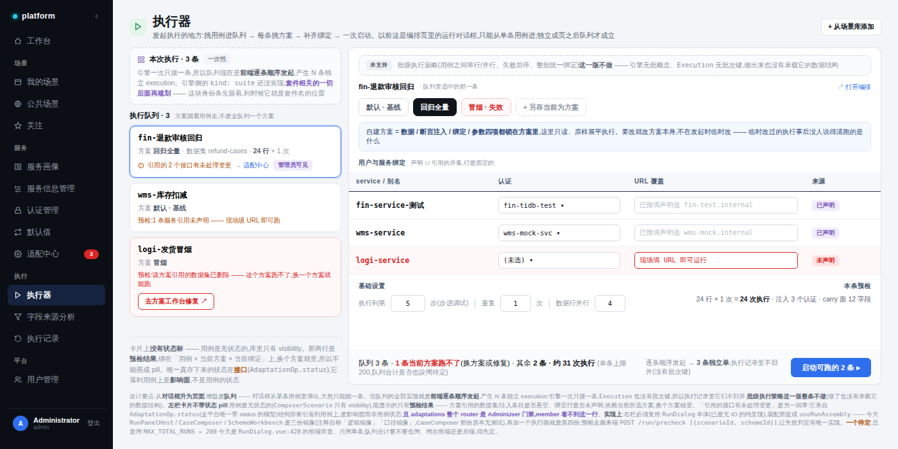
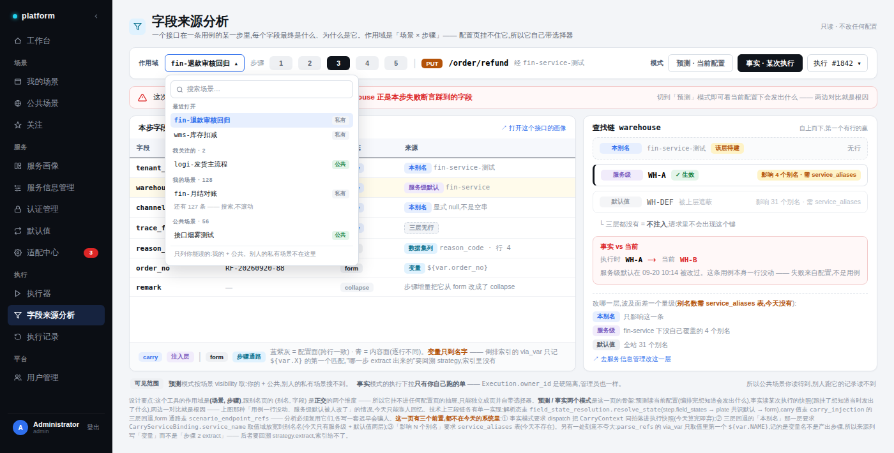
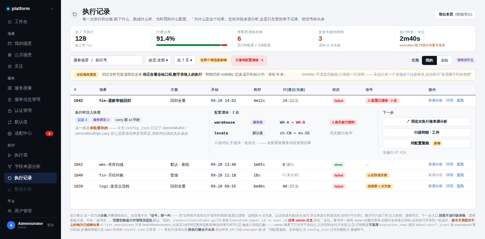

# 执行 — 设计与改造方案

> **范围**：侧边栏「执行」组四页。原来这一组叫「执行中心」，只有「执行历史」一项。
> **关联**：《服务画像 — 设计与改造方案》（实现中）、《配套页面重构 — 认证管理 / 字段默认值 / 适配中心》。本文不重复那两份的内容，引用处标 `[画像方案]` / `[配套方案]`。
> 本文涉及代码的部分均对齐 `src/gimbal` 与 `src/gimbal-platform` 当前实现，行号为撰写时快照。
> **2026-09-20 复核**：全文代码断言按 `0aa695f`（服务画像 P1）之后的树重验一遍，订正 8 处、
> 分期重排一轮，逐条见文末「修订记录」。

---

## 0. 这一组要回答什么，以及一条贯穿全文的纪律

| 页 | 路由 | 回答的问题 | 本期 |
|---|---|---|---|
| 执行器 | `/run` | 我要跑什么、怎么跑 | 做 |
| 字段来源分析 | `/field-trace` | 这一步的每个字段最终是什么、为什么 | 做 |
| 执行记录 | `/executions` | 跑了什么、跑成什么样、当时用的什么配置 | 做 |
| 数据分析 | `/analytics` | 最近整体怎么样、问题集中在哪 | **延后**，入口置灰保留 |

### 纪律：不发明系统没有的状态和数据

这一版的大半工作量是**把先前画进去的、系统其实没有的东西拿掉**。三条硬事实，后面每个设计决定都回到这里检验：

1. **用例与方案是无状态的。** `ComposerScenario` 只有 `visibility`，没有 `status`；`ComposerRunScheme` 也没有（只有 `is_default`）。全平台带 `status` 的是**运行与适配事件**这三张表——`Execution.status`（`models/execution.py:42`）、`AdaptationBatch.status`（`models/adaptation_batch.py:19`）、`AdaptationOp.status`（`models/adaptation_op.py:28`）——没有一张是用例生命周期。
2. **平台一次只发一条。** 套件在**引擎侧是实现了的**：`Engine.run(target: Scenario | Suite)`（`src/gimbal/core/runner.py:88`）、`cli/commands/run_suite.py` 整条在跑；`RunUnion` 里那句"暂时使用列表实现"（`src/gimbal/schema/scenario.py:55`）说的是 kind 的形状，不是"没写"。缺的是**平台没接线**——`run_dispatcher` 只 fanout `ComposerScenario`，子进程 argv 写死 `run launch`（`services/gimbal_launcher.py:102`）。所以"批"的语义今天在平台侧仍只能由前端顺序发起模拟，但补它的成本是"接一条已有能力"，不是"从零造引擎"。
3. **行级 / 步骤级结果不落库。** `run_dispatcher.execution_rows` 活跃执行读内存 registry、历史执行**扫 `data/runs/*.jsonl` 按 executionId 逐行回放**；步骤级明细只在 case 目录的 `result.json` 工件里。**单执行读得出，跨执行聚合不出来。**

第 3 条直接决定了数据分析本期延后（§4）。

---

## 1. 执行器 `/run`



### 1.1 为什么从对话框升为页面

今天发起执行只有一条路：在编排页点「运行」，弹出 `RunDialog`（数据集页那个入口连同路由已在 `6c072bb` 退役，见 §1.5）。对话框是**从某一条用例里弹出来的**，所以天然只能跑一条。

独立成页之后才谈得上"这次回归跑这 3 条"。这是页面形态相对对话框的**唯一**实质增益——其余（方案选择、绑定、参数）对话框都做得了。

### 1.2 队列的真实含义：前端逐条顺序发起

必须说清楚，否则会被当成批执行：

- 队列的全部实现 = **前端逐条调 `runScenario`**，产生 **N 条独立 execution**
- `Execution` 没有批次键，所以它们在执行记录里**不归并**
- 队列**不落库**，是一次性的挑选

**因此批级执行策略（用例之间串行/并行、失败后停还是继续、整批统一绑定）本期整条不做**——做了也没有承载它的数据结构。页面上那一格是一条虚线说明，不是可操作控件。

> **后端预留点（复核后建议提到 E1）**：给 `Execution` 加批次键。一批 N 条要能在执行记录里归并，这个字段越早加越便宜；它今天就成立，与套件无关。
> 但这一条不该留在 E2：`/run` 相对对话框的**全部**增益就是"这次跑这 3 条"（§1.1），N 条不归并时这个增益就只剩"一次点多条"——**批次键不在 E1，`/run` 就不该在 E1 单独成页**。见 §7。

### 1.3 套件：后面再规划

`Suite` 是编排期资产、跟场景同级、有自己的可见性——这条判断成立；引擎侧也已经实现（§0 第 2 条），缺的是平台接线：dispatch 认 Suite + 有批次键承载结果。所以**套件相关的组织方式（库页面、可见性、成员编排）本期不设计**，但理由要记准：是"平台没接 + 没有批次键归并"，不是"引擎没有"——后者会让人以为这是一道大工程，从而把 E2 的批次键也一起推远。

### 1.4 左栏卡片不带状态 pill

这是 §0 纪律最直接的体现。卡片上能显示的只有两类信息，**都不是用例的状态**：

| 显示 | 是什么 | 依赖 |
|---|---|---|
| 「预检：1 条服务引用未声明」 | **预检结果**，绑在「用例 × 当前所选方案 × 当前绑定」上，换个方案就变 | 装配期判定 |
| 「引用的 2 个接口有未处理变更」 | **影响面**，来自 `AdaptationOp.status` 经倒排索引落到用例上 | 适配事件 |

第一类做成右上角的彩色 pill 会被读成"这个对象的状态"，接着必然有人要求「我的场景」列表也加一列状态——那就凭空发明了一套用例生命周期。所以用普通文字行，不用 pill。

措辞也要注意：方案引用的数据集被删，正确说法是「**这个方案跑不了，换一个方案就能跑**」，不是「该用例禁跑」。

第二类挂 `管理员可见` 标：**`routers/adaptations.py` 的检测类路由全是 `AdminUser` 门禁**，member 看不到这一行。

### 1.5 右栏必须与运行对话框同源——而且今天不同源

复核后先把现状说准：**不是三份活的镜像，而是一份死代码 + 一份完整副本 + 半份 + 一处纯函数副本**。代码注释确实自己承认了镜像关系，但被镜像的那一方已经不在了：

| 位置 | 角色 | 复核结论 |
|---|---|---|
| `components/composer/RunDialog.vue` | 弹窗本体。props 全传入、**无网络 IO** | 可剥壳（`:13-219` 那层 Teleport 很干净）。但两点要改口径：emit 是 `close`/`confirm`/`saveAsScheme` **三个**不是两个；且它内部 `useRouter()` 跳转（`:453-458`）+ toast，不是零副作用 |
| `components/composer/RunPanelHost.vue` | 自称"两个执行入口共用的装配层" | **死代码**。两个消费方 `CaseDataSetsList.vue` / `DataSetEditor.vue` 连同数据集路由已在 `6c072bb` 退役，今天没有任何 `.vue` 挂载它，只剩自己的 7 条 RH-* 测试在跑。文件头"数据集页卡片「运行」…在用"已过期 |
| `views/CaseComposer.vue:234` | **不走 RunPanelHost**，直接挂 `RunDialog`，自己装配了一遍 | 唯一活的 dispatch 装配点：`:476-521` 派生 + `openRunDialog:422` + `onRunConfirm:1061` + `onSaveAsScheme:1129`，约 110 行 |
| `views/SchemeWorkbench.vue:145/160/280` | 注释「逻辑镜像 `RunPanelHost.serviceRows`」「`authOptions` 同构」 | **半份**：只派生 rows/options/取数，**不 dispatch**（它走 `updateRunScheme` 持久化），两者不同工 |
| `components/schemes/SchemeRunConfigSection.vue:44/70/79` | 三处「口径镜像 `RunDialog.explicitBindingOf` / `.degraded` / `.MAX_TOTAL_RUNS`」 | 抄的是 RunDialog 的**绑定语义**（纯函数），不是装配 |

`RunPanelHost.vue:74/85` 反过来也写着"与 CaseComposer 同构"——两边互认，**没有正本**。

原先引作铁证的那行测试注释**已过期**：

> `views/__tests__/CaseComposer.registry.test.ts:302` — RunPanelHost 的同款计算由 RH-* 锁定；**CaseComposer 的这份副本此前无测试**

"此前"之后补上了：`CaseComposer.run.test.ts:134/188/225/247` 已把这份副本的 schemes、deadEntryIds、confirm、saveAsScheme 都钉住。**三处派生点唯一一处测试都没有的是 `authOptions`** —— 收敛时要补的是它，不是再引这行注释。

所以这次收敛的准确说法是：**别让执行器去抄第三份**，而不是"四份合一"。落地三步：

1. `RunDialog.vue` 剥壳：`.run-overlay` + `.run-dialog` 那层 Teleport 拆出去，留下 **`RunConfigPanel`**（纯内容）
2. 两个外壳：弹层壳（编排页）和执行器页的右栏**直接内嵌**
3. 装配逻辑提成 **`useRunAssembly(scenarioId)`**，消费方 = CaseComposer / SchemeWorkbench / 执行器；`RunPanelHost` 要么删掉、要么改造成它的实现载体，**不要留成第三份**

两条边界要划清，否则会抽出一个大杂烩：

- **失效判定已有单源**：`useInjectableSurface.ts:287-290` 持有 `deadIds = intrinsic ∪ (契约在途 ? ∅ : contractDependent)`，四个消费方共用，该模块自己写着「视图不得各自复刻」。`useRunAssembly` 必须**消费** `surface.deadIds`，不是再算一遍。
- `explicitBindingOf` / `degraded` / `MAX_TOTAL_RUNS` 这三个副本是**纯函数、不依赖 scenarioId**，抽成 `utils/run-bindings.ts` 更合适；塞进 `useRunAssembly` 会让它变成既装配又判定的混合体。

扣掉这两块，真正待提取的公共体是：4 路并行取数、`serviceRows`、`authOptions`、`stepNames`、confirm 的 spread-guard 段、另存后重取 —— **约 60-70 行，2-3 个活消费方**。

`RunConfigPanel` 内嵌进右栏的约束：**按容器宽度自适应，不读固定弹窗宽**。

#### 三条时序坑，只有两条还需要搬

`RunPanelHost` 注释里这几条不是装饰，是踩过的：

1. **取数之后 `dataSets` / `registry` / `schemes` 的赋值必须在同一个同步 tick 内落完**（`RunPanelHost.vue:116-119`）—— 中间插一个 await，方案会在不完整的判定面上先求值一次，活着的方案闪现「已失效」。`authAliases` 那一路是**故意**放在这个块之外的（`:129-131`）。**这条要跟着搬进 composable。**
2. ~~契约在途时 `contractDependent` 不并入 `deadEntryIds`~~ —— **已经不在宿主手里了**：判定下沉到 `useInjectableSurface.ts:287-290`，宿主只取 `surface.deadIds`（`RunPanelHost.vue:92-93` 自己写着"只消费，不持有副本"）。composable 照消费即可，别重述这条规则。
3. 另存后整表替换会重置默认态绑定 —— 已知 deferred 行为（`RunPanelHost.vue:178-180`；根因是 `RunDialog.vue:457-469` 那个整表重建 bindings 的 watch）。**它没有登记在 `docs/DEFERRED.md`**，只活在代码注释里，别去那份清单找依据。

搬的时候顺带一件事：`CaseComposer` 那份副本比宿主超集，多出 saveDraft 先落盘、800ms 导航延时、未保存新用例守卫、`initialSchemeId` 深链四段 composer 专属逻辑 —— `useRunAssembly` 只收公共部分，这四段留作调用方注入的钩子，否则 composable 会被拽成 composer 专用件。

### 1.6 预检走服务端

```
POST /run/precheck  [{scenarioId, schemeId}, ...]
 → 每条返回 {schemeValid, danglingEntryIds, unboundServices}
```

入参是 **`{scenarioId, schemeId}` 对**，不是 scenarioId 列表——要检的本来就不是用例，是"这条用例配上这个方案能不能跑"。

两个收益：失效判定有**服务端唯一实现**（前端不用再抄一份），以及队列 N 条不必各装配一次（每条装配是 4 个并行请求 + 凭证池）。

> 复核补一条：`POST /api/scenarios/preview-plate`（`routers/scenarios.py:104`）**已经跑完整条装配 + carry 注入链**（`:182` `build_carry_context` → `:187` `materialize_run_copy`）。`/run/precheck` 该复用这套判定，别再开第二份失效口径。

### 1.7 一个待定（复核后收窄了一半）

`MAX_TOTAL_RUNS = 200` **不是前端独占常量**：后端 `core/config.py:59 MAX_RUNS_PER_EXECUTION = 200`，在 `run_dispatcher.py:546` 按 `rows × injection_entries × n_runs` 的**聚合**口径 409 拦截（错误文案就写着 `rows x nRuns`），`RunDialog.vue:428` 与 `SchemeRunConfigSection.vue:81` 只是它的两处前端镜像。

所以"只闸单条"这个前提是错的 —— **单条执行的聚合量今天已经闸住了**。真正待定的只剩一件事：**队列 N 条的跨执行合计**要不要闸、闸在前端还是后端。这决定了 §1.8 里"总量闸语义"这一格能不能划进"不动"。

### 1.8 改造清单

| 层 | 动作 |
|---|---|
| 前端 | 新路由 `/run` → `views/Runner.vue`；左栏队列 + 右栏 `RunConfigPanel` |
| 前端 | `RunDialog.vue` 剥壳为 `RunConfigPanel` + 弹层壳；装配逻辑 → `useRunAssembly`（**消费** `useInjectableSurface`，不重算失效判定） |
| 前端 | `CaseComposer` / `SchemeWorkbench` 改调 `useRunAssembly`，删各自的副本；`RunPanelHost.vue` 就地退役（它已无消费方） |
| 前端 | `explicitBindingOf` / `degraded` / `MAX_TOTAL_RUNS` → `utils/run-bindings.ts`，与 `RunDialog` 共用 |
| 前端 | 补 `authOptions` 派生的测试（三处副本里唯一没被钉住的一处） |
| 后端 | 新增 `POST /run/precheck`，判定复用 `preview-plate` 那条链 |
| 后端 | `Execution` 加批次键 —— **建议从 E2 提到本期**，理由见 §1.2 / §7 |
| 不动 | `runScenario` 分发链路、方案 CRUD、单执行总量闸（后端已闸）；跨执行合计待定 |

---

## 2. 字段来源分析 `/field-trace`



### 2.1 它的作用域挂不进任何配置页

这是这一页独立存在的全部理由。

- 别名详情的作用域是 `(别名, 字段)` —— 环境级、跨场景
- 这个工具的作用域是 `(场景, 步骤)` —— 实例级

两者**正交**，不是包含关系。抽屉成立的前提是宿主页面的作用域包含被展开对象的作用域，这里不包含，所以怎么挂都别扭。**结论：独立成页，自带作用域选择器。**

### 2.2 三段链合流

| 段 | 决定什么 | 单一实现 | 作用域 |
|---|---|---|---|
| ① 解析态 | 这个字段**归谁管** | `field_state_resolution.resolve_state`：`step.field_states[path] ?? entry.state ?? 'form'` → `form / collapse / carry`（`services/field_state_resolution.py:27-43`） | **步骤级** |
| ② 注入值（仅 carry） | 注入**什么** | `carry_injection` + `carry_store` 的层级回退 | 环境级 |
| ③ 填值通路（仅 form） | 值**从哪来** | 引擎 `src/gimbal/context/resolver.py`（`_resolve_value`）—— **不是** `scenario_endpoint_refs` | **步骤级** |

复核订正 ③：`scenario_endpoint_refs` 是给适配中心用的**倒排影响索引**（endpoint → 哪些场景命中，`services/adaptation_service.py` / `board_assembler.py` 在用），不是运行期填值器。它的主键确实含 `step_index`（`models/scenario_endpoint_ref.py:19-22`），所以"步骤级"这个判断没错，但**分析要读的是 resolver，索引只能当元数据来源**。另有一个坑：`0aa695f` 起这张表多了 `source="anchor"`、`field_name=""` 的锚定哨兵行（`endpoint_ref_index.py:38-41, 92-97`），朴素读取会把哨兵当字段读出来。

`field_states` 是 step 顶层的稀疏增量 —— ①③ 天生是步骤级的，整条链的作用域由它们钉死。

**分析必须复用这几份实现，不能另写一套。**`field_state_resolution` 的 docstring 自己立的规矩：「本模块是后端真源 —— 禁止各自散写，改语义只改这里」。各算各的，分析迟早会骗人，那比没有更糟。

顺带记一条现状偏差：① 在后端是真源，但**前端另有一份同式实现**（`frontend/src/utils/declarations.ts:20-33`，注释写着"与后端 `field_state_resolution.resolveState` 同式"）。trace 页要显示解析态，选哪一份都要在文档里写死，别让它变成第三份。

### 2.3 预测 / 事实双模式

这是这一页的骨架：

- **预测** —— 读当前配置。编排完想知道"会发出什么"
- **事实** —— 读某次执行的快照。跑挂了想知道"当时发出了什么"

两边一对比就是根因。图里那种「用例一行没动、服务级默认被人改了」的情况，今天只能靠人回忆。

### 2.4 场景选择器：不假设用户从空白页开始找

几千条用例时原生下拉直接废掉。所以：

- **主路径是带参进来**（从执行记录、从画像、从 composer），顶部选择器是兜底
- 选择器分组：最近打开 / 我关注的 / 我的场景 / 公共场景，每条挂 `私有` / `公共` 标
- 「我的场景 · 128」下只列几条，然后写「**还有 127 条 —— 搜索，不滚动**」
- 面板底部写死：「**只列你能读的：我的 + 公共。别人的私有场景不在这里**」

「我关注的」复用既有能力：`POST /api/scenarios/{id}/star` + `services/marks_store.stars`，且该路由注释明确 "no starring other users' private scenarios"，与可见范围一致。

### 2.5 查找链梯子

右侧是选中字段的纵向查找链，自上而下第一个有行的赢：生效层实心带 `✓ 生效`，被遮蔽层降透明挂「被上层遮蔽」（**不用删除线**——那读起来像"这个值错了"，它没错，只是没轮到），无行层虚线，终点「三层都没有 = 不注入」**永远显示**（它是语义终点，得让人看见链条有多长）。

复核：这四档与代码逐层对得上 —— 别名键与 base 服务键在应用前先按字段 merge（`carry_injection.py:106-121`，注释「精确别名键 > base 服务键 > 全局默认」），再落到 `run_materialize.py:202-208` 的 `bound → global_defaults → continue`。**但梯子外面还有两档代码里有、图上没有的**，落地要一并画：

- **body 已有键绝不覆盖**：注入是 `tgt.setdefault(...)`（`run_materialize.py:216`），即步骤里已经手填了值，carry 再命中也不生效。这一档必须排在梯子最上面，否则会出现"层显示生效、实际发出去的是手填值"的骗人结果。
- **无锚点降级**：候选域是 `bound ∪ global`，字段不在任何一层时走的是降级分支（`:192-195`），与"三层皆无"不是同一条路径。

梯子下面挂**影响面**：改本别名只影响这一条，改服务级影响该服务下没自己覆盖的 N 个别名，改默认值影响全站 N 个。**这个数必须在改之前就看得见**——今天改服务级默认值，你完全不知道会波及谁。复核：`service_aliases` 表已建（见 §2.6），这个 N 今天算得出来。

### 2.6 三个前置 → 复核后只剩一个

| # | 前置 | 影响 | 复核状态 |
|---|---|---|---|
| ① | dispatch 把 `CarryContext` 同拍落进**可查询的**执行快照 | **事实模式**不成立 | **仍未做**，是这一页唯一的前置 |
| ② | `CarryServiceBinding.service_name` 取值域放宽到别名名 `[配套方案 §2.3]` | 梯子的「本别名」那一层 | **已交付**（`0aa695f`） |
| ③ | `service_aliases` 表 `[画像方案 §5.3]` | 「影响 N 个别名」 | **已交付**（`0aa695f`） |

②③ 不用再等：`models/carry_binding.py:24-28` 的注释已经改写成「绑定键取值域 = base 目录服务名 ∪ 别名全名（配套方案 §2.3 放宽）… 历史注释『目录服务名，非用户引用键』已废止」，列本身是裸 `String(128)` 无 FK / CHECK，写侧不做名校验；`service_aliases` 表 + `services/service_aliases.py` + `routers/service_aliases.py` + 管理页 / 别名详情页一整套都在。**梯子那层「本别名」今天就能建，§2.5 的"影响 N 个别名"也算得出来。**

①的准确说法也要修正 —— 不是"算完就扔"，是**扔在了读不到的地方**：

- `config_json` 确实不含 carry 值（`run_dispatcher.py:589-617` 写入的键只有 `runId / scenarioId / dataSetIds / dataSetSelection / injectedAuths / serviceBindings / stepTo / schemeId / schemeName / nRuns / parallel / judgeDegraded`）。结构上也不可能含：`build_carry_context` 发生在 `_fanout` 里（`:769-776`），而 Execution 行在 `:579-618` 就插完了。`scenario_snapshot` 是 `copy.deepcopy(scen.payload)`（`:588`），即**注入前的编排稿**。
- 但物化后的请求体被 `_write_case_file` 落成了 `case.json`（`:885`，实现 `:1430-1443`，路径 `DATA_DIR/runs/cases/<runId>/<stem>/case.json`）—— carry 的**最终结果**其实在盘上。
- 它今天读不到是两重刻意的限制：工件白名单只放 `engine.log` / `result.json`，`case.json` 明确不暴露（`routers/executions.py:86-91`，含明文凭证）；且受 `CASE_RETENTION_DAYS` 清扫（`run_dispatcher.py:1403-1427`）、删执行即删目录。

所以 ① 有两条实现路线，要先选再排期：**A. 落一份脱敏的 carry 快照进 `config_json`**（新写，但从此与注入逻辑并行两份真相，且要自己处理脱敏）；**B. 给 `case.json` 开一个受控读口**（复用已物化的真相、不重复计算，但要设计凭证脱敏与字段级投影）。
**两条都要在文档里写死一条事实模式的 TTL 说明** —— 无论走哪条，"上周那次执行当时发了什么"都会随保留期到站而失效，这个边界不写清楚，事实模式就会被当成永久台账用。

### 2.7 一处刻意不夸大

`parse_refs` 的 `via_var` **只取值里第一个 `${var.NAME}` 匹配**，记的是**变量名**，不是产出步骤。所以来源列写「变量 `${var.order_no}`」，**不写「步骤 2 extract」**——后者要回溯 `strategy.extract`，不是索引能直接给的。

### 2.8 改造清单

| 层 | 动作 |
|---|---|
| 后端 | `GET /scenarios/{id}/steps/{index}/field-trace?mode=predict\|actual&executionId=` |
| 后端 | 实现 = 干跑 `field_state_resolution` + `carry_injection` + 引擎 `_resolve_value`，**保留逐层 trace**。零新表 |
| 后端 | 预测模式直接复用 `preview-plate` 那条链（`routers/scenarios.py:182-187` 已跑完装配 + 注入），只加"逐层出处"这一层返回结构，别再写第二份判定 |
| 后端 | 前置①：先选路线 A（落快照）/ B（开 `case.json` 受控读口），再定实现 |
| 前端 | 新路由 `/field-trace`，带搜索的场景选择器 + 步骤 pills + 模式切换 |
| 不动 | 三段链的实现本身 |

---

## 3. 执行记录 `/executions`



### 3.1 定位：台账，判断留给别人

「为什么是这个结果」交给字段来源分析，这一页只负责**把单子记准、把信号标出来**。

### 3.2 改造集中在「信号」那一列

把"这单值不值得点开"提到列表层：

| 信号 | 依据 |
|---|---|
| ⚠ 配置已漂移 · N 处 | 执行时注入快照 vs 当前值表（依赖前置①） |
| 连续第 N 次失败 | `Execution` 计数器 |
| 认证快速失败 | 未分发行的单，**所以「来源分析」入口是灰的**——没有行可分析 |

### 3.3 展开行只放三样

执行时注入快照、配置漂移对比、下一步入口。**刻意不放行级表格**——那是详情页的密度，塞进列表会把台账变成第二个详情页。

漂移面板**只读、不给「改回去」**：改配置是服务信息管理的事，在这里给写操作就等于开了第二个配置入口。

「用这次执行做来源分析」把 execution id 作为**事实模式的数据源**带过去——这是两个模块唯一的耦合点，一个 url 参数，不是共享状态。

### 3.4 与今天系统不符的四处（已在图上标出）

1. **`list_executions` 只有 `limit` / `offset` / `scenario_id`** —— 状态与时间范围筛选是新增（加列索引即可）
2. **触发人筛选已删** —— owner 隔离下它恒等于你自己，只有切到全站才有意义
3. **行级数据不落库** —— 所以时长 KPI 只给 execution 级（`started_at` / `finished_at` 有）；行级分布要等落库
4. **「同配置重跑」没有端点** —— 但 `config_json` 已存完整配方，重建即可

### 3.5 改造清单

| 层 | 动作 |
|---|---|
| 后端 | `list_executions` 加 `status` / 时间范围筛选（`routers/executions.py:42-48` 今天只有那三个参数，核实无误） |
| 后端 | `GET /executions/summary` —— 顶部 KPI 带。**必须声明在 `/{execution_id}` 之前**：那条先声明且带 `Annotated[int, Path(ge=1)]`（`core/deps.py:55`），字面量 `summary` 会被它吃掉并 422 |
| 后端 | `POST /executions/{id}/rerun` —— 按 `config_json` 重建配方（V1 的 create/rerun 路径已在 `6c072bb` 前后退役，今天确实没有端点） |
| 后端 | 跨 owner 聚合查询（全站视角，见 §5） |
| 前端 | 信号列 + 展开行三件套 + 范围切换器 |
| 不动 | `execution_rows` 回放、工件白名单（`case.json` 刻意不暴露，含明文凭证） |

两条落地提醒（复核补）：后端**没有 Alembic**，建表靠启动时 `Base.metadata.create_all`（`core/db.py:36`），所以"加索引"这句没有承载它的迁移脚本，改的是模型声明 + 手工处理既有库；以及上面那行"不动 · 工件白名单"与 §2.6 前置①的路线 B 直接冲突 —— 若选 B，这里就不是"不动"，要改成"开一个字段级投影的读口"。

---

## 4. 数据分析 `/analytics` — 本期延后


### 4.1 为什么可以延后：不留空洞

这不是"先做重要的"，而是**延后之后没有任何日常能力跟着消失**：

| 原本这一页给的 | 已经在别处 |
|---|---|
| 近 7 天执行 / 通过率 / 配置漂移 / 反复失败 / 执行时长 | **执行记录顶部那条 KPI 带**，用 `Execution` 计数器就能算 |
| 「从未被执行的用例」这个覆盖盲区 | **服务画像的热力网格**（②格「无用例覆盖」）`[画像方案 §2]` |

### 4.2 解锁它的唯一前置

**行级 / 步骤级结果落库。**

今天行级状态是扫 `data/runs/*.jsonl` 按 executionId 回放（`run_dispatcher._replay_rows`），步骤级明细只在 case 目录的 `result.json` 工件里。单执行读得出，**跨执行聚合不出来**。

所以这四块必须等：

- **失败原因构成**（断言失败 / 字段注入 / 连接认证 / 超时）
- **失败聚类 · 按接口**
- **不稳定用例的步骤级粒度**（翻转次数在 execution 级算得出，落到哪一步要解析 `result.json`）
- **行级耗时分布**

不带「需落库」标的（通过率趋势、从未被执行、执行时长）用 `Execution` 的计数器和时间戳就够，今天可算。

### 4.3 保留下来的设计，最该记住的一条

「失败原因构成」里那条切分：**配置类 vs 用例类**。

它直接决定下一步该去服务信息管理还是去编排页，而且**只有平台算得出来**——失败行的字段落在 carry 层还是 form 层，来源分析那套链已经算过了。这是这一页存在的最强理由，落库需求要支撑的也主要是它。

图表规范（落地时照此）：一张图**只有一根 y 轴**（通过率和执行量是两个量纲，不叠在一张图里）；单序列不给图例、标题自己说清是什么；多序列必给图例且直标到段上；「不稳定用例」是表不是图。四色分类 `#DC2626 / #2F6FED / #B45309 / #7C5CBF` 已过 CVD 校验（最差相邻对 ΔE 24.8 protan）。

### 4.4 入口处理

**侧边栏入口置灰保留**，不是删掉。延后的东西藏起来，过几个月没人记得它存在，那条落库前置也就跟着沉了；留个灰入口，点进去就撞上那条说明。

- 其他页面上：`opacity: .42`，不加角标（灰本身就说明问题，加标会抢适配中心那个红数字的注意力）
- 它自己这一页：正常高亮 + 琥珀 `延后` 小标

---

## 5. 可见范围：一条贯穿四页的规则

### 5.1 两个维度的可见范围不一样

| 维度 | member 能看到的 | 依据 |
|---|---|---|
| **场景**（用例数、覆盖、从未执行） | 我的 **+ 公共** | `ComposerScenario.visibility: private \| public` |
| **执行**（通过率、失败聚类、耗时） | **只有我自己跑的** | `Execution.owner_id == user.id`，硬隔离 |

**原则：分析的可见范围 = 被分析对象的可见范围，聚合不得突破个体。**用聚合绕过 private 就等于 private 不存在。

### 5.2 落成三层

| 角色 | 切换器 | 范围 |
|---|---|---|
| **member** | **不给切换器** | 场景维度 = 我的 + 公共；执行维度 = 我自己的。页面上一行静态说明 |
| **admin** | `我的` / `全站`，**默认「我的」** | 全站只给聚合数；明细仍按 visibility 过滤，读不到的显示「另有 N 条」 |

member 不给切换器是故意的：永远只有一个选项的下拉是噪音，还会暗示"有我看不到的东西"。
admin 默认「我的」也是故意的：管理员大部分时间也在干自己的活，全站是刻意切过去的动作，切过去时整页顶上挂 banner。

### 5.3 三条实现注意

1. **`routers/executions.py:53` 那条 `Execution.owner_id == user.id` 没有 admin 分支。**所以「全站」不是打开一个已有开关，而是要**另写一条跨 owner 的聚合查询**，只返回计数与最近状态，不返回执行详情或场景标题。**别顺手改那条已有查询**——那会把执行详情页也一起放开。按 id 的入口同样硬：`core/deps.py:69` 对别人的执行一律 404（`:59-61` 刻意合并 404/403，不泄露存在性），`/rows`、`/case-artifact`、`/scenario-snapshot`、DELETE、cancel 全走这个 `OwnedExecution` 依赖。
   复核补一条口径不对称，值得在文档里定性：`adaptations.py:133-137`（admin 看全量批次）、`scenarios.py:228`、`data_sets.py:92`、`users.py:77` **都有 admin 分支**，执行维度是全站唯一一处硬隔离。要么在 §5.1 里说明"执行刻意比其他域更严"是设计选择（理由是行级数据含真凭证与错误详情），要么就承认这是历史遗留 —— 别让它以"系统本来就一致"的面目被继承下去。
2. **混了两个维度的指标必须标口径。**「从未被执行的用例」对 member 的真实含义是「我可读的用例里、我自己没跑过的」，不是「没人跑过的」。
3. **「公共场景的通过率」对普通成员算不出来**——他读得到那条场景，读不到别人跑它的记录。所以凡是跨用例的比率，默认都是「我的口径」。这个限制保留（执行记录里常带真实数据、token 片段、错误详情，比场景定义敏感得多），代价就是上面那条。

---

## 6. 后端新增汇总

| 接口 / 变更 | 用途 | 依赖 | 期次（复核后） |
|---|---|---|---|
| `POST /run/precheck [{scenarioId, schemeId}]` | 执行器预检、失效判定唯一实现 | 复用 `preview-plate` 链 | E1 |
| `list_executions` 加 `status` / 时间范围筛选 | 执行记录筛选 | 改模型声明（无迁移脚本） | E1 |
| `GET /executions/summary` | 执行记录顶部 KPI 带 | 路由须排在 `/{id}` 前 | E1 |
| `POST /executions/{id}/rerun` | 同配置重跑 | `config_json` 已有配方 | E1 |
| `Execution` 加批次键 | 队列 N 条在记录里归并 | 无 | **E2 → E1**（`/run` 成页的前提，见 §1.2） |
| dispatch 落 carry 快照（路线 A）或开 `case.json` 读口（路线 B） | 事实模式 + 配置漂移 | **先选路线** | E2 |
| `GET /scenarios/{id}/steps/{index}/field-trace` | 字段来源分析 | 上一条（仅 actual 模式） | E2 |
| 跨 owner 聚合查询 | admin 全站视角 | 无 | E3 |
| **行级 / 步骤级结果落库** | 数据分析 | 大 | **延后** |

**零新表**，除了最后一条（落库本身就是建表）。复核两条：② ③ 两个原列前置已由 `0aa695f` 交付，本表已剔除；以及"零新表"在这里是**低成本的真话**——后端没有 Alembic，表由启动时 `create_all` 建（`core/db.py:36`），加列/加索引只改模型声明，代价是既有库要手工处理、也没有可回放的变更历史。

## 7. 分期

| 期 | 交付 | 能立住的理由 |
|---|---|---|
| **E1** | 执行记录（`status` / 时间筛选、KPI 带、rerun，以及不依赖快照的那两个信号）+ 组件收敛（`useRunAssembly` + `utils/run-bindings` + `RunPanelHost` 退役 + 补 `authOptions` 测试） | 零前置 |
| **E1 末** | `Execution` 批次键 → 执行器 `/run` 成页 | 批次键与 `/run` **同批**落地，页面才配得上"这次跑这 3 条"这个唯一的立页理由；否则 `/run` 相对对话框只剩"一次点多条"，不值一页 |
| **E2a** | 字段来源分析 · **预测模式** | 复核后**无前置**：② ③ 已交付，判定链 `preview-plate` 今天就在跑完整注入，只差把"逐层出处"返回出来 |
| **E2b** | 前置① → **事实模式** + 执行记录的漂移信号 | 唯一真前置，且要先在路线 A / B 之间定一条（§2.6） |
| **E3** | 范围切换器 / 全站视角 | 与 E1/E2 解耦，随时可插 |
| **延后** | 数据分析 | 等行级/步骤级结果落库 |

E1 能独立成立是关键：**执行记录这条链跑通，不依赖任何未落地的数据能力。**

**这次重排里最该采纳的一条是 E2a**：原方案把字段来源分析整页押在"落一份快照"上，排在执行器之后；复核发现它的前置 ② ③ 已被 `0aa695f` 交付，而**预测模式从来不需要快照**（它读的就是当前配置）。四页里只有这一页补的是真实空白——今天没人能回答"这一步的每个字段最终会是什么"。它该比 `/run` 更早见用户，而不是跟着事实模式一起排到 E2 尾部。

## 8. 明确不做的

| 不做 | 理由 |
|---|---|
| 批级执行策略（串行/并行、失败后停、整批统一绑定） | **平台侧**没有批概念：`Execution` 无批次键（本期补，见 §6）、dispatch 只认单场景。引擎侧套件是有的，但在没接线之前就把策略做进平台，等于凭空假设一套接线方案 |
| 套件的库页面 / 可见性 / 成员编排 | 缺的是平台接线（`gimbal_launcher.py:102` 把 argv 写死成 `run launch`）+ 批次键来承载归并结果——**不是"引擎没实现"**。等 E1 批次键定了形状再接，顺序才对 |
| 用例状态字段 | 用例是无状态的；能显示的只有预检结果和影响面，它们都不属于用例 |
| 队列落库 | 一次性的挑选，要复用的是方案；将来"哪些用例一起跑"归套件 |
| 漂移面板的「改回去」 | 改配置是服务信息管理的事，这里给写操作就是第二个配置入口 |
| 触发人筛选（我的范围下） | owner 隔离下恒等于你自己 |

---

## 附：设计系统取值

| 类别 | 取值 |
|---|---|
| 页面底 / 卡片底 | `#F3F5F8` / `#FFFFFF` |
| 卡片边 / 分隔线 | `1px #E1E5EB` / `#EEF0F3` |
| 表头 | 底 `#F6F8FC`，字 `#4A5A72` + `letter-spacing .06em`，下边框 `1.5px #2A3342` |
| 主文字 / 次级 / 弱化 | `#10151C` / `#5B6472` / `#8B93A1` |
| 解析态 · carry（平台注入） | `#2F6FED` on `#E7EFFE` |
| 解析态 · form（步骤内容） | `#10151C` on `#EEF0F3` |
| 解析态 · collapse | `#8B93A1` on `#F3F5F8` |
| 注入层 · 本别名 / 服务级 / 默认值 / 无行 | `#2F6FED`·`#E7EFFE` / `#7C5CBF`·`#F1ECFB` / `#5B6472`·`#EEF0F3` / `#8B93A1`·`#F3F5F8` 虚线 |
| 步骤通路（数据集列 / 变量） | `#0E7490` on `#E0F2FE` |
| 告警 / 漂移 | `#DC2626` on `#FEE2E2` |
| 待办 / 前置 | `#B45309` on `#FEF3C7` |
| 通过 | `#15803D` on `#E4F5EA` |

**色族的语义**（字段来源分析那张表最关键的一条）：**蓝紫灰 = 配置面（跨行一致），青 = 内容面（逐行不同）**。扫一眼就能分出"改配置能解决"还是"改用例能解决"——排查时第一个要分叉的判断就是这个，让它变成颜色而不是文字。

**落地前要先补 token**：这张表写的是 hex，而仓库已经有一层 Signal token（`tailwind.config.ts` 的 `signal.*` + `styles/theme.css`）。逐项对下来：`#F3F5F8`=canvas、`#FFFFFF`=card、`#E1E5EB`=line、`#10151C`=ink、`#2F6FED`=signal、`#DC2626`=failed、`#15803D`=done、`#7C5CBF`=domain.fin 已有归属；**没有归属的是** `#F6F8FC`（表头底）、`#4A5A72`（表头字）、`#2A3342`（表头下边框）、`#5B6472`、`#8B93A1`、`#EEF0F3`、`#E0F2FE`/`#0E7490`（内容面青）、`#B45309`/`#FEF3C7`（待办）、`#F1ECFB`、`#E4F5EA`。另外本表的 `#E7EFFE` 与 token `signal-soft: #E7EFFF` **一位之差**——不先对齐，落地必然分叉。先定哪些进 token 层、哪些算一次性装饰，再谈实现。

---

## 修订记录

**2026-09-20 · 按 `0aa695f`（服务画像 P1）之后的树复核全文**，8 处订正 + 分期重排：

| # | 位置 | 原表述 | 复核结果 |
|---|---|---|---|
| 1 | §0 硬事实 1 | 全平台唯一带 `status` 的模型是 `AdaptationOp` | 错。`Execution.status`、`AdaptationBatch.status` 也在；结论（用例无生命周期）不变，论据换掉 |
| 2 | §0 硬事实 2 / §1.3 / §8 | `Suite` 只有 kind 定义、**没有实现** | 错。`cli/commands/run_suite.py` 与 `Engine.run(Scenario \| Suite)` 均已实现；缺的是平台接线 + 批次键 |
| 3 | §1.5 | 三份活镜像，再加执行器就是第四份 | 失真。`RunPanelHost` 已无消费方（`6c072bb` 退役数据集路由后成死代码），活副本 2 处且不同工；所引测试注释也已过期 |
| 4 | §1.5 时序坑 2 | 掩空决策在宿主做，要搬进 composable | 已下沉到 `useInjectableSurface.ts:287-290`，只需消费 |
| 5 | §1.7 | `MAX_TOTAL_RUNS` 是前端独占常量、后端没有、只闸单条 | 后端 `config.py:59` + `run_dispatcher.py:546` 已按 `rows × entries × nRuns` 聚合 409；待定只剩跨执行合计 |
| 6 | §2.2 ③ | 填值通路 = `scenario_endpoint_refs` / `parse_refs` | 那是 endpoint→场景的倒排影响索引；真源是引擎 `context/resolver.py`。另需注意 `source="anchor"` 哨兵行 |
| 7 | §2.5 | 梯子四档 | 与代码逐层对得上，但漏了「body 显式值优先」与「无锚点降级」两档 |
| 8 | §2.6 ②③ | 两个前置待做 | 均已由 `0aa695f` 交付。前置只剩 ①，且 ① 要说成"落在读不到的地方"而非"算完即弃"（`case.json` 在盘上，只是白名单不暴露 + 受保留期清扫） |

分期改动两条主张：**批次键提到 E1**（`/run` 成页的前提，否则页面相对对话框没有净增益）；**字段来源分析拆成 E2a 预测（无前置）/ E2b 事实（前置①）**，E2a 建议早于 `/run`。另补 §3.5 的路由顺序与"无迁移脚本"两条落地坑、§5.3 执行维度硬隔离的口径不对称、附录的 token 归属缺口。
