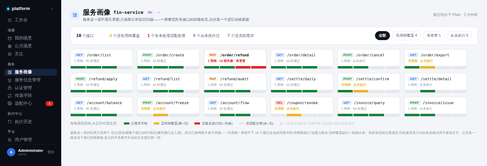
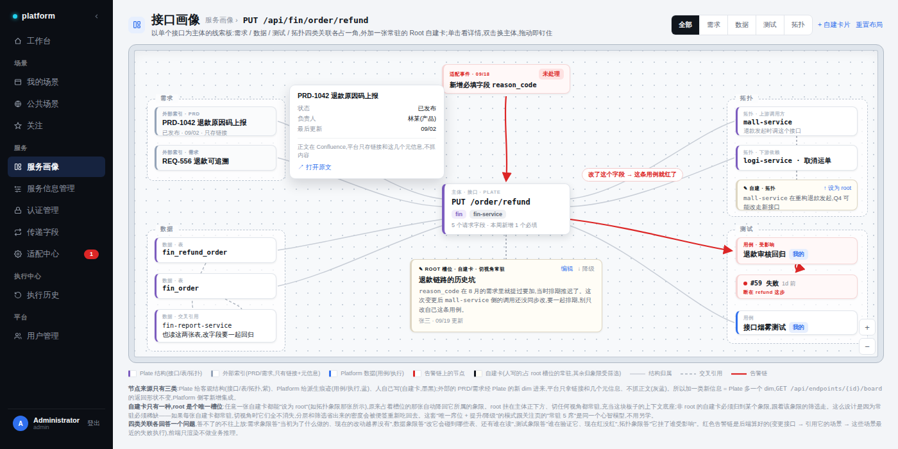
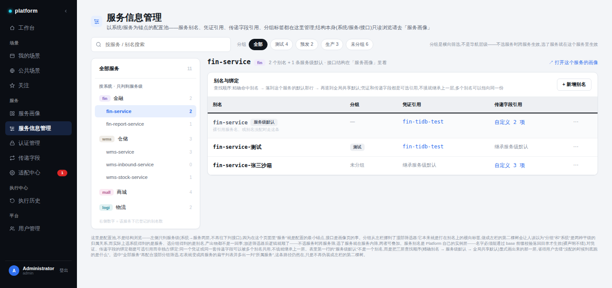

# 服务画像 — 设计与改造方案

> 范围：服务画像（服务级热力网格 + 接口级线索板）两个新页面，以及既有「服务信息管理」页的配套调整。
> 本文所有涉及代码的部分都对齐了 `src/gimbal-platform` 与 `src/gimbal-plate` 的当前实现。
> 2026-09-20 修订：全部资产引用对照源码逐项复核过；新增 §2.4 信号口径、§4.1 运行时解析链、§5.6 挂起清单。当前后端给不出数据源的需求槽信号与「取值集」引用已挂起，并各给了替代。

---

## 0. 一条贯穿全文的边界原则

> **判据：这份数据描述的是「被测系统本身长什么样」，还是「我们这次编排/部署打算怎么用它」？**
> 前者只能在 Plate，后者才允许落在 Platform。

由此推出三条硬约束，后面每一个设计决定都可以回到这里检验：

1. **Platform 只有两个数据来源**：Plate（实时读）和它自己。外部系统（Confluence / Jira / APM）一律不由 Platform 直连，而是作为 Plate 的新 dim 接进来。所以「加一类新信息」= Plate 多一个 dim，Platform 侧零新增集成面。
2. **Platform 不落 Plate 数据的权威副本**。`plate_client` 的 TTL/LRU 缓存只是性能层，不是事实源。
3. **Platform 真要编辑 Plate 的结构数据，只能桥接**：schema 由 Plate 决定、权限判断在 Plate、Platform 不落盘编辑草稿。否则 Platform 会变成事实上的第二个控制面。

节点来源因此只有三类，页面上用颜色固定区分：

| 来源 | 色值 | 内容 | 例子 |
|---|---|---|---|
| Plate 客观结构 | `#7C5CBF` 紫 | 被测系统自身的结构定义 | 接口、字段、库表、调用拓扑 |
| 外部索引（经 Plate） | `#94A3B8` 灰蓝 | **只有链接 + 几个元信息，不抓正文** | PRD、需求单 |
| Platform 派生痕迹 | `#2F6FED` 蓝 | 编排层自己产生的数据 | 用例、执行记录 |
| 人写的自建卡 | `#10151C` 墨黑 | 人的判断和上下文 | Root 卡、象限内的注解 |
| 告警链节点 | `#DC2626` 红 | 上述任意节点被卷进告警链时的叠加态 | — |

---

## 1. 为什么是两层，而不是一张「服务画像」

最早的版本把「一个服务的全部关联」画在一张图上，结果两头不到位：当索引嫌它信息太稀，当排查板嫌它一屏画不下。根因是**两种心智被塞进了同一个页面**——「我该看哪个接口」和「这个接口改了会怎样」是两件事。

拆开之后每层职责单一：

| 层 | 路由 | 要回答的问题 | 形态 |
|---|---|---|---|
| 服务级 | `/services/{name}` | 该看哪个接口？哪里是盲区？ | **热力网格**（不是关系图） |
| 接口级 | `/services/{name}/endpoints/{id}` | 这个接口改了会打到什么？ | **线索板**（关系图） |

系统级（跨服务拓扑）**本期不做**，理由见 §6。

---

## 2. 服务级 · 热力网格



### 2.1 功能

- 一屏列出该服务下全部接口，每格是一个接口瓦片
- 顶部统计条给出盲区总量：`18 个接口 / 4 个没有用例覆盖 / 1 个有未处理适配告警 / 6 个从未执行过`；「N 个没关联需求」这一项及对应 chip 随槽①推迟到 P2——P1 没有数据源（见 §2.4）
- 统计条右侧是与之对应的筛选 chip（全部 / 无用例覆盖 / 有告警 / 从未执行），点一下即筛
- 点任意瓦片进入该接口的线索板

### 2.2 边界

- **这一层不画关系图**。关系图一屏画不下 18 个接口各自的四类关联；网格能让「连着几格灰」这种覆盖缺口一眼跳出来
- 这一层**不做任何编辑**，纯读
- 关系的展开永远发生在接口那一层

### 2.3 样式规格

瓦片 `180 × 约 76px`，白底 `#FFFFFF`，边框 `1px #E1E5EB`，圆角 `8px`，有告警时边框转 `#F3CBCB`。

瓦片底部是**四格状态条**，位置固定，从左到右恒为：

| 位置 | 含义 | 绿 `#15803D` | 黄 `#F0B429` | 红 `#DC2626` | 灰 `#E4E8EE` |
|---|---|---|---|---|---|
| ① | 需求关联 | 已关联 | — | — | 无 |
| ② | 用例覆盖 | 有用例 | **无用例** | — | — |
| ③ | 最近执行 | 通过 | — | 失败 | 从未执行 |
| ④ | 适配告警 | — | — | 有未处理 | 无 |

位置固定是关键：用户扫的是**竖直方向的色块模式**，不是读文字。灰不代表坏，但连着几格灰就是盲区。

槽①在 P1 是**「未接入」占位格**（半透明 + 斜纹）：Plate 的 `reference` dim（P2）落地之前，endpoint→需求不存在任何数据源。场景 meta 虽有 `requirementRef` 字段，但 `plate_client` 的兜底注释写明「UI 不采集 → `[]`」（`services/plate_client.py:126`），当不了近似。是占位而不是缩成三格——格位是这套设计的根，P2 点亮时位置不迁移。

### 2.4 信号口径（P1 可用项全部对齐现有表）

| 槽 | 数据源 | 判定规则 |
|---|---|---|
| ① 需求关联 | **无（挂起，P2 = Plate `reference` dim）** | P1 恒占位；`stats` 不返回 `noRequirement` |
| ② 用例覆盖 | `scenario_endpoint_refs` 倒排索引 | 该 endpoint 在索引中有任一引用行 = 有用例。**含锚点行**（2026-09-20 硬化：零字段锚点步——GET 无参的典型——也发哨兵行），只查字段行会把这类场景算成无覆盖 |
| ③ 最近执行 | `executions` × 倒排索引 | 取**引用该 endpoint 的全部场景**中最近一次 execution（平台视角，不做 owner 过滤；与执行历史页的个人视图口径不同，后端一处 where 即可收紧）。绿 = `done`（终态规则「`failed > 0` → `failed`」保证 done 即全行通过，`run_dispatcher.py:1157`）；红 = `failed`；灰 = 从未执行；`running / queued` 按上一次完成态显示（无则灰）；`canceled` 同灰。tooltip 列分场景明细 |
| ④ 适配告警 | `adaptation_batches.endpoint_id` × `adaptation_ops.status` | 该 endpoint 名下 batch 存在 `status ∈ {pending, conflict}` 的 op = 有未处理告警。op 实为四态 `pending / applied / conflict / skipped`（`models/adaptation_op.py:28`），**conflict 同样未落定，计入**；`skipped / applied` 不计 |

fail-soft：网格的瓦片本身就是 Plate 接口清单，Plate 不可达时返回空 `endpoints` + `plateReachable: false`（信号沿用 `carry_drift` 的既有先例，`services/carry_store.py`），页面给降级横幅而不是白屏。

---

## 3. 接口级 · 线索板



### 3.1 布局：四象限 + 中心主体 + Root 槽位

主体（当前接口）居中，四类关联各占一角，**每类只回答一个具体问题，回答不了的不往上放**：

| 象限 | 回答的问题 | 节点来源 |
|---|---|---|
| 需求（左上） | 这个接口当初为了什么做的、现在的改动越界没有 | 外部索引（经 Plate） |
| 数据（左下） | 改它会碰到哪些表、还有谁在读 | Plate |
| 拓扑（右上） | 它挂了谁受影响 | Plate |
| 测试（右下） | 谁在验证它、现在红没红 | Platform |

这条「每类必须答一个问题」的判据是防止画像变成什么都往里塞的垃圾场的唯一闸门。

### 3.2 告警链

红色粗线贯穿一条真实因果：

```
适配事件(09/18 新增必填 reason_code) → PUT /order/refund → 退款审核回归 → #59 执行失败
```

这是整块板子的价值主张，也是卡片式仪表盘做不到的事——仪表盘只会把「适配有个告警」和「有个用例失败了」放进两张不相干的卡，让人自己去连。

**哪条链该标红由后端算好**，作为 `trails` 返回，前端只渲染高亮，不做业务推理。

### 3.3 Root 卡与自建卡

**卡只有一种（自建卡），root 是一个唯一槽位。**

- Root 槽位：挂在主体正下方，**切到任何视角都常驻**，充当这块板子的上下文底座
- 非 root 的自建卡：必须归到某个象限，跟着该象限的筛选走；它注解谁就用虚线连到谁
- 任意一张自建卡可「↑ 设为 root」，原来占槽位的那张自动降回它所属象限；root 卡上有「↓ 降级」
- 槽位数量 = 1

**为什么 root 必须稀缺**：如果每张自建卡都常驻，切视角时它们全不消失，分层和筛选省出来的密度会被便签重新吃回去。这套「唯一席位 + 提升/降级」跟关注页的「常驻 5 席」是同一个心智模型，用户不用另学。

**为什么需要这类卡**：Plate 给结构、Platform 给执行痕迹，但「这个坑当初为什么留下、这次要拉谁一起改」只有人知道。这类知识现在没地方放，只能躺在聊天记录里。

**权限一句话**：自建卡作者可编辑、降级、删除，他人只读——`board_cards.author` 即权限边界，不另设权限表。

### 3.4 交互

| 动作 | 行为 |
|---|---|
| hover 节点 | 高亮它的全部连线，其余淡化 |
| 单击节点 | 展开详情（字段级，含变更 diff） |
| 双击节点 | **换主体**——双击 `mall-service` 就跳到它的画像，板子可以顺链跨服务延伸 |
| 拖动节点 | 钉住，坐标存 localStorage（按主体分 key，纯前端偏好，不进后端） |
| 顶部视角切换 | 全部 / 需求 / 数据 / 测试 / 拓扑，**降级为可选筛选**——接口粒度下节点数十几个，四象限能同屏 |

### 3.5 连线语义

| 线型 | 含义 |
|---|---|
| 实线 `#C7CDD6` 1.4px | 结构归属（主体 → 各象限节点） |
| 虚线 `#A8B0BC` 1.3px | 交叉引用 / 自建卡注解谁 |
| 实线 `#DC2626` 2.2px + 箭头 | 告警链 |

告警链必须带箭头：线细的时候方向读不出来，而这条链的全部价值就在方向上。

### 3.6 外部索引的边界

PRD / 需求卡点开只显示**标题、状态、负责人、更新时间 + 一个跳转链接**，并明写「正文在 Confluence，平台只存链接和这几个元信息，不抓内容」。

理由与当初不让 Platform 存接口定义完全一致：一旦存了就有第二个会漂移的事实源，而文档的漂移比接口定义更快。

---

## 4. 服务信息管理（**新页**——2026-09-20 核实：前端 views / 路由 / Sidebar 均无此页，需从零搭建）

> 全套方案里唯一的净新增页面，别按「改几处」估工作量；下列「调整」实为初始设计。



定位是**配置池**，与画像的「探索」心智分开，故意不合并。

本轮调整三处：

1. **左栏只到服务级**（系统 → 服务两层，不再列接口）。接口结构是画像页的事；在这个页面里「服务」就是配置的最小锚点。右侧数字改为「该服务下已登记的别名数」
2. **分组从左栏挪到顶部筛选器**。原设计把分组做成左栏第二棵树是错的：选系统得到的是**服务**，选分组得到的是**别名**，产出物根本不是一回事，并排会让人误以为二者是平级归属。挪到顶部后逻辑顺了——不选服务时跨服务筛，选了服务就在服务内筛，两者可叠加
3. **表内显式画出「服务级默认」那一行**，把三层查找顺序摊开：`精确命中别名 → 该服务的默认 → 全局共享默认`，省得用户猜没配时跑的是什么

### 4.1 服务别名模型（沿用引擎既有规则，不新发明）

别名命名规则**复用编排引擎已有的** `<服务名>-<后缀>` 识别逻辑（`frontend/src/utils/service-alias.ts` 的 `deriveBase` + 后端镜像 `backend/app/services/service_names.py`）：最后一个 `-` 切分，前缀必须落在 Plate 目录内才生效，裸声明不猜。

**注册校验依赖 Plate 在线**（2026-09-20 拍板）：`alias_name` 必须通过 `derive_base` 落回 Plate 目录才可登记，而 `catalog_service_names` 在 Plate 不可达时降级为空集 → 校验恒失败——**Plate 宕机期间不能登记新别名**。接受此行为，不做「空集放行 + unverified 标记」的松绑：空枪别名会静默漏 carry/凭证注入，比暂时登记不了更糟；登记是低频配置操作，等 Plate 恢复再登。

别名对凭证、传递字段的绑定是**可选、稀疏、多对一的引用**，不是独占绑定——同一个凭证或同一套传递字段可以被多个别名共用，不填就继承上一层。这与「场景-方案」那种强绑定完全不同，所以别名管理刻意做成认证管理/传递字段那样低频、表格化的轻量交互，没有借用方案卡片的高曝光样式。

**「服务级默认」行 = `alias_name == base_service` 的真实行**（设计稿里打 tag 的那行不是虚拟行）：登记 `fin-service` 本名即得服务级默认，三层查找因此全部落在同一张表上，不引入第二种行。

**运行时解析链**（P1 即可实现，只挂在两个既有解析点上，不新起一套）：

- **凭证**（`auth_sessions`，owner 隔离池）：场景 `serviceBindings.authAlias` 显式绑定 > `service_aliases.credential_alias` 精确命中 > 无（不注入）。别名命中的凭证解析到**执行者本人**的凭证池——`run_dispatcher._resolve_exec_auths`（`services/run_dispatcher.py:1300`）现行为就是 owner 过滤，团队共享的别名行（`owner_user_id` 为空）同样按触发执行的人解析，凭证永远不跨人。**存档口径**（2026-09-20 拍板）：`config_json` 配方存档保持「如实记录原始请求」——`serviceBindings` 记场景原始绑定不动，别名级默认只扩 `injectedAuths` 注入清单与实际物化的 services 映射，执行历史页的展示口径零变化。
- **传递字段**（`carry_bindings` 两张值表）：**精确别名键 > `derive_base` 归约后的基础服务键 > 全局默认**。现状只按 base 查（`services/carry_injection.py:113` 的 `get_bindings(db, base)`），需扩成「先精确后归约」一条查找链。向后兼容：今天没有任何别名键的绑定行，扩展后行为逐字节不变，直到有人登记。

`service_aliases.carry_profile_ref`（引用「传递字段取值集」）**挂起**：现有模型没有「取值集」这个载体——常量池（`constant_entries`）是 per-owner 的字面量/生成器，语义不合；为它发明一个新实体不值。别名级差异用上面的 `carry_bindings` 别名键覆盖；「多个别名共用同一套值」的诉求等真实出现再评估（§5.6）。

---

## 5. 改造方案

### 5.1 已有可直接复用的（这是本方案成本低的主要原因）

| 现有资产 | 位置 | 用途 |
|---|---|---|
| **接口→场景倒排索引** | `models/scenario_endpoint_ref.py` + `services/endpoint_ref_index.py` | 直接支撑「关联场景」和热力网格②用例覆盖。写路径由 `scenario_store` **同事务维护**，可 `rebuild` 全量重建 —— **不需要新建索引**。2026-09-20 已硬化：①锚点行（零字段锚点步发 `source=anchor` 哨兵行，`impact` 的 O(全场景) 兜底直扫删除、`open_batch` 的 addField 不再漏零字段步）；②嵌套字段 removeField/mapValue 的匹配扩「祖先容器前缀命中」（草案带 `path`）；③新增只读漂移检查 `GET /api/adaptations/refs-drift`（悬空引用 / 全网零引用，结构同 `carry_drift`）。升级部署后须跑一次 `rebuild` 补齐存量锚点行 |
| `unindexed_steps()` | 同上 | 已被适配中心用于「未索引」挂牌，网格可复用为数据缺口提示 |
| Plate 读客户端 | `services/plate_client.py` | 接口结构。TTL/LRU + **stale-while-error 降级**只覆盖 `/api/endpoint/{id}/full` 这一条取数路径；接口清单走直连（`adaptation_service._plate_list_endpoints` 的风格，无缓存，网格这个量级够用） |
| 服务归属判定 | `services/service_names.py` / 前端 `utils/service-alias.ts` | `derive_base` / `deriveSystem`，**不新起一套匹配规则** |
| 执行记录 | `services/execution_store.py` | 热力网格③、线索板执行节点 |
| 适配事件 | `services/adaptation_service.py`、`models/adaptation_batch.py`、`models/adaptation_op.py` | 热力网格④、告警链起点。**endpoint 落在 `adaptation_batches.endpoint_id`**（`models/adaptation_batch.py:16`），op 四态经 `batch_id` 关联——告警链第一环的 join 键就在这张表上 |
| 接口目录路由 | `routers/endpoint_catalog.py` | 已有 `/{endpoint_id}/full`、`resolve-paths` 等 |
| 配置池相关 | `services/carry_store.py`、`services/carry_injection.py`、`services/scheme_store.py` | 服务信息管理那侧。carry 解析现状只按 `derive_base` 归约后的 base 服务查绑定（`carry_injection.py:113`），别名级精确命中是本方案要扩的那一条查找链（§4.1） |
| 凭证池 | `models/auth_session.py` + `routers/auth_sessions.py` | `credential_alias` 的引用目标。owner 隔离（`uq_auth_owner_alias`）、Fernet 静态加密；执行期解析在 `run_dispatcher._resolve_exec_auths`（按执行者本人池子，`services/run_dispatcher.py:1300`）。注意 **`routers/auth.py` 是平台用户登录，与本项无关** |

### 5.2 Plate 侧新增（按 ADR 0002 的 `/api/{dim}` 语法扩 dim）

| dim | 内容 | 对应象限 | 期次 |
|---|---|---|---|
| `reference` | PRD / 需求的链接 + 元信息（标题、状态、负责人、更新时间） | 需求 | P2 |
| `table` | 接口涉及的库表、读写关系、跨服务共用情况 | 数据 | P3 |
| `topology` | 服务间调用关系（上游/下游） | 拓扑 | P3 |

**关键点**：这三个 dim 全部在 Plate 侧接入外部系统（Confluence / Jira / 库表元数据 / APM）。Platform 一行集成代码都不写，`board` 接口的返回形状也不变。三个 dim 落地之前，对应象限与网格槽①保持占位（挂起清单 §5.6）。另注：ADR 0002 在仓库级 `docs/adr/0002-plate-http-routing-grammar.md`，不在 plate 包内；Plate 现有 dim 为 `endpoint / service / system / config / meta / resource / scenario` 加语法 dim `strategy / generators`，没有叫 `interfaces` 的东西——字段内嵌在 endpoint 契约里。

### 5.3 Platform 后端新增

**新增 router `routers/service_profile.py`**

```
GET /api/services/{service}/grid
  → { endpoints: [{ id, method, path, signals: { req /* P1 恒 null */, cases, lastRun, alarm },
                    caseCount, lastRunAt }],
      stats: { total, noCases, hasAlarm, neverRun },   // noRequirement 随 P2 reference dim 再加
      plateReachable: bool }

GET /api/endpoints/{endpoint_id}/board
  → { nodes: [{ id, kind, quadrant, label, meta }],
      edges: [{ from, to, kind }],
      trails: [{ kind: 'risk', path: [nodeId...] }] }

GET /api/endpoints/{endpoint_id}/board?expand=<nodeId>
  → 该节点的二度关联（默认只拉一度，避免一次拉巨图）
```

- `kind` ∈ `endpoint | table | topology | reference | scenario | execution | adaptation | card`
- `edge.kind` ∈ `contains | refs | affects | ran | annotates`
- 其中 `refs` 直接查 `scenario_endpoint_refs`，**不扫 payload**
- `endpoint_id` 含斜杠,路由参数用 `:path` 转换器（同 `routers/endpoint_catalog.py:43` 的既有写法）
- 主体节点 fail-soft 分两档：`/full` 不可达时用**轻量列表**兜底——Plate 的 `EndpointView` 本就带 `method / path / service / version`（`gimbal_plate/http/views.py:142`），只缺字段明细；轻量列表也不可达才退到裸 `endpoint_id`（点分命名空间，如 `fin.order.add`，**不带** method+path），板子不断中心

**新增 `services/board_assembler.py`**：聚合 + `trails` 计算 + fail-soft。

`trails` 的风险链算法（每一环都对齐现有表）：`adaptation_batches.endpoint_id` 命中、且该 batch 下存在 `status ∈ {pending, conflict}` 的 op（op 四态 pending/applied/conflict/skipped，**conflict 同样未落定，计入**；skipped/applied 不计）→ 查倒排索引拿引用该 endpoint 的场景 → 这些场景最近一次 execution 为 `failed`（终态规则「`failed > 0` → `failed`」保证 failed 即有任一行失败，`run_dispatcher.py:1157`）。这个判断集中在后端，前端不做业务推理。

**fail-soft 纪律**（沿用 `plate_client` 现有降级风格）：任一数据源不可达只影响对应那批节点，不拖垮整页。Plate 挂了就少掉接口/表/拓扑节点，用例/执行/适配/自建卡照常显示，页面上给降级提示。

**新增表 `board_cards`（自建卡）**

| 列 | 说明 |
|---|---|
| `id` | PK |
| `subject_kind` / `subject_id` | 卡挂在哪个主体上（当前只有 `endpoint`） |
| `body` | 正文，自由编辑 |
| `is_root` | 是否占 root 槽位 |
| `quadrant` | 非 root 时必填，∈ `requirement / data / test / topology` |
| `annotates_node_id` | 可空，注解的是哪个节点（决定虚线连到谁） |
| `author` / `updated_at` | — |

**root 唯一性用部分唯一索引保证**：`UNIQUE (subject_kind, subject_id) WHERE is_root`。提升/降级在一个事务里完成（先降旧的、再升新的），避免出现两张 root。

配套 CRUD 路由：`POST/PATCH/DELETE /api/board-cards`，`POST /api/board-cards/{id}/promote`。

**新增表 `service_aliases`（服务信息管理那侧）**

| 列 | 说明 |
|---|---|
| `alias_name` | PK，必须能通过 `derive_base` 落回 Plate 目录 |
| `base_service` | 派生得到，冗余存一份便于查询 |
| `group_tag` | 可空，横向分组标签（环境只是常见用法之一） |
| `credential_alias` | 可空，引用认证管理的凭证；**多个别名可指向同一个** |
| `carry_profile_ref` | **挂起（§5.6）**：现有模型无「取值集」载体。别名级差异改用 `carry_bindings` 别名键精确命中，解析链见 §4.1 |
| `owner_user_id` | 可空；非空=个人默认，空=团队共享 |

写侧 CRUD 本页（同 `board_cards` 的路由风格）；**读侧不新起解析点**——凭证落在 `run_dispatcher` 的注入清单与 services 映射（`services/run_dispatcher.py:552-580`），carry 落在 `carry_injection.build_carry_context` 的查找链（§4.1），合并顺序照 §4.1 的两层优先级写死。

### 5.4 前端新增

| 项 | 内容 |
|---|---|
| 路由 | `/services/:name` → `views/ServiceGrid.vue`；`/services/:name/endpoints/:id` → `views/EndpointBoard.vue` |
| 依赖 | `@vue-flow/core` — **净新增**（`frontend/package.json` 现无此项；固定四象限布局只用它的 pan / zoom / 拖拽，不用力导向） |
| 布局 | 初始坐标**自己按四象限算死，不用力导向**——每次打开位置一致才有「板子」的感觉；用户拖动后的坐标存 localStorage |
| 侧边栏 | `components/chrome/Sidebar.vue` 「服务」组（现为认证管理 / 传递字段 / 适配中心）新增「服务画像」**与「服务信息管理」** |
| 新页 | `views/ServiceAdmin.vue`（§4：左栏系统→服务树 + 顶部分组筛选 + 别名表 CRUD + 服务级默认行）+ `api/service-aliases.ts`（照 `api/adaptations.ts` 的 http 封装模式） |
| 既有页调整 | `views/CarryConfig.vue` 的服务绑定选择器要能选到「服务」或「某个已登记别名」 |

### 5.5 分期

| 期 | 交付 | 依赖 |
|---|---|---|
| **P1** | 热力网格（槽①为「未接入」占位，统计条无需求数字与 chip）+ 线索板（测试象限完整、需求/数据/拓扑三个象限显示「未接入」占位）+ 自建卡与 root 槽位 + 服务别名表（凭证绑定 + carry 别名键，见 §4.1）+ **服务信息管理页（新页，§4）** | **零外部依赖**。数据全部来自现有的倒排索引 + `execution_store` + `adaptation_service` + `plate_client`。这一期就能交付告警链的完整价值 |
| **P2** | 需求象限点亮；网格槽①与「没关联需求」统计 / chip 同步点亮 | Plate `reference` dim |
| **P3** | 数据 / 拓扑象限点亮；双击换主体跨服务顺链 | Plate `table` / `topology` dim |
| **P4** | 系统级拓扑（条件触发，见 §6） | 见下 |

P1 能独立成立是这个方案的关键：**不等 Plate 的任何新 dim，告警链就能跑通**，因为它只用到适配事件 + 倒排索引 + 执行记录，全是 Platform 现有资产。

**P1 交付状态（2026-09-20，四个切片全部落地）**：

| 切片 | 交付 |
|---|---|
| ① 热力网格 | `GET /api/services/{service}/grid`（`board_assembler.grid` 四路聚合 + `plateReachable` 降级）+ `ServiceGrid.vue`（统计条/筛选 chip/四格状态条/槽①占位格）+ `/services` 落地页与导航 |
| ② 线索板 | `GET /api/endpoints/{id}/board`（三档主体降级 + 测试象限 + trails 后端算好 + expand 二度）+ `board_cards` 表（partial unique index 的 root 槽位、promote 单条 CASE UPDATE 原子换椅、demote）+ `EndpointBoard.vue`（@vue-flow/core 净新增，四象限固定坐标、告警链渲染、视角筛选、拖拽坐标 localStorage） |
| ③ 别名基础层 | `service_aliases` 表 + CRUD（强约束注册校验）+ carry 三层解析（`carry_injection` 别名键稀疏覆盖）+ 凭证注入（`run_dispatcher` 注入清单扩、显式绑定优先、存档记原始） |
| ④ 服务信息管理 | `ServiceAdmin.vue`（系统→服务两层树、顶部分组筛选、服务级默认行）+ CarryConfig 选择器 datalist 扩「目录服务 + 已登记别名」 |

验证基线：后端 611 / 前端 1037 测试全绿；倒排索引硬化（锚点行/祖先容器匹配/refs-drift）随 ① 之前落地。挂起项不变（§5.6）；P2/P3 等 Plate dim。

### 5.6 挂起清单（当前后端给不出数据的，先不做）

| 项 | 挂起原因（逐条核到源码） | 替代 / 解除条件 |
|---|---|---|
| 网格槽①需求信号、`stats.noRequirement`、对应筛选 chip | Plate 无 `reference` dim；场景 `meta.requirementRef` 因 UI 不采集恒空（`plate_client.py:126` 兜底注释），**无近似可用** | P2 `reference` dim 落地即点亮；此前槽位保留占位格，格位不迁移 |
| `service_aliases.carry_profile_ref`（取值集引用） | 现有模型无「取值集」载体；常量池是 per-owner 的字面量/生成器，语义不合 | 别名级差异用 `carry_bindings` 别名键（§4.1 解析链）；「多别名共用一套值」的诉求真实出现再评估 |
| 线索板需求 / 数据 / 拓扑象限 | 对应 Plate dim 不存在（P2 / P3） | 象限渲染「未接入」占位 |
| 双击换主体（跨服务顺链） | 依赖拓扑节点，拓扑 dim 是 P3 | P1 保留双击交互，暂无跨服务节点可点 |
| 系统级拓扑 | §6 三条理由，数据源不存在 | §6 两条触发条件 |

留在 P1 的每一项都验证过数据闭环：告警链的三环——`adaptation_batches.endpoint_id`、倒排索引、`executions` 计数——全部落在现有表里；别名绑定的两个解析点（`run_dispatcher` 注入清单、`carry_injection` 查找链）都是现有代码上的最小扩展。

倒排索引的四个盲区（零字段锚点 / 响应侧断言 / 顶层键粒度 / via_var 首匹配）评估结论：**前两个的修复面已落地一半**——零字段锚点行与嵌套祖先容器匹配已在 2026-09-20 硬化进索引（见 §5.1 资产表），悬空引用检查也有了（`refs-drift`）；**仍挂起**的是：响应侧断言引用进索引（需扩 `source` 枚举加 `assert`，随 P2/P3 评估）和 `via_var` 多变量内嵌（尾部场景，出现真实 payload 再修）。

---

## 6. 系统级关联：本期不做

三条理由，最硬的是第一条：

1. **数据源不存在**。服务调用拓扑得来自 Plate 的新 dim，而 Plate 现在没有采集调用关系的能力——要么静态分析、要么接链路追踪、要么服务注册，都是不小的前置工程。另一条路是从场景反推（哪些场景跨了哪些服务），但那是**测试视角的关联**，不是真实运行时拓扑，两者混起来会误导人
2. **它可能不该由我们做**。调用拓扑通常已经在 APM / 服务网格里了，我们再画一份就会面临「跟那边不一致」——正好撞上 §0 的那条边界：不做第二个事实源
3. **频率不对**。网格和线索板是排查日常会用的；拓扑图属于架构评审才看

而且**顺链追踪已经覆盖了大部分需求**：线索板双击换主体，点 `mall-service` 直接跳它的画像，一跳一跳摸下去。排查时要的通常是「这一条链」，不是「整张图」。

**触发条件**（任一成立即重新评估）：

- Plate 侧真的有了可信的调用关系 dim
- 反复出现「一次改动要评估 3 个以上系统影响面」且顺链明显不够用

**更便宜的替代**：如果只是想回答「这次变更波及几个系统」，放到**适配中心**做——适配事件本来就是变更入口，在那儿按系统聚合影响面，比单开拓扑图轻得多，而且是在用户本来就会去的地方。

---

## 附：设计系统取值

| 类别 | 取值 |
|---|---|
| 页面底 / 卡片底 | `#F3F5F8` / `#FFFFFF` |
| 画布底 + 点阵 | `#F7F9FB` + `radial-gradient(#C8D1DB 1px) 18px` |
| 画布外框 | `1px #AEB8C4` + `inset 0 0 0 8px #DFE5EC` + `inset 0 0 0 9px #BFC8D3` |
| 象限分区框 | `1px dashed #BCC6D2`，圆角 `10px` |
| 主文字 / 次级 / 弱化 | `#10151C` / `#5B6472` / `#8B93A1` |
| 强调色 | `#2F6FED`（底 `#E7EFFE`） |
| 成功 / 失败 / 警示 | `#15803D`（底 `#E4F5EA`）/ `#DC2626`（底 `#FEE2E2`）/ `#F0B429` |
| 系统分类色 | fin `#7C5CBF`/`#F1ECFB`，wms `#8A7D6B`/`#F0EDE8`，mall `#B0568E`/`#FBEAF3`，logi `#2E8B9E`/`#E3F2F3` |
| HTTP 方法 | GET `#2F6FED`/`#E7EFFE`，POST `#15803D`/`#E4F5EA`，PUT `#B45309`/`#FEF3E2`，DELETE `#DC2626`/`#FEE2E2` |
| 等宽字体 | `ui-monospace, monospace`（接口路径、别名、表名、字段名一律等宽） |
